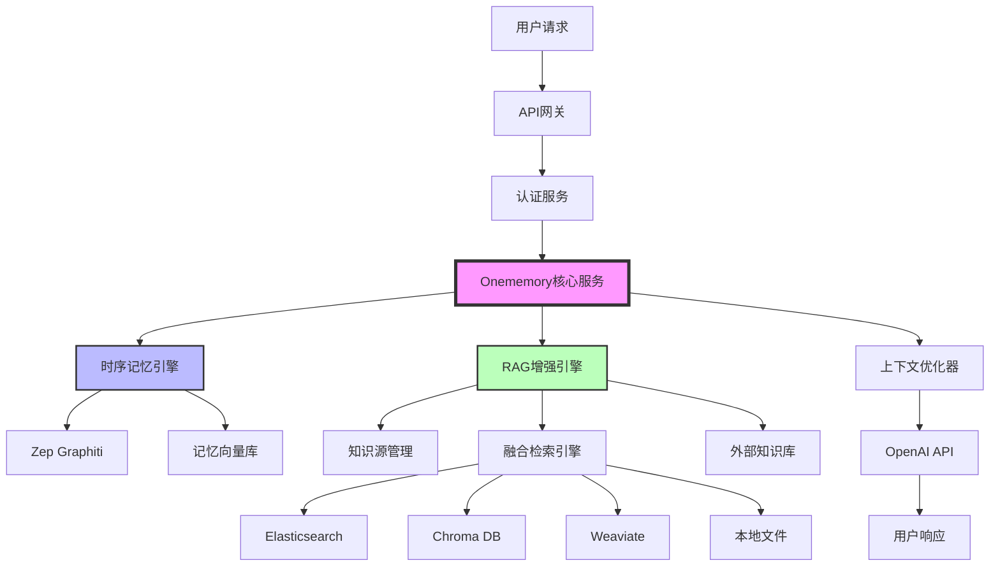
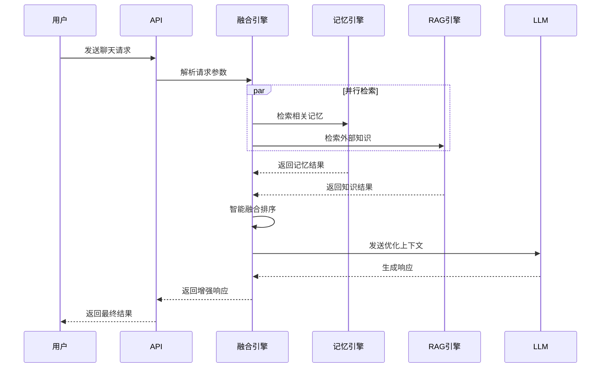
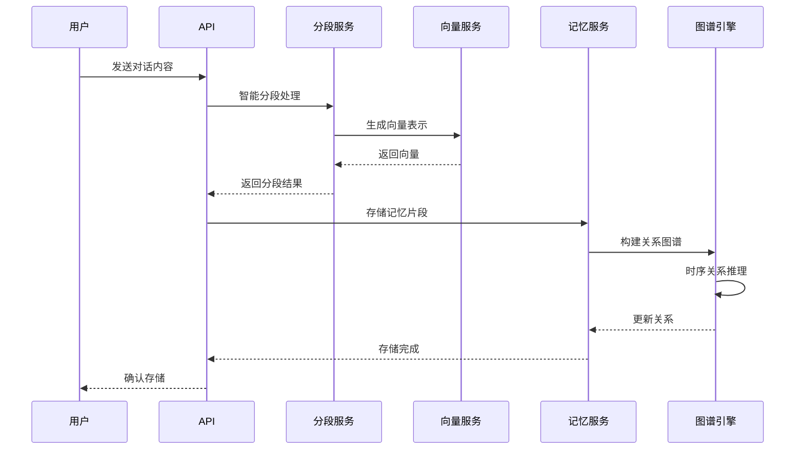

# Supermemory 技术实现方案

## 1. 产品概述

Supermemory 是一个基于时序记忆架构的智能记忆系统，通过RAG（Retrieval-Augmented Generation）技术增强，实现多源知识的智能融合检索。系统采用双引擎架构，将时序记忆与外部知识库无缝融合，为用户提供更加智能和个性化的交互体验。

## 2. 核心架构

### 2.1 系统架构图



### 2.2 核心组件

#### 2.2.1 时序记忆引擎
- **Zep Graphiti**: 基于图数据库的时序记忆管理
- **记忆向量库**: 存储对话历史和用户偏好
- **时序关系推理**: 分析记忆间的时间关联

#### 2.2.2 RAG增强引擎
- **知识源管理**: 统一管理外部知识库连接
- **融合检索引擎**: 智能融合记忆与外部知识
- **多源适配器**: 支持多种知识库类型

#### 2.2.3 上下文优化器
- **智能排序**: 基于相关性和时效性排序
- **Token优化**: 动态调整上下文长度
- **质量评估**: 评估检索结果质量

## 3. 核心功能流程

### 3.1 智能聊天流程



### 3.2 记忆存储流程



## 4. RAG增强功能

### 4.1 融合检索策略

Supermemory的RAG功能不是独立系统，而是深度集成到记忆检索中的增强模块：

#### 4.1.1 智能融合算法
```typescript
interface FusionStrategy {
  memoryWeight: number;      // 记忆权重 (0.6-0.8)
  ragWeight: number;         // RAG权重 (0.2-0.4)
  timeDecay: number;         // 时间衰减因子
  relevanceBoost: number;    // 相关性提升
}
```

#### 4.1.2 检索流程
1. **查询理解**: 分析用户意图和查询类型
2. **并行检索**: 同时搜索记忆库和外部知识库
3. **结果融合**: 基于权重和时效性智能融合
4. **质量评估**: 评估融合结果的相关性
5. **上下文优化**: 动态调整上下文长度和质量

### 4.2 知识源管理

#### 4.2.1 支持的源类型
- **Elasticsearch**: 企业文档和日志
- **Chroma DB**: 向量化的知识库
- **Weaviate**: 语义知识图谱
- **本地文件**: Markdown、PDF、TXT等
- **API接口**: 第三方知识服务

#### 4.2.2 配置管理
```typescript
interface KnowledgeSource {
  id: string;
  name: string;
  type: 'elasticsearch' | 'chroma' | 'weaviate' | 'local' | 'api';
  config: {
    endpoint: string;
    credentials: object;
    index?: string;
    collection?: string;
  };
  priority: number;      // 1-10，影响融合权重
  enabled: boolean;
  lastSync: Date;
}
```

## 5. 数据模型设计

### 5.1 核心实体

#### 5.1.1 记忆实体 (MemoryEntity)
```typescript
interface MemoryEntity {
  id: string;
  projectId: string;
  sessionId: string;
  content: string;
  embedding: number[];
  metadata: {
    timestamp: Date;
    importance: number;
    category: string;
    tags: string[];
  };
  relationships: Relationship[];
}
```

#### 5.1.2 知识片段 (KnowledgeChunk)
```typescript
interface KnowledgeChunk {
  id: string;
  sourceId: string;
  content: string;
  embedding: number[];
  metadata: {
    filePath?: string;
    section?: string;
    timestamp: Date;
    relevance: number;
  };
}
```

#### 5.1.3 融合结果 (FusedResult)
```typescript
interface FusedResult {
  id: string;
  type: 'memory' | 'knowledge';
  content: string;
  score: number;
  source: string;
  metadata: {
    originalScore: number;
    fusionWeight: number;
    timestamp: Date;
    confidence: number;
  };
}
```

### 5.2 数据库设计

#### 5.2.1 记忆表 (memories)
```sql
CREATE TABLE memories (
  id UUID PRIMARY KEY DEFAULT gen_random_uuid(),
  project_id VARCHAR(255) NOT NULL,
  session_id VARCHAR(255) NOT NULL,
  content TEXT NOT NULL,
  embedding vector(1536),
  metadata JSONB,
  created_at TIMESTAMP DEFAULT NOW(),
  updated_at TIMESTAMP DEFAULT NOW()
);

CREATE INDEX idx_memories_project ON memories(project_id);
CREATE INDEX idx_memories_session ON memories(session_id);
```

#### 5.2.2 知识源表 (knowledge_sources)
```sql
CREATE TABLE knowledge_sources (
  id UUID PRIMARY KEY DEFAULT gen_random_uuid(),
  name VARCHAR(255) NOT NULL,
  type VARCHAR(50) NOT NULL,
  config JSONB NOT NULL,
  priority INTEGER DEFAULT 5,
  enabled BOOLEAN DEFAULT true,
  last_sync TIMESTAMP,
  created_at TIMESTAMP DEFAULT NOW()
);
```

#### 5.2.3 融合日志表 (fusion_logs)
```sql
CREATE TABLE fusion_logs (
  id UUID PRIMARY KEY DEFAULT gen_random_uuid(),
  query TEXT NOT NULL,
  memory_results INTEGER,
  rag_results INTEGER,
  fused_results INTEGER,
  strategy VARCHAR(50),
  processing_time_ms INTEGER,
  created_at TIMESTAMP DEFAULT NOW()
);
```

## 6. API接口设计

### 6.1 聊天接口

#### 6.1.1 增强聊天
```http
POST /api/v1/chat/enhanced
Content-Type: application/json

{
  "messages": [
    {"role": "user", "content": "请帮我查找关于机器学习的内容"}
  ],
  "projectId": "proj_123",
  "useMemory": true,
  "useRAG": true,
  "ragOptions": {
    "sources": ["docs", "wiki"],
    "fusionStrategy": "hybrid",
    "limit": 10
  },
  "contextOptions": {
    "maxTokens": 4000,
    "includeHistory": true
  }
}
```

#### 6.1.2 响应格式
```json
{
  "id": "chat_123",
  "choices": [{
    "message": {
      "role": "assistant",
      "content": "基于您的历史学习和外部知识库，我为您找到了相关内容..."
    }
  }],
  "metadata": {
    "memoryUsed": true,
    "ragUsed": true,
    "sourcesUsed": ["memory", "docs", "wiki"],
    "contextSources": [
      {"type": "memory", "source": "历史对话", "score": 0.95},
      {"type": "rag", "source": "技术文档", "score": 0.87}
    ]
  }
}
```

### 6.2 知识管理接口

#### 6.2.1 添加知识源
```http
POST /api/v1/knowledge/sources
Content-Type: application/json

{
  "name": "技术文档库",
  "type": "elasticsearch",
  "config": {
    "endpoint": "http://localhost:9200",
    "index": "tech_docs",
    "apiKey": "xxx"
  },
  "priority": 8
}
```

#### 6.2.2 检索知识
```http
POST /api/v1/knowledge/search
Content-Type: application/json

{
  "query": "机器学习算法",
  "sources": ["tech_docs", "wiki"],
  "limit": 10,
  "includeMemory": true
}
```

## 7. 性能优化

### 7.1 检索优化

#### 7.1.1 向量索引优化
- **HNSW算法**: 高效的近似最近邻搜索
- **分层索引**: 按时间、类别分层存储
- **缓存机制**: 热点查询结果缓存

#### 7.1.2 融合算法优化
```typescript
class FusionOptimizer {
  // 预计算相似度矩阵
  precomputeSimilarity(results: FusedResult[]): number[][] {
    // 实现细节
  }
  
  // 动态权重调整
  adjustWeights(context: QueryContext): FusionStrategy {
    // 基于查询类型和历史效果调整权重
  }
}
```

### 7.2 存储优化

#### 7.2.1 数据分片
- **按项目分片**: 不同项目数据分离
- **按时间分片**: 历史数据归档处理
- **向量量化**: 降低存储成本

#### 7.2.2 压缩策略
- **Embedding压缩**: 使用PQ（Product Quantization）
- **文本压缩**: 智能文本摘要和压缩
- **增量更新**: 只存储变化部分

## 8. 监控与分析

### 8.1 性能指标

#### 8.1.1 检索性能
- **延迟**: 平均检索时间 < 200ms
- **吞吐量**: 支持 1000 QPS
- **准确率**: Top-5 准确率 > 90%

#### 8.1.2 融合效果
- **相关性**: 融合结果相关性 > 85%
- **覆盖率**: 知识覆盖率 > 95%
- **新鲜度**: 知识更新延迟 < 1小时

### 8.2 监控仪表板

#### 8.2.1 实时监控
```typescript
interface MonitoringMetrics {
  retrievalLatency: number;
  fusionAccuracy: number;
  memoryUsage: number;
  ragHitRate: number;
  userSatisfaction: number;
}
```

#### 8.2.2 告警机制
- **性能告警**: 延迟超过阈值
- **质量告警**: 准确率下降
- **容量告警**: 存储空间不足

## 9. 部署架构

### 9.1 容器化部署

#### 9.1.1 Docker服务
```yaml
version: '3.8'
services:
  supermemory-api:
    image: supermemory/api:latest
    ports:
      - "3000:3000"
    environment:
      - DATABASE_URL=postgresql://user:pass@db:5432/supermemory
      - REDIS_URL=redis://redis:6379
      - OPENAI_API_KEY=${OPENAI_API_KEY}
    depends_on:
      - postgres
      - redis
      - qdrant
      
  memory-service:
    image: supermemory/memory:latest
    environment:
      - GRAPH_DATABASE=neo4j://neo4j:7687
      - VECTOR_DATABASE=qdrant://qdrant:6333
```

#### 9.2.2 Kubernetes配置
```yaml
apiVersion: apps/v1
kind: Deployment
metadata:
  name: supermemory-api
spec:
  replicas: 3
  selector:
    matchLabels:
      app: supermemory-api
  template:
    spec:
      containers:
      - name: api
        image: supermemory/api:latest
        resources:
          requests:
            memory: "512Mi"
            cpu: "250m"
          limits:
            memory: "1Gi"
            cpu: "500m"
```

## 10. 未来规划

### 10.1 功能增强

#### 10.1.1 多模态支持
- **图像理解**: 支持图像内容检索
- **音频处理**: 支持语音转文本检索
- **视频分析**: 支持视频内容理解

#### 10.1.2 智能推理
- **知识图谱**: 构建领域知识图谱
- **推理引擎**: 基于图谱的逻辑推理
- **因果分析**: 分析事件因果关系

### 10.2 性能提升

#### 10.2.1 硬件加速
- **GPU加速**: 向量计算GPU加速
- **专用芯片**: 考虑使用AI芯片
- **边缘计算**: 支持边缘部署

#### 10.2.2 算法优化
- **新算法**: 采用最新检索算法
- **机器学习**: 基于用户反馈优化
- **自适应**: 系统自动调优参数

---

**总结**: Supermemory通过深度集成RAG技术，实现了时序记忆与外部知识的智能融合。系统采用双引擎架构，在保证记忆连贯性的同时，通过外部知识库增强回答的准确性和全面性。这种设计使得Supermemory不仅是一个记忆系统，更是一个智能的知识增强平台。