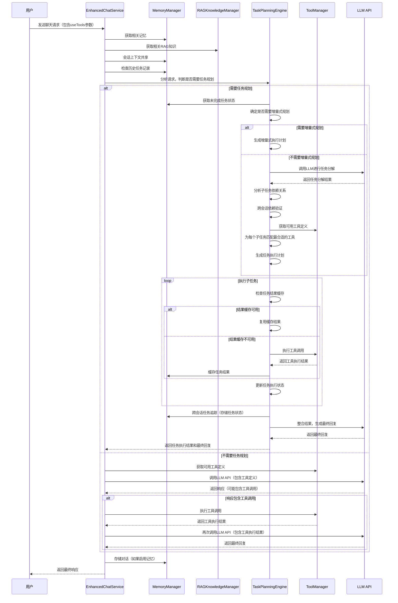
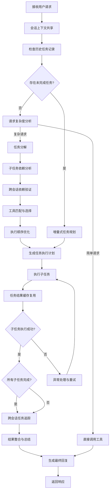
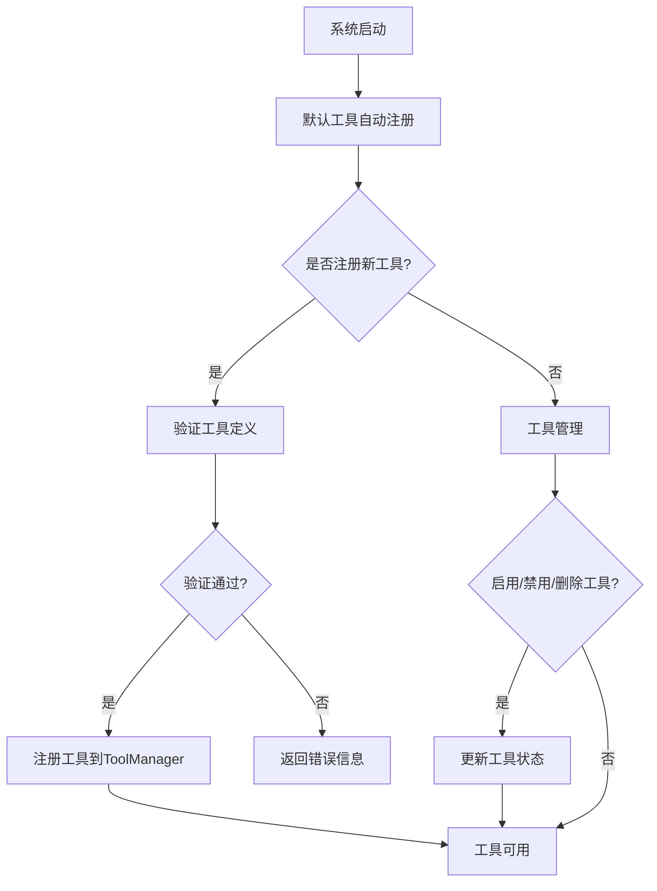

# Onememory支持工具调用

## 1. 概述

Onememory是基于时序记忆架构的智能记忆系统，深度集成RAG技术，实现多源知识智能融合检索。为了进一步扩展系统能力，Onememory支持工具调用和任务规划功能，允许系统与外部工具和服务进行交互，同时支持复杂任务的分解、执行和跨会话管理，增强系统的实用性、扩展性和智能化水平。

### 1.1 背景与价值

随着AI技术的发展，单纯的文本生成已经无法满足复杂应用场景的需求。工具调用允许AI系统执行具体操作，如查询实时数据、调用外部API、执行计算等，从而扩展AI系统的能力边界。而任务规划则使系统能够处理更复杂的请求，将其分解为可执行的子任务序列，并规划执行顺序和所需工具。

Onememory支持工具调用和任务规划的价值在于：
- **增强系统能力**：允许系统与外部工具和服务交互，执行具体操作，处理复杂任务
- **扩展应用场景**：支持更多复杂应用场景，如实时数据查询、计算分析、外部系统集成、多步骤任务处理等
- **提高实用性**：直接为用户提供可执行的结果，而不仅仅是文本建议
- **增强用户体验**：无缝的工具调用和任务规划体验，用户无需手动执行复杂的多步骤操作
- **跨会话连续性**：支持跨会话任务状态管理，避免重复规划和执行
- **智能资源利用**：通过任务规划和结果缓存，优化资源使用，提高系统效率

## 2. 架构设计

### 2.1 整体架构

Onememory在现有双引擎架构基础上，新增**工具引擎**和**任务规划引擎**，形成四引擎架构：

```
┌─────────────────────────────────────────────────────────────────────────────────┐
│                               Onememory系统                                     │
├─────────────────┬─────────────────┬─────────────────┬───────────────────────────┤
│  时序记忆引擎   │   RAG增强引擎   │   任务规划引擎   │           工具引擎        │
│  (Temporal      │  (RAG           │  (Task Planning │  (Tool Engine)            │
│   Memory        │   Enhancement    │   Engine)       │                           │
│   Engine)       │   Engine)        │                 │                           │
├─────────────────┼─────────────────┼─────────────────┼───────────────────────────┤
│  记忆管理       │  知识融合检索   │  任务分解与规划   │  工具注册与管理           │
│  时序实体提取   │  多源知识融合   │  执行顺序优化     │  工具执行与调度           │
│  动态关系推理   │  融合策略优化   │  工具选择与分配   │  工具调用处理             │
└─────────────────┴─────────────────┴─────────────────┴───────────────────────────┘
```

### 2.1.1 任务规划引擎

任务规划引擎是Onememory新增的核心组件，负责将复杂任务分解为一系列子任务，并规划执行顺序和所需工具，同时支持跨会话任务状态管理。主要功能包括：

- **任务分解**：将复杂用户请求分解为可执行的子任务序列
- **工具选择**：为每个子任务选择最合适的工具
- **执行规划**：规划子任务的执行顺序和依赖关系
- **状态管理**：跟踪任务执行状态，处理异常情况
- **结果整合**：整合所有子任务的执行结果，生成最终回复
- **跨会话任务追踪**：将任务执行状态持久化到时序记忆引擎，支持跨会话识别相同/相关任务
- **增量式任务规划**：任务规划前检查历史记录，仅生成包含未完成步骤的增量式执行计划
- **会话上下文共享**：基于用户ID/项目ID自动关联相关会话，共享任务状态上下文
- **任务结果缓存复用**：对相同输入的任务/子任务结果进行缓存，直接复用历史执行结果
- **跨会话依赖验证**：验证历史完成的子任务是否仍满足当前任务的依赖条件

任务规划引擎的引入使Onememory能够处理更复杂的用户请求，智能地组合使用多个工具，提高系统的实用性和智能化水平。

### 2.2 核心组件

#### 2.2.1 TaskPlanningEngine

TaskPlanningEngine是任务规划引擎的核心服务，负责将复杂任务分解为可执行的子任务序列，并规划执行顺序。主要功能包括：
- 复杂任务分解
- 子任务依赖关系分析
- 工具选择与匹配
- 执行顺序优化
- 任务执行状态管理
- 异常处理与回滚
- 结果整合与总结

#### 2.2.2 ToolManager

ToolManager是工具调用功能的核心服务，负责工具的注册、描述和执行。主要功能包括：
- 工具注册与管理
- 工具定义获取
- 工具执行调度
- 工具调用结果处理

#### 2.2.3 ToolRegistry

ToolRegistry是工具注册表，存储所有可用工具的定义和实现。主要功能包括：
- 工具定义存储
- 工具版本管理
- 工具状态管理（启用/禁用）
- 工具权限管理

#### 2.2.4 ToolExecutor

ToolExecutor是工具执行器，负责安全执行工具调用。主要功能包括：
- 工具参数验证
- 工具安全执行
- 工具执行超时控制
- 工具执行结果格式转换

#### 2.2.5 ToolCallProcessor

ToolCallProcessor是工具调用处理器，负责处理LLM返回的工具调用请求。主要功能包括：
- 工具调用请求解析
- 工具调用执行调度
- 工具调用结果收集
- 工具调用历史记录

## 3. 核心功能

### 3.1 工具注册与管理

- **自动注册**：系统启动时，默认工具自动注册到ToolManager
- **手动注册**：管理员可通过API或UI注册新工具
- **工具验证**：工具注册时进行安全性和有效性验证
- **工具状态管理**：工具可被启用、禁用或删除
- **工具版本控制**：支持工具版本管理，便于迭代更新
- **工具元数据管理**：存储工具的功能描述、适用场景、参数要求等元数据

### 3.2 任务规划

- **复杂任务分解**：将复杂用户请求分解为可执行的子任务序列
- **子任务依赖分析**：分析子任务之间的依赖关系，确定执行顺序
- **智能工具选择**：根据子任务需求，自动选择最合适的工具
- **执行路径优化**：优化子任务的执行顺序，提高整体执行效率
- **动态任务调整**：根据执行过程中的情况，动态调整任务规划
- **异常处理机制**：处理执行过程中的异常情况，支持重试和回滚
- **结果整合与总结**：整合所有子任务的执行结果，生成最终回复
- **跨会话任务追踪**：将任务执行状态持久化到时序记忆引擎，支持跨会话识别相同/相关任务
- **增量式任务规划**：任务规划前检查历史记录，仅生成包含未完成步骤的增量式执行计划
- **会话上下文共享**：基于用户ID/项目ID自动关联相关会话，共享任务状态上下文
- **任务结果缓存复用**：对相同输入的任务/子任务结果进行缓存，直接复用历史执行结果
- **任务状态可视化**：提供UI界面展示跨会话任务状态，支持手动调整任务进度
- **跨会话依赖验证**：验证历史完成的子任务是否仍满足当前任务的依赖条件

### 3.3 工具调用处理

- **工具调用解析**：解析LLM返回的工具调用请求
- **并行执行**：支持多个工具调用并行执行，提高处理效率
- **安全执行**：在安全沙箱中执行工具调用，防止安全漏洞
- **超时控制**：对工具执行时间进行限制，防止无限循环
- **错误处理**：优雅处理工具执行错误，提供友好的错误信息

### 3.4 工具响应生成

- **结果格式化**：将工具执行结果格式化为LLM可理解的格式
- **上下文整合**：将工具执行结果整合到对话上下文中
- **最终回复生成**：基于工具执行结果，生成最终的用户回复

### 3.5 工具调用监控与日志

- **调用记录**：记录所有工具调用的详细信息
- **性能监控**：监控工具调用的执行时间、成功率等指标
- **统计分析**：提供工具调用的统计分析报告
- **审计日志**：记录工具调用的审计信息，便于追溯

## 4. 工作流程

### 4.1 工具调用基本流程（含任务规划）



### 4.2 任务规划详细流程



### 4.3 工具注册与管理流程



## 5. 使用方法

### 5.1 API调用

#### 5.1.1 增强聊天接口（含任务规划）

```bash
POST /api/enhanced-chat
Content-Type: application/json

{
  "messages": [
    {
      "role": "user",
      "content": "帮我查询北京和上海今天的天气，然后比较一下两个城市的温度差异，并给出建议"
    }
  ],
  "model": "gpt-3.5-turbo",
  "projectId": "proj_123",
  "useMemory": true,
  "useRAG": true,
  "useTools": true,
  "useTaskPlanning": true,  # 是否启用任务规划
  "taskPlanningOptions": {
    "maxSteps": 10,          # 最大子任务数
    "enableParallel": true,  # 是否启用并行执行
    "timeout": 60000         # 任务规划超时时间（毫秒）
  }
}
```

#### 5.1.2 工具管理接口

- **获取所有工具定义**
  ```bash
  GET /api/tools
  ```

- **获取特定工具定义**
  ```bash
  GET /api/tools/get_current_weather
  ```

- **注册新工具**
  ```bash
  POST /api/tools
  Content-Type: application/json
  
  {
    "definition": {
      "type": "function",
      "function": {
        "name": "my_custom_tool",
        "description": "我的自定义工具",
        "parameters": {
          "type": "object",
          "properties": {
            "param1": {
              "type": "string",
              "description": "参数1"
            }
          },
          "required": ["param1"]
        }
      }
    },
    "implementation": "async (params) => { return JSON.stringify({ result: params.param1 }); }"
  }
  ```

### 5.2 配置说明

#### 5.2.1 环境变量配置

```bash
# 任务规划配置
TASK_PLANNING_ENABLED=true        # 是否启用任务规划功能
TASK_PLANNING_TIMEOUT=60000        # 任务规划超时时间（毫秒）
TASK_MAX_STEPS=20                  # 最大子任务数
TASK_ENABLE_PARALLEL=true          # 是否启用并行执行
TASK_PLANNING_MODEL="gpt-4o"       # 用于任务规划的LLM模型

# 工具调用配置
TOOL_CALL_ENABLED=true            # 是否启用工具调用功能
TOOL_EXECUTION_TIMEOUT=30000      # 工具执行超时时间（毫秒）
TOOL_MAX_CONCURRENT_CALLS=10      # 最大并发工具调用数
TOOL_SECURITY_ENABLED=true        # 是否启用工具执行安全检查
```

#### 5.2.2 工具配置示例

```json
{
  "tools": [
    {
      "name": "get_current_weather",
      "enabled": true,
      "description": "获取指定位置的当前天气",
      "parameters": {
        "location": {
          "type": "string",
          "description": "城市和地区，例如：北京"
        },
        "unit": {
          "type": "string",
          "enum": ["celsius", "fahrenheit"],
          "description": "温度单位，默认为摄氏度"
        }
      },
      "required": ["location"]
    }
  ]
}
```

## 6. 工具开发

### 6.1 工具开发规范

1. **工具命名**：使用清晰、描述性的名称，避免使用缩写或模糊的名称
2. **参数设计**：参数应具有清晰的类型和描述，避免使用复杂的嵌套结构
3. **返回格式**：返回格式应简洁、结构化，便于LLM理解
4. **错误处理**：工具应妥善处理错误情况，返回有意义的错误信息
5. **安全性**：工具应避免执行危险操作，如文件系统写入、网络请求等（除非必要）
6. **性能**：工具应尽量高效，避免长时间执行

### 6.2 工具开发示例

#### 6.2.1 JavaScript工具示例

```javascript
// 天气工具示例
const weatherTool = {
  definition: {
    type: 'function',
    function: {
      name: 'get_current_weather',
      description: 'Get the current weather for a specific location',
      parameters: {
        type: 'object',
        properties: {
          location: {
            type: 'string',
            description: 'The city and state, e.g. San Francisco, CA',
          },
          unit: {
            type: 'string',
            enum: ['celsius', 'fahrenheit'],
            description: 'The temperature unit to use. Defaults to celsius.',
          },
        },
        required: ['location'],
      },
    },
  },
  implementation: async (params) => {
    // 实现逻辑
    const { location, unit = 'celsius' } = params;
    // 调用天气API获取数据
    const weatherData = await fetchWeatherData(location, unit);
    return JSON.stringify(weatherData);
  },
};
```

#### 6.2.2 Python工具示例（通过API调用）

```python
# Python工具示例（通过HTTP API调用）
import requests
import json

def calculate_pi(digits):
    # 计算指定位数的圆周率
    # 实现逻辑...
    return {
        "digits": digits,
        "result": "3.1415926535..."
    }

# 通过API暴露工具
@app.route('/api/tools/calculate_pi', methods=['POST'])
def handle_calculate_pi():
    params = request.json
    result = calculate_pi(params.get('digits', 10))
    return jsonify(result)
```

### 6.3 工具注册与部署

1. **本地开发**：在开发环境中编写和测试工具
2. **注册工具**：通过API或UI将工具注册到Onememory系统
3. **验证工具**：测试工具调用是否正常工作
4. **部署工具**：将工具部署到生产环境
5. **监控工具**：监控工具的运行状态和性能

## 7. 安全性

### 7.1 工具执行安全

- **沙箱执行**：工具在安全沙箱中执行，限制对系统资源的访问
- **参数验证**：严格验证工具参数的类型、格式和范围
- **超时控制**：设置工具执行超时时间，防止无限循环
- **权限限制**：限制工具的网络访问、文件系统访问等权限
- **恶意代码检测**：检测和阻止恶意代码执行

### 7.2 工具调用安全

- **身份验证**：验证工具调用者的身份和权限
- **授权检查**：检查调用者是否有权限使用特定工具
- **频率限制**：限制工具调用的频率，防止滥用
- **审计日志**：记录所有工具调用的详细信息，便于追溯

### 7.3 数据安全

- **数据加密**：对工具调用的敏感数据进行加密
- **数据隔离**：不同用户的工具调用数据相互隔离
- **数据清理**：及时清理工具调用的临时数据
- **合规性检查**：确保工具调用符合相关法规和政策

## 8. 监控与日志

### 8.1 监控指标

#### 8.1.1 任务规划指标

| 指标名称 | 描述 | 单位 | 告警阈值 |
|---------|------|------|----------|
| 任务规划成功率 | 成功完成任务规划的请求数/总请求数 | % | < 95% |
| 任务平均分解步数 | 每个任务平均分解的子任务数 | 个 | > 15个 |
| 任务规划平均时间 | 任务规划的平均执行时间 | ms | > 10000ms |
| 任务执行成功率 | 成功完成执行的任务数/总任务数 | % | < 90% |
| 并行执行利用率 | 并行执行的子任务数/总子任务数 | % | < 30% |
| 任务超时率 | 超时的任务数/总任务数 | % | > 5% |

#### 8.1.2 工具调用指标

| 指标名称 | 描述 | 单位 | 告警阈值 |
|---------|------|------|----------|
| 工具调用成功率 | 成功执行的工具调用数/总工具调用数 | % | < 95% |
| 工具平均执行时间 | 工具执行的平均时间 | ms | > 5000ms |
| 工具调用频率 | 单位时间内的工具调用次数 | 次/分钟 | > 100次/分钟 |
| 工具错误率 | 执行失败的工具调用数/总工具调用数 | % | > 5% |
| 并发工具调用数 | 当前正在执行的工具调用数 | 个 | > 10个 |

### 8.2 日志记录

#### 8.2.1 任务规划日志

记录所有任务规划的详细信息，包括：
- 规划时间
- 调用者信息
- 原始请求内容
- 任务分解结果
- 子任务依赖关系
- 工具匹配方案
- 执行顺序规划
- 规划耗时
- 规划状态
- 错误信息（如果有）

#### 8.2.2 任务执行日志

记录任务执行的详细信息，包括：
- 执行开始时间
- 执行结束时间
- 任务ID
- 当前执行步骤
- 子任务执行结果
- 任务执行状态
- 并行执行情况
- 资源使用情况
- 错误信息（如果有）

#### 8.2.3 工具调用日志

记录所有工具调用的详细信息，包括：
- 调用时间
- 调用者信息
- 工具名称
- 工具参数
- 执行结果
- 执行时间
- 错误信息（如果有）

#### 8.2.4 工具执行日志

记录工具执行的详细信息，包括：
- 执行开始时间
- 执行结束时间
- 执行状态
- 资源使用情况
- 错误信息（如果有）

#### 8.2.5 安全审计日志

记录工具调用和任务规划的安全审计信息，包括：
- 调用者身份验证信息
- 授权检查结果
- 安全策略执行情况
- 异常行为检测结果

### 8.3 监控工具

Onememory提供了多种监控工具，用于监控任务规划和工具调用的运行状态和性能：

- **监控仪表板**：实时显示任务规划和工具调用的关键指标和状态
- **任务规划监控**：专门监控任务分解、执行和结果整合的全过程
- **工具调用监控**：监控工具调用的执行情况和性能
- **告警系统**：当指标超过阈值时，发送告警通知
- **日志查询**：支持按条件查询任务规划和工具调用日志
- **统计分析**：提供任务规划和工具调用的统计分析报告
- **任务可视化**：可视化展示任务执行流程和状态

## 9. 最佳实践

### 9.1 工具设计最佳实践

1. **保持工具简洁**：每个工具应只负责一个具体功能，避免功能过于复杂
2. **参数设计合理**：参数应具有清晰的类型和描述，避免使用复杂的嵌套结构
3. **返回格式统一**：返回格式应简洁、结构化，便于LLM理解
4. **错误处理完善**：工具应妥善处理错误情况，返回有意义的错误信息
5. **性能优化**：工具应尽量高效，避免长时间执行

### 9.2 工具调用最佳实践

1. **合理设置超时时间**：根据工具的实际执行时间，合理设置超时时间
2. **控制并发调用数**：根据系统资源和工具性能，合理控制并发调用数
3. **使用频率限制**：为防止滥用，设置合理的工具调用频率限制
4. **监控工具性能**：定期监控工具的性能指标，及时优化低效工具
5. **定期更新工具**：根据业务需求和技术发展，定期更新工具

### 9.3 安全最佳实践

1. **启用安全检查**：始终启用工具执行的安全检查
2. **严格验证参数**：对工具参数进行严格验证，防止注入攻击
3. **限制工具权限**：根据工具的实际需求，限制其对系统资源的访问权限
4. **定期安全审计**：定期对工具进行安全审计，发现和修复安全漏洞
5. **遵循最小权限原则**：工具应只拥有执行其功能所需的最小权限

### 9.4 任务规划最佳实践

1. **合理设计任务粒度**：将复杂任务分解为大小适中的子任务，避免过大或过小的子任务
2. **优化子任务依赖关系**：尽量减少子任务之间的依赖关系，提高并行执行效率
3. **选择合适的规划模型**：根据任务复杂度选择合适的LLM模型进行任务规划
4. **合理配置超时时间**：根据任务复杂度和工具执行时间，设置合理的任务规划和执行超时时间
5. **启用并行执行**：对于独立的子任务，启用并行执行以提高整体效率
6. **监控任务执行状态**：定期监控任务执行状态，及时发现和处理异常情况
7. **优化工具匹配策略**：根据任务需求，优化工具匹配策略，提高工具选择的准确性
8. **合理设置最大子任务数**：根据系统资源和任务复杂度，设置合理的最大子任务数
9. **实现优雅的异常处理**：为任务执行添加合适的异常处理机制，支持重试和回滚
10. **定期分析任务执行数据**：定期分析任务执行数据，优化任务规划和执行策略
11. **利用跨会话任务追踪**：充分利用系统的跨会话任务追踪能力，避免重复规划
12. **合理设置任务结果缓存**：根据任务结果的时效性，合理设置缓存过期时间
13. **明确会话关联策略**：根据业务需求，明确设置会话关联策略（基于用户ID/项目ID等）
14. **提供任务状态可视化**：为用户提供清晰的任务状态可视化界面，增强用户体验
15. **定期验证跨会话依赖**：定期验证历史完成的子任务是否仍满足当前任务的依赖条件
16. **支持手动干预任务状态**：允许用户手动调整任务状态，处理特殊情况

## 10. 常见问题

### 10.1 工具调用失败的常见原因

1. **参数错误**：工具参数的类型、格式或范围不符合要求
2. **超时错误**：工具执行时间超过了设置的超时时间
3. **权限错误**：调用者没有权限使用该工具
4. **网络错误**：工具调用外部服务时发生网络错误
5. **内部错误**：工具实现中存在bug或异常

### 10.2 任务规划失败的常见原因

1. **复杂度过高**：任务过于复杂，无法在有限步骤内完成
2. **工具不匹配**：没有找到适合完成子任务的工具
3. **依赖循环**：子任务之间存在循环依赖关系
4. **超时错误**：任务规划或执行时间超过了设置的超时时间
5. **模型限制**：用于任务规划的LLM模型能力不足
6. **资源不足**：系统资源不足，无法执行所有子任务

### 10.3 如何排查工具调用问题

1. **查看日志**：检查工具调用日志，了解具体的错误信息
2. **测试工具**：直接测试工具，验证其是否能正常工作
3. **检查参数**：检查工具调用的参数是否正确
4. **检查权限**：检查调用者是否有权限使用该工具
5. **检查网络**：检查网络连接是否正常

### 10.4 如何排查任务规划问题

1. **查看任务规划日志**：检查任务规划日志，了解任务分解和执行情况
2. **分析子任务依赖关系**：检查子任务之间是否存在循环依赖或不合理的依赖关系
3. **验证工具可用性**：检查是否有可用的工具来完成各个子任务
4. **调整规划参数**：尝试调整任务规划的超时时间、最大子任务数等参数
5. **更换规划模型**：尝试使用更强大的LLM模型进行任务规划
6. **简化任务请求**：将复杂任务拆分为多个简单任务，分别处理

### 10.5 如何优化工具性能

1. **优化工具实现**：优化工具的代码实现，提高执行效率
2. **减少外部依赖**：减少工具对外部服务的依赖，或优化外部服务调用
3. **增加缓存**：对频繁调用的工具结果进行缓存，减少重复计算
4. **并行执行**：对于支持并行的工具，启用并行执行
5. **资源优化**：为工具分配足够的系统资源，如CPU、内存等

### 10.6 如何优化任务规划性能

1. **优化任务分解策略**：调整任务分解的粒度和方式，提高分解效率
2. **优化工具匹配算法**：改进工具匹配算法，提高工具选择的准确性和效率
3. **增加规划缓存**：对相似任务的规划结果进行缓存，减少重复规划
4. **启用并行执行**：对于独立的子任务，启用并行执行以提高整体效率
5. **选择合适的规划模型**：根据任务复杂度选择合适的LLM模型
6. **优化子任务依赖关系**：减少子任务之间的依赖关系，提高并行度
7. **合理配置资源**：为任务规划和执行分配足够的系统资源

### 10.7 如何确保工具调用的安全性

1. **启用安全检查**：始终启用工具执行的安全检查
2. **严格验证参数**：对工具参数进行严格验证，防止注入攻击
3. **限制工具权限**：根据工具的实际需求，限制其对系统资源的访问权限
4. **定期安全审计**：定期对工具进行安全审计，发现和修复安全漏洞
5. **遵循最小权限原则**：工具应只拥有执行其功能所需的最小权限

### 10.8 如何确保任务规划的安全性

1. **验证任务请求**：对用户的任务请求进行验证，防止恶意请求
2. **限制任务复杂度**：设置最大子任务数和执行时间，防止资源耗尽攻击
3. **监控异常行为**：监控任务规划和执行过程中的异常行为
4. **实现访问控制**：对任务规划功能设置访问权限，只允许授权用户使用
5. **安全审计**：对任务规划和执行过程进行安全审计，便于追溯
6. **输入验证**：对任务规划的输入进行严格验证，防止注入攻击

## 11. 未来规划

### 11.1 功能增强

- **多模态工具支持**：支持图像、音频、视频等多模态工具
- **工具链支持**：支持多个工具组成的工具链，实现复杂功能
- **动态工具生成**：根据用户需求，动态生成和注册工具
- **工具市场**：建立工具市场，允许用户共享和使用第三方工具
- **跨会话任务协作**：支持多个用户协作完成同一任务，共享任务状态
- **智能任务推荐**：基于历史任务执行情况，智能推荐相关任务或工具
- **任务执行预测**：预测任务执行时间和资源需求，优化任务调度
- **高级任务可视化**：提供更丰富的任务执行可视化方式，如甘特图、流程图等
- **任务模板管理**：支持创建和管理任务模板，快速生成相似任务
- **自动化任务触发**：支持基于事件或时间的自动化任务触发

### 11.2 性能优化

- **工具执行加速**：优化工具执行环境，提高执行速度
- **智能调度**：根据工具的性能和资源需求，智能调度工具执行
- **缓存优化**：优化工具结果缓存策略，提高缓存命中率
- **资源管理**：优化工具的资源使用，提高系统的整体性能

### 11.3 安全性增强

- **高级威胁检测**：实现更高级的恶意代码检测和防御机制
- **零信任架构**：采用零信任架构，增强工具调用的安全性
- **区块链验证**：利用区块链技术，增强工具调用的可追溯性和不可篡改性
- **隐私保护**：加强工具调用的隐私保护，保护用户的敏感数据

## 12. 总结

Onememory支持工具调用功能，允许系统与外部工具和服务进行交互，增强系统的实用性和扩展性。工具调用功能采用了安全、高效、可扩展的设计，支持多种工具类型和执行环境，便于开发和集成新工具。

通过工具调用功能，Onememory可以执行具体操作，如查询实时数据、调用外部API、执行计算等，从而扩展系统的能力边界，支持更多复杂应用场景。同时，Onememory提供了完善的监控和日志机制，确保工具调用的安全、可靠和高效运行。

未来，Onememory将继续增强工具调用功能，支持更多工具类型和执行环境，提供更丰富的工具生态，为用户提供更强大、更实用的智能记忆系统。
