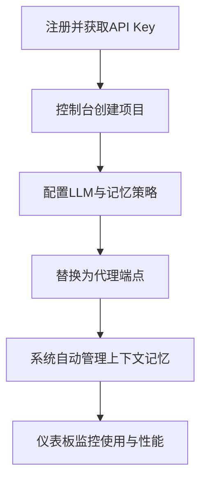
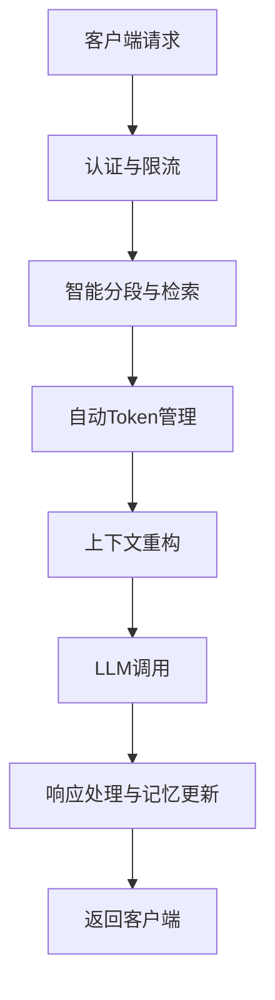
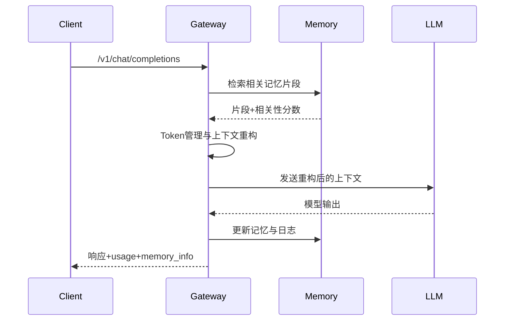

# Onememory 功能需求文档

## 1. 文档目标
- 明确系统范围、角色、核心功能与验收标准，指导前后端协同实现。
- 结合现有前端页面与技术文档，形成可落地的需求说明与流程图。
- 对齐 API、数据模型与非功能性要求，支持后续迭代与测试。

## 2. 系统范围与角色
- 前端控制台：项目管理、代理配置、记忆管理、分段配置、Token 管理、分析仪表板、API 文档与测试、系统设置。
- API 层：透明代理、记忆管理、分段配置、Token 管理、项目管理。
- 数据层：用户、项目、会话、消息、记忆块、分段配置、Token 配置、使用日志、API 密钥。
- 角色：
  - 开发者：创建项目、配置代理与记忆、查看统计、管理 API Key。
  - 企业用户：协作、私有部署、权限与合规管理。

## 3. 业务流程

### 3.1 开发者集成流程

- 目标：开发者无需重写业务代码即可获得持久化记忆能力。
- 验收：完成端点替换后，API 文档页测试成功，仪表板显示统计。

### 3.2 请求处理流程

- 要求：
  - 认证：基于 `API Key` 校验与权限控制。
  - 限流：按 `user_id/project_id/key_hash` 维度限制速率。
  - 分段与检索：语义/段落/固定/滑窗/混合策略；向量化后检索相关片段。
  - Token 管理：计数、压缩/摘要/截断、上下文窗口重构。

### 3.3 记忆检索与上下文融合（序列图）

## 4. 页面功能需求

### 4.1 项目管理（/projects）
- 列表与搜索：按名称/状态/时间过滤；分页与空态展示。
- 操作按钮：
  - 查看：弹窗显示项目详情、配置预览、最近调用。
  - 编辑：名称、描述、状态；保存后列表即时更新。
  - 删除：二次确认；成功后从列表移除。
  - 更多：状态切换（active/paused）、复制项目（拷贝配置与名称后缀）。
- 创建项目：弹窗表单（名称、描述、初始模型与记忆参数）。
- 验收：按钮可点击、弹窗交互完整、状态与列表一致更新。

### 4.2 代理配置（/proxy-config）
- 模型选择与参数：provider、model、温度、回退策略。
- 记忆策略：启用开关、记忆深度、相关性阈值、权重配置。
- 保存与预览：保存成功反馈；示例请求/响应预览模块。

### 4.3 记忆管理（/memory）
- 对话历史：时间线视图、搜索过滤、分页。
- 数据管理：清理过期记忆、备份/导出、保留期限设置。
- 检索工具：输入查询，返回片段与评分，支持排序与拷贝。

### 4.4 分段配置（/segmentation-config）
- 参数：最大分段、重叠、策略（语义/段落/固定/滑窗/混合）。
- 嵌入：模型选择、维度与归一化。
- 阈值与权重：语义/时间/重要性/位置权重。
- 测试工具：文本→分段预览→向量化与检索→性能指标。

### 4.5 Token 管理（/token-management）
- 使用统计：输入/输出/记忆 Token、压缩比例、趋势。
- 优化配置：压缩策略、截断规则、预留 Token、自动优化开关。
- 成本分析与建议：基于使用日志输出优化建议与预算预估。

### 4.6 分析仪表板（/analytics）
- 性能：响应时间趋势、检索效率、命中率、异常分布。
- 成本：Token 成本、优化建议、使用预测。

### 4.7 API 文档与测试（/api-docs）
- ApiClient 抽象：支持 `useMock` 一键切换。
- 配置：`API Base URL`、`API Key`（`Bearer sk-xxxx...`），持久化到 `localStorage`。
- 测试端点：`chat-completion`、`memory-search`、`memory-create`、`projects-list`。
- 反馈：请求/响应展示、错误提示、超时控制。

### 4.8 系统设置（/settings）
- 账户与安全：基础资料、API Key 管理入口。
- 主题与外观：深色/浅色切换。
- 全局参数：默认 Base URL、全局代理参数。

## 5. API 需求
- 透明代理：`POST /v1/chat/completions`（model、messages、temperature、max_tokens、stream、memory_config）。
- 记忆管理：`GET /v1/memory/conversations`、`POST /v1/memory/clear`、`PUT /v1/memory/update`、`GET /v1/memory/search`、`POST /v1/memory/retrieve`。
- 分段配置：`GET/PUT /v1/segmentation/config`、`POST /v1/segmentation/test`、`GET /v1/segmentation/performance`。
- Token 管理：`GET /v1/token/usage`、`GET /v1/token/statistics`、`PUT /v1/token/config`、`POST /v1/token/optimize`。
- 项目管理：`GET/POST /v1/projects`、`PUT/DELETE /v1/projects/{id}`，支持筛选与分页。

## 6. 数据模型（摘要）
- USER：id、email、plan、created_at。
- PROJECT：id、user_id、name、description、config、status。
- CONVERSATION：id、project_id、session_id、metadata。
- MESSAGE：id、conversation_id、role、content、token_count。
- MEMORY_CHUNK：id、message_id、content、embedding、relevance_score、chunk_type。
- SEGMENTATION_CONFIG：分段与嵌入参数、阈值与权重。
- TOKEN_CONFIG：上下文窗口、预留 Token、压缩配置、权重与自动优化。
- USAGE_LOG/TOKEN_USAGE_LOG：使用记录、成本与审计。
- API_KEY：id、project_id、key_hash、permissions、expires_at。

## 7. 安全、性能与监控
- 安全：API Key 校验、权限（读/写/管理）、速率限制、数据合规与审计。
- 性能：响应时间与检索命中率监控、Redis 多层缓存、异步队列（Bull）。
- 可观测：Prometheus+Grafana；报警与阈值配置。

## 8. 验收标准
- 项目管理页：查看/编辑/删除/更多操作正常，弹窗完整，状态一致更新。
- API 文档页：Mock/Real 切换即时生效，配置持久化；端点测试通过。
- 配置与管理页：参数保存/读取一致，测试工具可运行，指标显示正确。
- 后端 API：所有 v1 端点可用；认证/限流/错误处理符合规范；日志可追踪。

## 9. 里程碑
- M0：控制台框架、项目管理与 API 测试可用、Mock/Real 切换。
- M1：透明代理与记忆管理初版、分段配置与测试工具上线。
- M2：Token 管理与优化策略、分析仪表板与监控接入。
- M3：企业权限、私有部署支持、性能优化与压测。