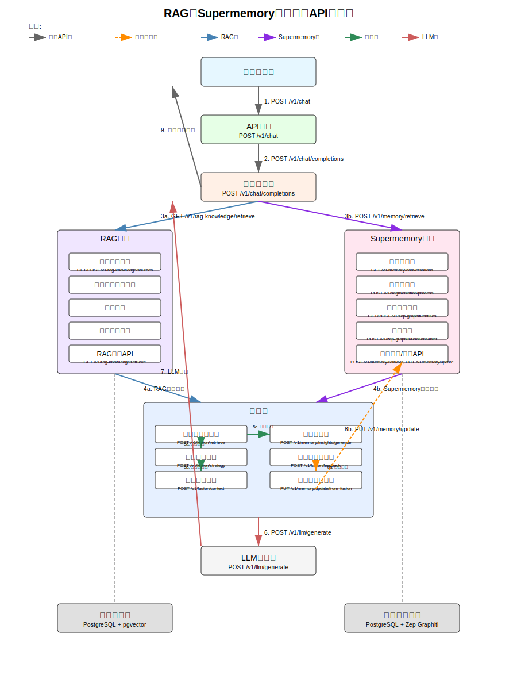
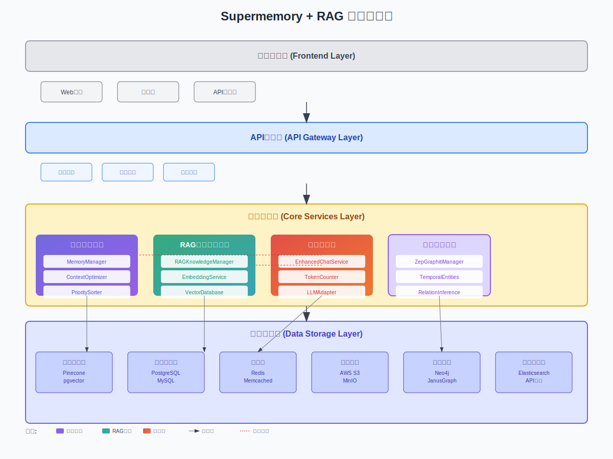
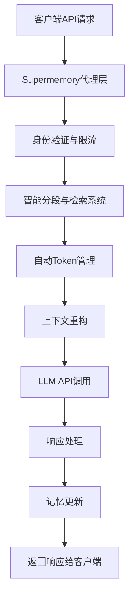
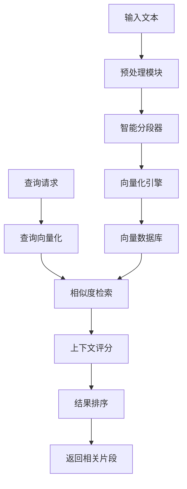
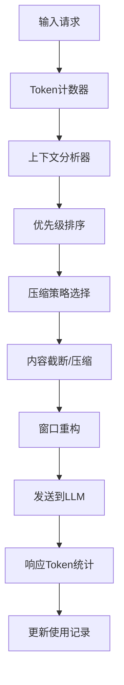
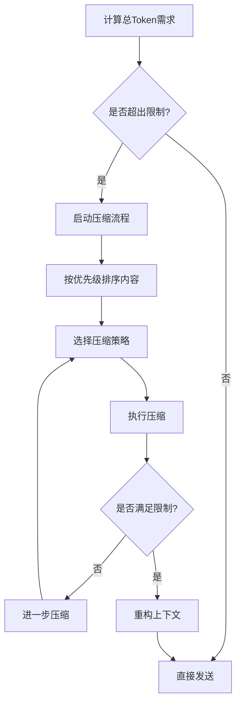

# Onememory 技术实现方案

## 1. 产品概述

Onememory 是一个突破性的AI记忆增强系统，通过透明代理机制为大语言模型提供无限记忆能力。系统解决了传统LLM上下文窗口限制问题，使AI应用能够维持长期对话记忆和深度理解能力。

- **核心价值**：为现有AI应用提供持久化记忆能力，无需重写代码
- **目标用户**：AI应用开发者、企业级AI解决方案提供商
- **技术优势**：透明集成、智能检索、自动优化

## 2. 核心功能

### 2.1 用户角色

| 角色 | 注册方式 | 核心权限 |
|------|----------|----------|
| 开发者 | API Key申请 | 可创建项目、配置代理、查看使用统计 |
| 企业用户 | 商务合作 | 可使用高级功能、私有部署、定制化服务 |

### 2.2 功能模块

系统包含以下核心页面：
1. **管理控制台**：项目管理、API配置、使用监控
2. **代理配置页**：LLM模型选择、记忆策略配置
3. **记忆管理页**：对话历史查看、记忆数据管理
4. **分析仪表板**：性能分析、成本统计、优化建议
5. **智能分段配置页**：分段策略设置、检索参数调优
6. **Token管理页**：使用量监控、优化策略配置

### 2.3 页面详情

| 页面名称 | 模块名称 | 功能描述 |
|----------|----------|----------|
| 管理控制台 | 项目管理 | 创建、编辑、删除AI项目；生成API密钥；设置访问权限 |
| 管理控制台 | 使用监控 | 实时监控API调用量、Token使用情况、响应时间统计 |
| 代理配置页 | 模型配置 | 选择底层LLM模型；设置模型参数；配置回退策略 |
| 代理配置页 | 记忆策略 | 配置记忆保留策略；设置检索算法参数；定义上下文优先级 |
| 记忆管理页 | 对话历史 | 查看完整对话记录；搜索特定对话内容；导出对话数据 |
| 记忆管理页 | 数据管理 | 清理过期记忆；备份重要对话；设置数据保留期限 |
| 智能分段配置页 | 分段策略 | 设置文本分段算法；配置向量化模型；调整相似度阈值 |
| 智能分段配置页 | 检索优化 | 配置检索排序权重；设置上下文窗口大小；优化检索性能 |
| Token管理页 | 使用监控 | 实时Token消耗统计；成本分析；使用趋势预测 |
| Token管理页 | 优化配置 | 设置压缩策略；配置截断规则；调整优先级算法 |
| 分析仪表板 | 性能分析 | 分析响应时间趋势；监控记忆检索效率；识别性能瓶颈 |
| 分析仪表板 | 成本优化 | 统计Token使用成本；提供优化建议；预测使用趋势 |

## 3. 核心流程

### 3.1 开发者集成流程
1. 开发者注册账户并获取API密钥
2. 在控制台创建新项目并配置LLM模型
3. 将原有API端点替换为Supermemory代理端点
4. 系统自动开始记录和管理对话上下文
5. 通过仪表板监控使用情况和性能

### 3.2 API请求处理流程


### 3.3 记忆心智模型处理流程



## 7. 记忆系统与心智模型

### 7.1 设计目标与原则
- 连通性：记忆以图结构组织，节点与边体现实体、概念、事实、观点之间的丰富关系。
- 时间性：记忆具备时间戳与演化轨迹，支持新近性与历史累积的平衡。
- 抽象性：从具体对话与文档抽象出“概念”与“模式”，形成更高层级的心智模型。
- 可解释性：每条记忆与关系都具备来源、置信度、权重与演化记录，可审计可追溯。
- 可控性：支持策略化的保留、合并、冲突解决与重要性调优，保证对业务目标的可控服务。

### 7.2 数据模型（知识图谱）

#### 7.2.1 节点类型
- MemoryNode：对话轮次片段、文档片段或结构化事实。
- Entity：具名实体（人、组织、产品、功能模块、技术名词等）。
- Concept：抽象概念或主题（如“记忆巩固”“关系推理”）。
- Insight：由系统生成的观察、规律、建议、趋势或异常。
- ConversationTurn：具体对话轮次，关联上下文、说话人与时间。

示例：
```json
{
  "id": "node_123",
  "type": "MemoryNode",
  "text": "用户希望代理层自动保存长期记忆",
  "embedding": [0.12, -0.04, ...],
  "attributes": {"source": "chat", "importance": 0.8},
  "timestamps": {"created_at": "2025-10-22T12:00:00Z"},
  "provenance": {"project_id": "proj_1", "turn_id": "turn_45"}
}
```

#### 7.2.2 边类型
- relates_to：语义相关或主题关联。
- supports：证据支持某个结论或观点。
- contradicts：与某结论矛盾，需冲突解决。
- causes / precedes：因果与时间先后关系。
- part_of：组成关系（片段属于文档/主题）。
- derived_from：由某节点推导得到（如Insight来源）。

示例：
```json
{
  "source": "node_123",
  "target": "concept_memory_consolidation",
  "type": "relates_to",
  "weight": 0.72,
  "confidence": 0.85,
  "created_at": "2025-10-22T12:00:00Z"
}
```

### 7.3 演化机制
- 时间衰减：对节点与边应用指数衰减函数 `decay = exp(-λ * Δt)`，防止旧记忆无限占优。
- 强化学习：基于被引用频次、检索命中、用户反馈，提高重要性与权重。
- 巩固合并：聚类相近节点，合并为更稳定的“概念”或“主题”，保留谱系关系。
- 泛化抽象：从具体事实上升到模式与规则，形成心智模型层级。
- 冲突解决：对 `supports` 与 `contradicts` 进行置信度加权，输出可解释结论与不确定性范围。

### 7.4 检索与推理（混合检索）
- 向量检索：基于嵌入召回高语义相似候选。
- 图遍历：基于主题、关系类型与个性化权重进行路径搜索（BFS/个性化PageRank）。
- 路径评分：综合 `relevance`、`recency`、`importance`、`diversity` 与关系类型权重。
- 上下文组装：沿最优路径收集片段、概念与洞察，构建高质量可控上下文。

流程：
```
1) query 向量化，初始候选 via ANN
2) 在图上以候选为种子进行多跳扩展（限制半径与关系类型）
3) 对路径进行评分与去冗余，确保信息覆盖与多样性
4) 依据Token预算进行裁剪与摘要，生成最终上下文
```

### 7.5 洞察生成
- 规则引擎 + LLM 结合：对模式、趋势、异常进行解释与建议输出。
- 结果结构化：Insight 节点包含来源、影响范围、建议动作与置信度。
- 缓存与版本：重要洞察进行版本化与生命周期管理，支持回溯与撤销。

### 7.6 API 扩展
```
GET  /v1/memory/graph/nodes?query=...
POST /v1/memory/graph/nodes
POST /v1/memory/graph/edges
POST /v1/memory/graph/link           # 自动实体链接与关系识别
GET  /v1/memory/graph/traverse        # 按条件遍历/路径查询
POST /v1/memory/insights/generate     # 生成洞察
GET  /v1/memory/insights              # 查询洞察
POST /v1/memory/learn                 # 强化/反馈更新权重
```

### 7.7 摄取管道实现（伪代码）
```pseudo
function ingest(event):
  text = normalize(event)
  entities = extract_entities(text)
  concepts = detect_concepts(text)
  links = link_relations(entities, concepts, text)
  upsert_nodes_and_edges(entities, concepts, links)
  consolidate_and_evolve()
  insights = generate_insights_if_needed()
  cache_and_index(insights)
```

### 7.8 LLM上下文组装器
```
输入：query、候选节点集、Token预算
输出：上下文块（含原文、摘要、元信息、来源引用）
过程：
- 路径选择：按综合评分选取若干最优路径
- 信息抽取：提取片段与概念说明，保留关键关系
- 预算裁剪：基于优先级进行压缩与摘要，保证关键证据完整性
- 可解释性：附加来源、权重与演化说明，便于审计


### 3.3 记忆心智模型处理流程
```mermaid
graph TD
    A[输入事件/对话] --> B[代理层接入]
    B --> C[记忆摄取管道]
    C --> D[实体/概念抽取]
    D --> E[关系识别与链接]
    E --> F[知识图谱更新]
    F --> G[演化与巩固]
    G --> H[洞察生成]

    Q[查询/对话请求] --> R[混合检索(向量+图)]
    R --> S[路径推理与评分]
    S --> T[上下文组装器]
    T --> U[LLM调用]
    U --> V[反馈与权重学习]
    V --> G
```

## 4. 智能分段与检索系统

### 4.1 系统架构
智能分段与检索系统是Supermemory的核心组件，负责将长文本智能分段、向量化存储，并根据查询需求快速检索相关内容。



### 4.2 文本分段算法

#### 4.2.1 多层级分段策略
- **语义分段**：基于句子语义边界进行分段
- **段落分段**：按自然段落结构分割
- **固定长度分段**：按Token数量固定分割
- **滑动窗口分段**：重叠分段确保上下文连续性

#### 4.2.2 分段算法实现
```
算法：智能文本分段
输入：原始文本 text，最大分段长度 max_length，重叠长度 overlap
输出：分段列表 segments

1. 预处理文本（去除多余空格、标准化格式）
2. 识别语义边界（句号、段落、标题等）
3. 按优先级进行分段：
   a. 优先在语义边界处分段
   b. 如果语义块过长，按句子边界分段
   c. 如果句子过长，按固定长度分段
4. 添加重叠内容确保上下文连续性
5. 为每个分段生成元数据（位置、类型、重要性）
```

### 4.3 向量化嵌入处理

#### 4.3.1 嵌入模型选择
- **主模型**：text-embedding-ada-002 (OpenAI)
- **备用模型**：sentence-transformers/all-MiniLM-L6-v2
- **多语言支持**：multilingual-e5-large

#### 4.3.2 向量化流程


### 4.4 相似度检索机制

#### 4.4.1 检索算法
- **余弦相似度**：计算查询向量与存储向量的余弦相似度
- **欧几里得距离**：计算向量间的欧几里得距离
- **混合检索**：结合语义相似度和关键词匹配

#### 4.4.2 检索优化策略
```
检索流程：
1. 查询向量化
2. 粗筛：使用近似最近邻算法(ANN)快速筛选候选
3. 精排：计算精确相似度分数
4. 上下文评分：考虑时间衰减、重要性权重
5. 结果合并：去重并按相关性排序
```

### 4.5 上下文相关性评分

#### 4.5.1 评分算法
```
相关性分数 = α × 语义相似度 + β × 时间权重 + γ × 重要性权重 + δ × 位置权重

其中：
- α, β, γ, δ 为可配置权重参数
- 语义相似度：向量余弦相似度 [0,1]
- 时间权重：exp(-λ × 时间间隔) 时间衰减函数
- 重要性权重：基于用户交互、关键词密度等
- 位置权重：在对话中的位置重要性
```

#### 4.5.2 动态权重调整
- **学习用户偏好**：根据用户反馈调整权重
- **上下文适应**：根据对话类型动态调整
- **性能优化**：根据检索效果自动调优

## 5. 自动Token管理系统

### 5.1 Token管理架构


### 5.2 Token计数和预估算法

#### 5.2.1 精确计数方法
```
Token计数算法：
1. 使用对应模型的tokenizer进行精确计数
2. 缓存常用文本的token数量
3. 预估新内容的token消耗
4. 考虑不同语言的token密度差异
```

#### 5.2.2 预估策略
- **字符比例法**：中文约0.7token/字符，英文约0.25token/字符
- **历史统计法**：基于历史数据建立预估模型
- **实时校准**：动态调整预估参数

### 5.3 上下文窗口动态管理

#### 5.3.1 窗口分配策略
```
上下文窗口分配：
- 系统提示词：10-15% (固定保留)
- 历史对话：40-60% (动态调整)
- 当前查询：15-25% (必须保留)
- 检索内容：20-35% (智能筛选)
- 响应预留：5-10% (确保完整输出)
```

#### 5.3.2 动态调整机制


### 5.4 内容压缩和摘要策略

#### 5.4.1 压缩算法层次
1. **无损压缩**：去除冗余空格、重复内容
2. **语义压缩**：提取关键信息，去除次要细节
3. **摘要压缩**：使用摘要模型生成简化版本
4. **截断压缩**：按重要性截断低优先级内容

#### 5.4.2 智能摘要生成
```
摘要策略：
- 抽取式摘要：选择重要句子组成摘要
- 生成式摘要：使用小型语言模型生成摘要
- 结构化摘要：保留关键实体和关系
- 渐进式摘要：多层次摘要，按需展开
```

### 5.5 优先级排序机制

#### 5.5.1 内容优先级评分
```
优先级分数 = w1×时间新近度 + w2×相关性 + w3×重要性 + w4×用户偏好

评分维度：
- 时间新近度：最近的对话内容优先级更高
- 相关性：与当前查询相关的内容优先级更高
- 重要性：包含关键信息的内容优先级更高
- 用户偏好：用户关注的话题优先级更高
```

#### 5.5.2 动态优先级调整
- **实时学习**：根据用户交互调整优先级
- **上下文感知**：根据对话主题调整权重
- **反馈优化**：根据模型输出质量调整策略

### 5.6 自动截断和补充逻辑

#### 5.6.1 智能截断策略
```
截断决策流程：
1. 识别内容边界（句子、段落、对话轮次）
2. 计算截断后的信息损失
3. 选择信息损失最小的截断点
4. 保留关键上下文连接词
5. 添加截断标记和摘要信息
```

#### 5.6.2 内容补充机制
- **渐进式加载**：根据需要逐步加载更多上下文
- **相关性补充**：检索相关的历史内容进行补充
- **用户主动补充**：允许用户手动添加重要上下文

## 6. 用户界面设计

### 6.1 设计风格
- **主色调**：深蓝色 (#1E3A8A) 和浅蓝色 (#3B82F6)
- **辅助色**：灰色系 (#6B7280, #F3F4F6) 和绿色 (#10B981)
- **按钮样式**：圆角矩形，渐变背景，悬停效果
- **字体**：Inter, -apple-system, 主要字号 14px-16px
- **布局风格**：卡片式设计，左侧导航，响应式布局
- **图标风格**：线性图标，统一的视觉语言

### 6.2 页面设计概览

| 页面名称 | 模块名称 | UI元素 |
|----------|----------|---------|
| 管理控制台 | 项目管理 | 卡片式项目列表，创建按钮，搜索框，状态指示器 |
| 管理控制台 | 使用监控 | 实时图表，数据卡片，时间选择器，导出按钮 |
| 代理配置页 | 模型配置 | 下拉选择器，参数滑块，预设模板，保存按钮 |
| 记忆管理页 | 对话历史 | 时间线视图，搜索过滤器，分页组件，详情弹窗 |
| 智能分段配置页 | 参数调优 | 滑块控件，实时预览，性能指标，测试工具 |
| Token管理页 | 使用统计 | 环形图表，趋势线图，成本计算器，优化建议 |

### 6.3 响应式设计
- **桌面优先**：主要面向开发者的桌面端使用
- **移动适配**：支持平板和手机端的基本功能访问
- **触控优化**：按钮和交互元素适配触控操作