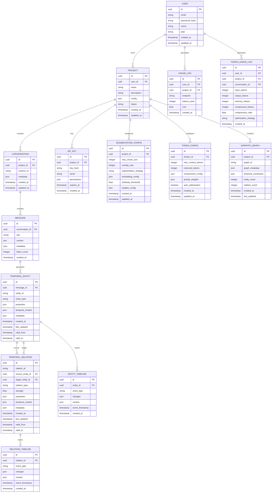

# Supermemory 技术架构设计

## 1. 架构设计

## 6. 心智模型与知识图谱设计

### 6.1 目标与作用

* 模拟人类记忆：形成连接、随时间演化、从积累中产生洞察。

* 服务上下文构建：为LLM提供可解释、可控、可追溯的高质量上下文。

* 支撑分析与优化：通过洞察节点输出性能优化、模式识别与策略建议。

### 6.2 组件与职责

* 知识图谱存储（KG）：持久化节点与边，记录权重、置信度、时间戳与来源。

* 关系引擎（RE）：实体链接、关系识别、路径筛选与合并。

* 演化引擎（EE）：时间衰减、强化、巩固、泛化与冲突解决。

* 洞察生成器（IS）：规则与LLM结合，生成结构化洞察（趋势、异常、建议）。

* 上下文组装器（CA）：沿高分路径抽取片段与概念，按Token预算组装上下文。

### 6.3 数据存储选型

* PostgreSQL + pgvector：向量索引与相似度检索，复用现有数据层。

* 图结构实现：使用邻接表（edges表）与必要索引实现图遍历；可选接入Neo4j/JanusGraph用于大规模图。

* 缓存：Redis用于热节点与路径结果缓存，提升检索与推理性能。

### 6.4 数据模型

* 节点（nodes）：`id, type, text/attrs, embedding, importance, confidence, created_at, updated_at, provenance`

* 边（edges）：`source, target, type, weight, confidence, created_at, updated_at`

* 类型：`MemoryNode, Entity, Concept, Insight, ConversationTurn`

* 关系：`relates_to, supports, contradicts, causes, precedes, part_of, derived_from`

### 6.5 摄取与演化流程


### 6.6 混合检索与路径推理


路径评分维度：`relevance, recency, importance, diversity, relation_type_weights`

### 6.7 API 扩展

* `GET  /v1/memory/graph/nodes?query=...`

* `POST /v1/memory/graph/nodes`

* `POST /v1/memory/graph/edges`

* `POST /v1/memory/graph/link`（自动实体链接与关系识别）

* `GET  /v1/memory/graph/traverse`（按条件遍历/路径查询）

* `POST /v1/memory/insights/generate`

* `GET  /v1/memory/insights`

* `POST /v1/memory/learn`（强化/反馈更新权重）

### 6.8 策略与治理

* 权重与阈值：按项目/用户定制关系类型权重与重要性阈值。

* 生命周期：旧节点衰减与归档、重要节点巩固与版本化。

* 审计与可解释：保留来源、演化记录与评分细节，支撑合规与复盘。


## 2. 技术描述

* **前端**: React@18 + TypeScript + Tailwind CSS + Vite

* **后端**: Node.js + Express@4 + TypeScript

* **数据库**: PostgreSQL + Redis

* **时序知识图谱**: Zep Graphiti Engine + Zep Cloud Service

* **嵌入服务**: Zep内置嵌入服务 + OpenAI text-embedding-3-small (备用)

* **消息队列**: Redis + Bull Queue

* **缓存系统**: Redis (多层缓存策略)

* **监控**: Prometheus + Grafana + Zep Analytics

* **部署**: Docker + Kubernetes

## 3. 路由定义

| 路由                   | 用途                     |
| -------------------- | ---------------------- |
| /dashboard           | 管理控制台主页，显示项目概览和使用统计    |
| /projects            | 项目管理页面，创建和配置AI项目       |
| /proxy-config        | 代理配置页面，设置LLM模型和记忆策略    |
| /memory              | 记忆管理页面，查看和管理对话历史       |
| /knowledge-graph     | Zep时序知识图谱可视化页面，实体和关系管理 |
| /temporal-entities   | 时序实体管理页面，实体时间线和演化追踪   |
| /relation-inference  | 动态关系推理页面，关系发现和强度分析    |
| /memory-synthesis    | 跨会话记忆合成页面，记忆整合和优化     |
| /segmentation-config | 智能分段配置页面，设置分段策略和检索参数   |
| /token-management    | Token管理页面，监控使用量和优化策略配置 |
| /analytics           | 分析仪表板，性能和成本分析          |
| /settings            | 系统设置页面，账户和安全配置         |
| /api-docs            | API文档页面，开发者集成指南        |

## 4. API定义

### 4.1 核心代理API

**透明代理接口**

```

POST /v1/chat/completions

````

请求参数:

| 参数名            | 参数类型    | 是否必需  | 描述                              |
| -------------- | ------- | ----- | ------------------------------- |
| model          | string  | true  | LLM模型名称 (gpt-4, claude-3, etc.) |
| messages       | array   | true  | 对话消息数组                          |
| temperature    | number  | false | 生成温度 (0-2)                      |
| max\_tokens    | number  | false | 最大token数                        |
| stream         | boolean | false | 是否流式响应                          |
| memory\_config | object  | false | 记忆配置参数                          |

响应:

| 参数名          | 参数类型   | 描述        |
| ------------ | ------ | --------- |
| id           | string | 请求唯一标识    |
| object       | string | 响应对象类型    |
| created      | number | 创建时间戳     |
| model        | string | 使用的模型     |
| choices      | array  | 生成的回复选项   |
| usage        | object | Token使用统计 |
| memory\_info | object | 记忆处理信息    |

示例请求:

```json
{
  "model": "gpt-4",
  "messages": [
    {"role": "user", "content": "你好，我想了解AI的发展历史"}
  ],
  "temperature": 0.7,
  "memory_config": {
    "enable_memory": true,
    "memory_depth": 10,
    "relevance_threshold": 0.8
  }
}
````

**记忆管理API**

```
GET /v1/memory/conversations
POST /v1/memory/clear
PUT /v1/memory/update
GET /v1/memory/search
POST /v1/memory/retrieve
```

**智能分段配置API**

```
GET /v1/segmentation/config
PUT /v1/segmentation/config
POST /v1/segmentation/test
GET /v1/segmentation/performance
```

**Token管理API**

```
GET /v1/token/usage
GET /v1/token/statistics
PUT /v1/token/config
POST /v1/token/optimize
```

**项目管理API**

```
GET /v1/projects
POST /v1/projects
PUT /v1/projects/{id}
DELETE /v1/projects/{id}
```

**Zep Graphiti时序知识图谱API**

```
GET /v1/zep-graphiti/entities
POST /v1/zep-graphiti/entities
GET /v1/zep-graphiti/entities/{entityId}/timeline
GET /v1/zep-graphiti/relations
POST /v1/zep-graphiti/relations/infer
GET /v1/zep-graphiti/graph/traverse
POST /v1/zep-graphiti/memories/synthesize
POST /v1/zep-graphiti/deduplication
GET /v1/zep-graphiti/optimization/suggestions
GET /v1/zep-graphiti/health
```

## 5. 服务器架构图


## 6. 数据模型

### 6.1 数据模型定义



### 6.2 数据定义语言

**用户表 (users)**

```sql
-- 创建用户表
CREATE TABLE users (
    id UUID PRIMARY KEY DEFAULT gen_random_uuid(),
    email VARCHAR(255) UNIQUE NOT NULL,
    password_hash VARCHAR(255) NOT NULL,
    name VARCHAR(100) NOT NULL,
    plan VARCHAR(20) DEFAULT 'free' CHECK (plan IN ('free', 'pro', 'enterprise')),
    created_at TIMESTAMP WITH TIME ZONE DEFAULT NOW(),
    updated_at TIMESTAMP WITH TIME ZONE DEFAULT NOW()
);

-- 创建索引
CREATE INDEX idx_users_email ON users(email);
CREATE INDEX idx_users_plan ON users(plan);
```

**项目表 (projects)**

```sql
-- 创建项目表
CREATE TABLE projects (
    id UUID PRIMARY KEY DEFAULT gen_random_uuid(),
    user_id UUID NOT NULL REFERENCES users(id) ON DELETE CASCADE,
    name VARCHAR(100) NOT NULL,
    description TEXT,
    config JSONB DEFAULT '{}',
    status VARCHAR(20) DEFAULT 'active' CHECK (status IN ('active', 'paused', 'deleted')),
    created_at TIMESTAMP WITH TIME ZONE DEFAULT NOW(),
    updated_at TIMESTAMP WITH TIME ZONE DEFAULT NOW()
);

-- 创建索引
CREATE INDEX idx_projects_user_id ON projects(user_id);
CREATE INDEX idx_projects_status ON projects(status);
```

**对话表 (conversations)**

```sql
-- 创建对话表
CREATE TABLE conversations (
    id UUID PRIMARY KEY DEFAULT gen_random_uuid(),
    project_id UUID NOT NULL REFERENCES projects(id) ON DELETE CASCADE,
    session_id VARCHAR(255) NOT NULL,
    metadata JSONB DEFAULT '{}',
    created_at TIMESTAMP WITH TIME ZONE DEFAULT NOW(),
    updated_at TIMESTAMP WITH TIME ZONE DEFAULT NOW()
);

-- 创建索引
CREATE INDEX idx_conversations_project_id ON conversations(project_id);
CREATE INDEX idx_conversations_session_id ON conversations(session_id);
CREATE INDEX idx_conversations_created_at ON conversations(created_at DESC);
```

**消息表 (messages)**

```sql
-- 创建消息表
CREATE TABLE messages (
    id UUID PRIMARY KEY DEFAULT gen_random_uuid(),
    conversation_id UUID NOT NULL REFERENCES conversations(id) ON DELETE CASCADE,
    role VARCHAR(20) NOT NULL CHECK (role IN ('user', 'assistant', 'system')),
    content TEXT NOT NULL,
    metadata JSONB DEFAULT '{}',
    token_count INTEGER DEFAULT 0,
    created_at TIMESTAMP WITH TIME ZONE DEFAULT NOW()
);

-- 创建索引
CREATE INDEX idx_messages_conversation_id ON messages(conversation_id);
CREATE INDEX idx_messages_created_at ON messages(created_at DESC);
CREATE INDEX idx_messages_token_count ON messages(token_count);
```

**记忆块表 (memory\_chunks)**

```sql
-- 创建记忆块表
CREATE TABLE memory_chunks (
    id UUID PRIMARY KEY DEFAULT gen_random_uuid(),
    message_id UUID NOT NULL REFERENCES messages(id) ON DELETE CASCADE,
    content TEXT NOT NULL,
    embedding VECTOR(1536), -- 使用pgvector扩展
    relevance_score FLOAT DEFAULT 0.0,
    chunk_type VARCHAR(50) DEFAULT 'semantic' CHECK (chunk_type IN ('semantic', 'paragraph', 'fixed', 'sliding')),
    chunk_index INTEGER DEFAULT 0,
    metadata JSONB DEFAULT '{}',
    created_at TIMESTAMP WITH TIME ZONE DEFAULT NOW()
);

-- 创建向量索引
CREATE INDEX idx_memory_chunks_embedding ON memory_chunks USING ivfflat (embedding vector_cosine_ops);
CREATE INDEX idx_memory_chunks_message_id ON memory_chunks(message_id);
CREATE INDEX idx_memory_chunks_relevance_score ON memory_chunks(relevance_score DESC);
CREATE INDEX idx_memory_chunks_chunk_type ON memory_chunks(chunk_type);
CREATE INDEX idx_memory_chunks_chunk_index ON memory_chunks(chunk_index);
```

**分段配置表 (segmentation\_configs)**

```sql
-- 创建分段配置表
CREATE TABLE segmentation_configs (
    id UUID PRIMARY KEY DEFAULT gen_random_uuid(),
    project_id UUID NOT NULL REFERENCES projects(id) ON DELETE CASCADE,
    max_chunk_size INTEGER DEFAULT 512,
    overlap_size INTEGER DEFAULT 50,
    segmentation_strategy VARCHAR(50) DEFAULT 'semantic' CHECK (segmentation_strategy IN ('semantic', 'paragraph', 'fixed', 'sliding', 'hybrid')),
    embedding_config JSONB DEFAULT '{"model": "text-embedding-3-small", "dimensions": 1536}',
    similarity_threshold FLOAT DEFAULT 0.7,
    weights_config JSONB DEFAULT '{"semantic": 0.4, "temporal": 0.3, "importance": 0.2, "position": 0.1}',
    created_at TIMESTAMP WITH TIME ZONE DEFAULT NOW(),
    updated_at TIMESTAMP WITH TIME ZONE DEFAULT NOW()
);

-- 创建索引
CREATE INDEX idx_segmentation_configs_project_id ON segmentation_configs(project_id);
CREATE UNIQUE INDEX idx_segmentation_configs_project_unique ON segmentation_configs(project_id);
```

**Token配置表 (token\_configs)**

```sql
-- 创建Token配置表
CREATE TABLE token_configs (
    id UUID PRIMARY KEY DEFAULT gen_random_uuid(),
    project_id UUID NOT NULL REFERENCES projects(id) ON DELETE CASCADE,
    max_context_tokens INTEGER DEFAULT 4096,
    reserved_tokens INTEGER DEFAULT 1000,
    compression_config JSONB DEFAULT '{"enable_compression": true, "compression_ratio": 0.7, "summary_model": "gpt-3.5-turbo"}',
    priority_weights JSONB DEFAULT '{"temporal": 0.3, "relevance": 0.4, "importance": 0.2, "user_preference": 0.1}',
    auto_optimization BOOLEAN DEFAULT true,
    created_at TIMESTAMP WITH TIME ZONE DEFAULT NOW(),
    updated_at TIMESTAMP WITH TIME ZONE DEFAULT NOW()
);

-- 创建索引
CREATE INDEX idx_token_configs_project_id ON token_configs(project_id);
CREATE UNIQUE INDEX idx_token_configs_project_unique ON token_configs(project_id);
```

**Token使用日志表 (token\_usage\_logs)**

```sql
-- 创建Token使用日志表
CREATE TABLE token_usage_logs (
    id UUID PRIMARY KEY DEFAULT gen_random_uuid(),
    user_id UUID NOT NULL REFERENCES users(id) ON DELETE CASCADE,
    project_id UUID REFERENCES projects(id) ON DELETE SET NULL,
    conversation_id UUID REFERENCES conversations(id) ON DELETE SET NULL,
    input_tokens INTEGER DEFAULT 0,
    output_tokens INTEGER DEFAULT 0,
    memory_tokens INTEGER DEFAULT 0,
    compressed_tokens INTEGER DEFAULT 0,
    compression_ratio FLOAT DEFAULT 1.0,
    optimization_strategy VARCHAR(100),
    created_at TIMESTAMP WITH TIME ZONE DEFAULT NOW()
);

-- 创建索引
CREATE INDEX idx_token_usage_logs_user_id ON token_usage_logs(user_id);
CREATE INDEX idx_token_usage_logs_project_id ON token_usage_logs(project_id);
CREATE INDEX idx_token_usage_logs_conversation_id ON token_usage_logs(conversation_id);
CREATE INDEX idx_token_usage_logs_created_at ON token_usage_logs(created_at DESC);

-- 创建分区表（按月分区）
CREATE TABLE token_usage_logs_y2024m01 PARTITION OF token_usage_logs
FOR VALUES FROM ('2024-01-01') TO ('2024-02-01');
```

**API密钥表 (api\_keys)**

```sql
-- 创建API密钥表
CREATE TABLE api_keys (
    id UUID PRIMARY KEY DEFAULT gen_random_uuid(),
    project_id UUID NOT NULL REFERENCES projects(id) ON DELETE CASCADE,
    key_hash VARCHAR(255) NOT NULL UNIQUE,
    name VARCHAR(100) NOT NULL,
    permissions JSONB DEFAULT '{}',
    expires_at TIMESTAMP WITH TIME ZONE,
    created_at TIMESTAMP WITH TIME ZONE DEFAULT NOW()
);

-- 创建索引
CREATE INDEX idx_api_keys_project_id ON api_keys(project_id);
CREATE INDEX idx_api_keys_key_hash ON api_keys(key_hash);
```

**使用日志表 (usage\_logs)**

```sql
-- 创建使用日志表
CREATE TABLE usage_logs (
    id UUID PRIMARY KEY DEFAULT gen_random_uuid(),
    user_id UUID NOT NULL REFERENCES users(id) ON DELETE CASCADE,
    project_id UUID REFERENCES projects(id) ON DELETE SET NULL,
    endpoint VARCHAR(255) NOT NULL,
    tokens_used INTEGER DEFAULT 0,
    cost DECIMAL(10,6) DEFAULT 0.0,
    created_at TIMESTAMP WITH TIME ZONE DEFAULT NOW()
);

-- 创建索引
CREATE INDEX idx_usage_logs_user_id ON usage_logs(user_id);
CREATE INDEX idx_usage_logs_project_id ON usage_logs(project_id);
CREATE INDEX idx_usage_logs_created_at ON usage_logs(created_at DESC);

-- 创建分区表（按月分区）
CREATE TABLE usage_logs_y2024m01 PARTITION OF usage_logs
FOR VALUES FROM ('2024-01-01') TO ('2024-02-01');
```

**初始化数据**

```sql
-- 插入示例用户
INSERT INTO users (email, password_hash, name, plan) VALUES
('admin@supermemory.ai', '$2b$10$example_hash', 'Admin User', 'enterprise'),
('demo@example.com', '$2b$10$example_hash', 'Demo User', 'pro');

-- 插入示例项目
INSERT INTO projects (user_id, name, description, config) VALUES
((SELECT id FROM users WHERE email = 'demo@example.com'), 
 'Demo Chat Bot', 
 'A demonstration chatbot with memory capabilities',
 '{"model": "gpt-4", "memory_depth": 10, "temperature": 0.7}');

-- 插入默认分段配置
INSERT INTO segmentation_configs (project_id, max_chunk_size, overlap_size, segmentation_strategy, similarity_threshold) VALUES
((SELECT id FROM projects WHERE name = 'Demo Chat Bot'),
 512, 50, 'semantic', 0.7);

-- 插入默认Token配置
INSERT INTO token_configs (project_id, max_context_tokens, reserved_tokens, auto_optimization) VALUES
((SELECT id FROM projects WHERE name = 'Demo Chat Bot'),
 4096, 1000, true);

-- 插入示例API密钥
INSERT INTO api_keys (project_id, key_hash, name, permissions) VALUES
((SELECT id FROM projects WHERE name = 'Demo Chat Bot'),
 '$2b$10$demo_api_key_hash',
 'Demo API Key',
 '{"read": true, "write": true, "admin": false}');
```

