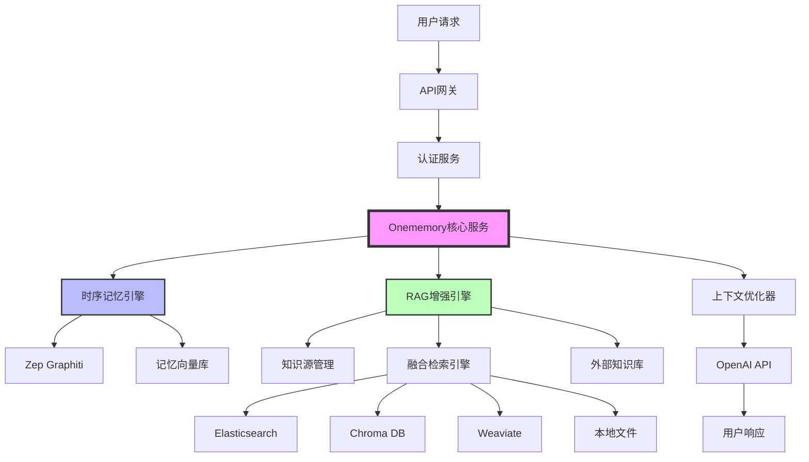
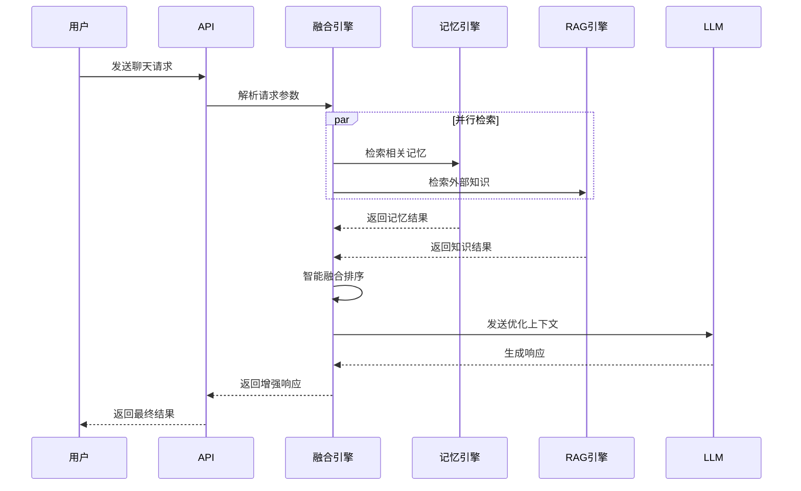
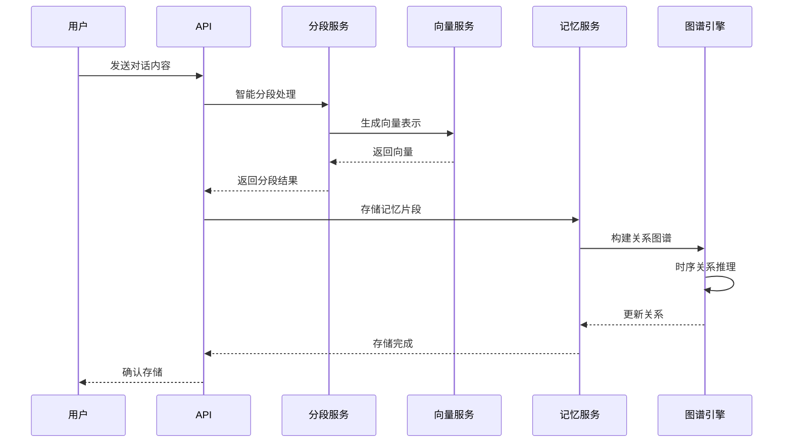

# ONEmemory 技术实现方案

## 1. 产品概述

Onememory 是一个基于时序记忆架构的智能记忆系统，通过RAG（Retrieval-Augmented Generation）技术增强，实现多源知识的智能融合检索。系统采用双引擎架构，将时序记忆与外部知识库无缝融合，为用户提供更加智能和个性化的交互体验。

## 2. 核心架构

### 2.1 系统架构图



### 2.2 核心组件

#### 2.2.1 时序记忆引擎
- **Zep Graphiti**: 基于图数据库的时序记忆管理
- **记忆向量库**: 存储对话历史和用户偏好
- **时序关系推理**: 分析记忆间的时间关联

#### 2.2.2 RAG增强引擎
- **知识源管理**: 统一管理外部知识库连接
- **融合检索引擎**: 智能融合记忆与外部知识
- **多源适配器**: 支持多种知识库类型

#### 2.2.3 上下文优化器
- **智能排序**: 基于相关性和时效性排序
- **Token优化**: 动态调整上下文长度
- **质量评估**: 评估检索结果质量

## 3. 核心功能流程

### 3.1 智能聊天流程



### 3.2 记忆存储流程



## 4. RAG增强功能

### 4.1 融合检索策略

Supermemory的RAG功能不是独立系统，而是深度集成到记忆检索中的增强模块：

#### 4.1.1 智能融合算法
```typescript
interface FusionStrategy {
  memoryWeight: number;      // 记忆权重 (0.6-0.8)
  ragWeight: number;         // RAG权重 (0.2-0.4)
  timeDecay: number;         // 时间衰减因子
  relevanceBoost: number;    // 相关性提升
}
```

#### 4.1.2 检索流程
1. **查询理解**: 分析用户意图和查询类型
2. **并行检索**: 同时搜索记忆库和外部知识库
3. **结果融合**: 基于权重和时效性智能融合
4. **质量评估**: 评估融合结果的相关性
5. **上下文优化**: 动态调整上下文长度和质量

### 4.2 知识源管理

#### 4.2.1 支持的源类型
- **Elasticsearch**: 企业文档和日志
- **Chroma DB**: 向量化的知识库
- **Weaviate**: 语义知识图谱
- **本地文件**: Markdown、PDF、TXT等
- **API接口**: 第三方知识服务

#### 4.2.2 配置管理
```typescript
interface KnowledgeSource {
  id: string;
  name: string;
  type: 'elasticsearch' | 'chroma' | 'weaviate' | 'local' | 'api';
  config: {
    endpoint: string;
    credentials: object;
    index?: string;
    collection?: string;
  };
  priority: number;      // 1-10，影响融合权重
  enabled: boolean;
  lastSync: Date;
}
```

## 5. 数据模型设计

### 5.1 核心实体

#### 5.1.1 记忆实体 (MemoryEntity)
```typescript
interface MemoryEntity {
  id: string;
  projectId: string;
  sessionId: string;
  content: string;
  embedding: number[];
  metadata: {
    timestamp: Date;
    importance: number;
    category: string;
    tags: string[];
  };
  relationships: Relationship[];
}
```

#### 5.1.2 知识片段 (KnowledgeChunk)
```typescript
interface KnowledgeChunk {
  id: string;
  sourceId: string;
  content: string;
  embedding: number[];
  metadata: {
    filePath?: string;
    section?: string;
    timestamp: Date;
    relevance: number;
  };
}
```

#### 5.1.3 融合结果 (FusedResult)
```typescript
interface FusedResult {
  id: string;
  type: 'memory' | 'knowledge';
  content: string;
  score: number;
  source: string;
  metadata: {
    originalScore: number;
    fusionWeight: number;
    timestamp: Date;
    confidence: number;
  };
}
```

### 5.2 数据库设计

#### 5.2.1 记忆表 (memories)
```sql
CREATE TABLE memories (
  id UUID PRIMARY KEY DEFAULT gen_random_uuid(),
  project_id VARCHAR(255) NOT NULL,
  session_id VARCHAR(255) NOT NULL,
  content TEXT NOT NULL,
  embedding vector(1536),
  metadata JSONB,
  created_at TIMESTAMP DEFAULT NOW(),
  updated_at TIMESTAMP DEFAULT NOW()
);

CREATE INDEX idx_memories_project ON memories(project_id);
CREATE INDEX idx_memories_session ON memories(session_id);
```

#### 5.2.2 知识源表 (knowledge_sources)
```sql
CREATE TABLE knowledge_sources (
  id UUID PRIMARY KEY DEFAULT gen_random_uuid(),
  name VARCHAR(255) NOT NULL,
  type VARCHAR(50) NOT NULL,
  config JSONB NOT NULL,
  priority INTEGER DEFAULT 5,
  enabled BOOLEAN DEFAULT true,
  last_sync TIMESTAMP,
  created_at TIMESTAMP DEFAULT NOW()
);
```

#### 5.2.3 融合日志表 (fusion_logs)
```sql
CREATE TABLE fusion_logs (
  id UUID PRIMARY KEY DEFAULT gen_random_uuid(),
  query TEXT NOT NULL,
  memory_results INTEGER,
  rag_results INTEGER,
  fused_results INTEGER,
  strategy VARCHAR(50),
  processing_time_ms INTEGER,
  created_at TIMESTAMP DEFAULT NOW()
);
```

## 6. API接口设计

### 6.1 聊天接口

#### 6.1.1 增强聊天
```http
POST /api/v1/chat/enhanced
Content-Type: application/json

{
  "messages": [
    {"role": "user", "content": "请帮我查找关于机器学习的内容"}
  ],
  "projectId": "proj_123",
  "useMemory": true,
  "useRAG": true,
  "ragOptions": {
    "sources": ["docs", "wiki"],
    "fusionStrategy": "hybrid",
    "limit": 10
  },
  "contextOptions": {
    "maxTokens": 4000,
    "includeHistory": true
  }
}
```

#### 6.1.2 响应格式
```json
{
  "id": "chat_123",
  "choices": [{
    "message": {
      "role": "assistant",
      "content": "基于您的历史学习和外部知识库，我为您找到了相关内容..."
    }
  }],
  "metadata": {
    "memoryUsed": true,
    "ragUsed": true,
    "sourcesUsed": ["memory", "docs", "wiki"],
    "contextSources": [
      {"type": "memory", "source": "历史对话", "score": 0.95},
      {"type": "rag", "source": "技术文档", "score": 0.87}
    ]
  }
}
```

### 6.2 知识管理接口

#### 6.2.1 添加知识源
```http
POST /api/v1/knowledge/sources
Content-Type: application/json

{
  "name": "技术文档库",
  "type": "elasticsearch",
  "config": {
    "endpoint": "http://localhost:9200",
    "index": "tech_docs",
    "apiKey": "xxx"
  },
  "priority": 8
}
```

#### 6.2.2 检索知识
```http
POST /api/v1/knowledge/search
Content-Type: application/json

{
  "query": "机器学习算法",
  "sources": ["tech_docs", "wiki"],
  "limit": 10,
  "includeMemory": true
}
```

## 7. 性能优化

### 7.1 检索优化

#### 7.1.1 向量索引优化
- **HNSW算法**: 高效的近似最近邻搜索
- **分层索引**: 按时间、类别分层存储
- **缓存机制**: 热点查询结果缓存

#### 7.1.2 融合算法优化
```typescript
class FusionOptimizer {
  // 预计算相似度矩阵
  precomputeSimilarity(results: FusedResult[]): number[][] {
    // 实现细节
  }
  
  // 动态权重调整
  adjustWeights(context: QueryContext): FusionStrategy {
    // 基于查询类型和历史效果调整权重
  }
}
```

### 7.2 存储优化

#### 7.2.1 数据分片
- **按项目分片**: 不同项目数据分离
- **按时间分片**: 历史数据归档处理
- **向量量化**: 降低存储成本

#### 7.2.2 压缩策略
- **Embedding压缩**: 使用PQ（Product Quantization）
- **文本压缩**: 智能文本摘要和压缩
- **增量更新**: 只存储变化部分

## 8. 监控与分析

### 8.1 性能指标

#### 8.1.1 检索性能
- **延迟**: 平均检索时间 < 200ms
- **吞吐量**: 支持 1000 QPS
- **准确率**: Top-5 准确率 > 90%

#### 8.1.2 融合效果
- **相关性**: 融合结果相关性 > 85%
- **覆盖率**: 知识覆盖率 > 95%
- **新鲜度**: 知识更新延迟 < 1小时

### 8.2 监控仪表板

#### 8.2.1 实时监控
```typescript
interface MonitoringMetrics {
  retrievalLatency: number;
  fusionAccuracy: number;
  memoryUsage: number;
  ragHitRate: number;
  userSatisfaction: number;
}
```

#### 8.2.2 告警机制
- **性能告警**: 延迟超过阈值
- **质量告警**: 准确率下降
- **容量告警**: 存储空间不足

## 9. 部署架构

### 9.1 容器化部署

#### 9.1.1 Docker服务
```yaml
version: '3.8'
services:
  supermemory-api:
    image: supermemory/api:latest
    ports:
      - "3000:3000"
    environment:
      - DATABASE_URL=postgresql://user:pass@db:5432/supermemory
      - REDIS_URL=redis://redis:6379
      - OPENAI_API_KEY=${OPENAI_API_KEY}
    depends_on:
      - postgres
      - redis
      - qdrant
      
  memory-service:
    image: supermemory/memory:latest
    environment:
      - GRAPH_DATABASE=neo4j://neo4j:7687
      - VECTOR_DATABASE=qdrant://qdrant:6333
```

#### 9.2.2 Kubernetes配置
```yaml
apiVersion: apps/v1
kind: Deployment
metadata:
  name: supermemory-api
spec:
  replicas: 3
  selector:
    matchLabels:
      app: supermemory-api
  template:
    spec:
      containers:
      - name: api
        image: supermemory/api:latest
        resources:
          requests:
            memory: "512Mi"
            cpu: "250m"
          limits:
            memory: "1Gi"
            cpu: "500m"
```

## 10. 前端功能实现

### 10.1 RAG知识源管理界面

#### 10.1.1 知识源管理页面
系统提供了完整的知识源管理前端界面，支持以下功能：

**核心功能组件**:
- **知识源列表**: 展示所有已配置的知识源，包括名称、类型、状态、文档数量等信息
- **添加/编辑对话框**: 支持创建和编辑知识源配置
- **项目关联**: 知识源可与项目关联，实现项目级别的资源管理
- **状态管理**: 实时显示知识源的连接状态（已连接/断开连接/测试中）

**界面特性**:
```typescript
interface KnowledgeSource {
  id: string;
  name: string;
  type: string;
  config: Record<string, any>;
  priority: number;
  enabled: boolean;
  projectId: string;
  projectName?: string;
  lastSync?: string;
  documentCount?: number;
  status?: 'connected' | 'disconnected' | 'testing';
}
```

**项目关联功能**:
- 知识源创建时必须关联到具体项目
- 支持按项目筛选知识源
- 项目切换时自动更新知识源列表
- 与项目管理系统无缝集成

#### 10.1.2 融合搜索配置界面

**搜索策略配置**:
- **记忆权重调节**: 控制时序记忆在搜索结果中的权重（0.6-0.8）
- **RAG权重调节**: 控制外部知识源的权重（0.2-0.4）
- **时间衰减因子**: 调整时间对搜索结果相关性的影响
- **相关性提升**: 增强高相关性内容的排序权重

**高级设置选项**:
- **结果数量限制**: 设置最大搜索结果数量
- **搜索超时时间**: 配置搜索操作的超时时间
- **重试机制**: 设置失败重试次数和间隔
- **缓存策略**: 配置搜索结果缓存行为

**界面实现**:
```typescript
interface FusionStrategy {
  memoryWeight: number;      // 记忆权重 (0.6-0.8)
  ragWeight: number;         // RAG权重 (0.2-0.4)
  timeDecay: number;         // 时间衰减因子
  relevanceBoost: number;    // 相关性提升
  maxResults: number;        // 最大结果数量
  timeoutMs: number;         // 超时时间(毫秒)
  retryAttempts: number;     // 重试次数
  enableCache: boolean;       // 启用缓存
}
```

### 10.2 状态管理与数据流

#### 10.2.1 Zustand状态管理
系统采用Zustand进行状态管理，提供以下核心功能：

**RAG状态管理**:
```typescript
interface RAGState {
  // 知识源管理
  knowledgeSources: RAGKnowledgeSource[];
  selectedSources: string[];
  
  // 搜索配置
  fusionStrategy: FusionStrategy;
  searchQuery: string;
  
  // 搜索结果
  searchResults: RAGSearchResult[];
  searchLoading: boolean;
  searchError: string | null;
  
  // UI状态
  showAdvancedSettings: boolean;
  selectedProjectId: string;
  
  // 操作方法
  setKnowledgeSources: (sources: RAGKnowledgeSource[]) => void;
  addKnowledgeSource: (source: RAGKnowledgeSource) => void;
  updateKnowledgeSource: (id: string, updates: Partial<RAGKnowledgeSource>) => void;
  removeKnowledgeSource: (id: string) => void;
  
  // 搜索相关方法
  performSearch: (query?: string) => Promise<void>;
  refreshResults: () => Promise<void>;
  applyPresetStrategy: (preset: 'balanced' | 'memory-focused' | 'knowledge-focused' | 'recent') => void;
}
```

**状态持久化**:
- 使用localStorage实现状态持久化
- 支持跨页面状态保持
- 提供状态重置和恢复功能

#### 10.2.2 数据流架构

**组件数据流**:
1. **知识源管理页面**: 从状态管理获取知识源列表，支持增删改查操作
2. **融合搜索配置**: 管理搜索策略配置，实时更新状态
3. **项目关联**: 通过selectedProjectId实现项目级别的数据隔离

**API集成**:
- 提供完整的CRUD操作接口
- 支持批量操作和状态更新
- 集成错误处理和加载状态管理

### 10.3 导航与路由集成

#### 10.3.1 侧边栏导航
在系统侧边栏中集成了RAG功能导航组：

```typescript
const navigationGroups: (NavigationItem | NavigationGroup)[] = [
  // ... 其他导航组
  {
    name: "RAG功能",
    items: [
      { name: "知识源管理", href: "/rag-knowledge-sources", icon: BookOpen },
      { name: "融合搜索", href: "/fusion-search-config", icon: Search },
    ]
  },
  // ... 其他导航组
];
```

#### 10.3.2 路由配置
在应用主路由中配置了RAG相关页面：

```typescript
// RAG知识源管理页面
{ path: '/rag-knowledge-sources', element: <RAGKnowledgeSources /> }

// 融合搜索配置页面  
{ path: '/fusion-search-config', element: <FusionSearchConfig /> }
```

### 10.4 用户交互设计

#### 10.4.1 表单交互
- **实时验证**: 表单输入实时验证和错误提示
- **自动保存**: 关键配置自动保存到本地状态
- **批量操作**: 支持知识源的批量启用/禁用
- **快捷操作**: 提供常用操作的快捷方式

#### 10.4.2 反馈机制
- **操作反馈**: 所有操作都有明确的视觉反馈
- **状态指示**: 实时显示系统状态和连接情况
- **错误处理**: 友好的错误提示和恢复建议
- **加载状态**: 异步操作的加载指示器

#### 10.4.3 响应式设计
- **自适应布局**: 适配不同屏幕尺寸
- **移动端优化**: 触摸友好的交互设计
- **键盘导航**: 完整的键盘操作支持
- **无障碍访问**: 符合无障碍设计标准

### 10.5 Token管理界面

#### 10.5.1 API令牌管理
系统提供完整的API令牌管理功能，支持多种权限级别和细粒度控制：

**核心功能组件**:
- **令牌列表**: 展示所有API令牌，包括名称、权限、创建时间、最后使用、过期时间等
- **令牌生成**: 支持创建新的API令牌，可配置权限范围和过期时间
- **权限管理**: 支持读取、写入、管理三级权限组合
- **使用统计**: 实时显示令牌使用次数和频率限制
- **项目关联**: 令牌可与项目关联，实现项目级别的访问控制

**令牌数据结构**:
```typescript
interface ApiToken {
  id: string;
  name: string;
  token: string;
  permissions: string[];      // ['read', 'write', 'admin']
  createdAt: string;
  lastUsed: string;
  expiresAt: string | null;
  isActive: boolean;
  usageCount: number;
  rateLimit: number;          // 每分钟请求限制
  project: string;          // 关联项目名称
}
```

**安全特性**:
- **令牌加密**: 令牌值在显示时部分隐藏，支持一键复制
- **权限验证**: 基于权限级别的访问控制
- **过期管理**: 自动检测过期令牌并标记状态
- **使用监控**: 实时跟踪令牌使用情况和异常检测

#### 10.5.2 权限控制
- **分级权限**: 读取、写入、管理三级权限体系
- **项目隔离**: 不同项目的令牌相互隔离
- **速率限制**: 支持配置每分钟的请求次数限制
- **IP白名单**: 可配置允许访问的IP地址范围

### 10.6 分段配置界面

#### 10.6.1 智能分段策略
系统提供多种文本分段策略配置，支持语义分段、固定长度分段和混合分段：

**分段策略类型**:
- **语义分段**: 基于文本语义相似性进行智能分段，保持内容逻辑连贯性
- **固定分段**: 按固定字符数进行分段，简单快速但可能破坏语义
- **自适应分段**: 根据内容结构自适应调整分段大小
- **混合分段**: 结合多种策略，在语义和结构之间找到平衡

**配置参数**:
```typescript
interface SegmentationConfig {
  enabled: boolean;
  strategy: "semantic" | "fixed" | "adaptive" | "hybrid";
  maxChunkSize: number;        // 最大分段大小（字符数）
  minChunkSize: number;        // 最小分段大小（字符数）
  overlapSize: number;         // 分段重叠大小
  semanticThreshold: number;   // 语义相似性阈值
  preserveStructure: boolean;  // 是否保持文档结构
  splitOnSentences: boolean;   // 是否在句子边界分割
  splitOnParagraphs: boolean;  // 是否在段落边界分割
  customDelimiters: string[];  // 自定义分隔符
  languageModel: string;       // 使用的语言模型
  embeddingModel: string;      // 使用的嵌入模型
}
```

#### 10.6.2 分段测试功能
- **实时测试**: 支持输入测试文本进行分段预览
- **效果对比**: 可对比不同分段策略的效果差异
- **参数调优**: 实时调整参数并查看分段结果变化
- **性能评估**: 显示分段处理的时间和资源消耗

**测试界面特性**:
- **文本输入**: 支持大段文本输入和编辑
- **结果展示**: 以不同颜色高亮显示各个分段
- **统计分析**: 显示分段数量、平均大小等统计信息
- **导出功能**: 支持将分段结果导出为JSON或文本格式

### 10.7 知识图谱可视化

#### 10.7.1 图谱展示
系统提供交互式知识图谱可视化界面：

**可视化特性**:
- **节点展示**: 实体节点以不同大小和颜色表示重要性
- **关系连线**: 关系边以不同粗细表示关联强度
- **时间轴**: 支持按时间维度查看图谱演变
- **交互操作**: 支持节点拖拽、缩放、筛选等操作

**图谱类型**:
- **实体关系图**: 展示实体间的关联关系
- **时序演化图**: 显示知识随时间的变化
- **层次结构图**: 展示知识的层次组织结构
- **语义相似图**: 基于语义相似性聚类展示

#### 10.7.2 图谱分析
- **路径分析**: 查找两个实体间的最短路径
- **社区发现**: 识别知识图谱中的社区结构
- **中心性分析**: 计算实体的重要性指标
- **异常检测**: 识别图谱中的异常模式和关系

### 10.8 记忆合成功能

#### 10.8.1 会话记忆合成
系统支持将多个会话的记忆片段合成为完整的知识：

**合成策略**:
- **时间聚合**: 按时间顺序聚合相关记忆
- **主题聚类**: 基于主题相似性聚类记忆
- **重要性评分**: 根据记忆重要性进行筛选和排序
- **冲突解决**: 处理不同记忆中的冲突信息

**合成结果**:
```typescript
interface MemorySynthesis {
  id: string;
  project: string;
  sessionIds: string[];        // 来源会话ID列表
  synthesizedMemories: {
    id: string;
    content: string;
    confidence: number;        // 合成置信度
    sources: string[];           // 来源记忆ID
    temporalContext: {
      startTime: string;
      endTime: string;
      duration: number;
    };
  }[];
}
```

#### 10.8.2 合成质量评估
- **置信度评分**: 评估合成结果的可信度
- **完整性检查**: 验证合成记忆的完整性
- **一致性验证**: 确保合成记忆内部一致性
- **用户反馈**: 收集用户对合成质量的反馈

### 10.9 时序实体管理

#### 10.9.1 时序实体追踪
系统支持对具有时间属性的实体进行全生命周期管理：

**实体特性**:
- **时间有效性**: 实体在特定时间段内有效
- **状态演变**: 记录实体状态随时间的变化
- **关系时序**: 实体间关系的时间变化
- **历史版本**: 保存实体的历史版本信息

**时序实体结构**:
```typescript
interface TemporalEntity {
  id: string;
  entityId: string;
  entityType: string;
  project: string;
  properties: Record<string, any>;
  temporalContext: {
    createdAt: string;
    lastUpdated: string;
    validFrom: string;
    validTo?: string;          // 为空表示当前仍然有效
  };
  metadata: {
    source: string;
    confidence: number;
    updateCount: number;
  };
}
```

#### 10.9.2 时间线分析
- **实体演化**: 追踪单个实体随时间的演变过程
- **关系变化**: 分析实体间关系的时间变化
- **事件检测**: 识别重要的时间节点和事件
- **预测分析**: 基于历史趋势预测未来发展

### 10.10 关系推理引擎

#### 10.10.1 智能推理
系统提供基于知识图谱的关系推理功能：

**推理类型**:
- **直接关系推理**: 基于已有关系推导新关系
- **间接关系推理**: 通过中间实体推导隐含关系
- **时序推理**: 考虑时间因素的关系推理
- **因果推理**: 基于因果关系进行推理

**推理方法**:
```typescript
interface TemporalRelation {
  id: string;
  relationId: string;
  sourceEntityId: string;
  targetEntityId: string;
  relationType: string;
  strength: number;            // 关系强度
  confidence: number;          // 推理置信度
  temporalContext: {
    createdAt: string;
    lastUpdated: string;
    validFrom: string;
    validTo?: string;
  };
  inferenceMetadata: {
    method: string;            // 推理方法
    evidence: string[];        // 推理证据
    reasoning: string;         // 推理过程说明
  };
}
```

#### 10.10.2 推理验证
- **逻辑一致性**: 验证推理结果的逻辑一致性
- **证据支持**: 为推理结果提供证据支持
- **置信度评估**: 评估推理结果的可靠性
- **反例检测**: 识别可能的反例和例外情况

## 11. 未来规划

### 11.1 功能增强

#### 11.1.1 多模态支持
- **图像理解**: 支持图像内容检索
- **音频处理**: 支持语音转文本检索
- **视频分析**: 支持视频内容理解

#### 11.1.2 智能推理
- **知识图谱**: 构建领域知识图谱
- **推理引擎**: 基于图谱的逻辑推理
- **因果分析**: 分析事件因果关系

#### 11.1.3 前端功能扩展
- **可视化分析**: 知识源使用情况和效果分析图表
- **智能推荐**: 基于使用模式的知识源推荐
- **批量导入**: 支持批量导入知识源配置
- **导出功能**: 支持配置和数据的导出备份

### 11.2 性能提升

#### 11.2.1 硬件加速
- **GPU加速**: 向量计算GPU加速
- **专用芯片**: 考虑使用AI芯片
- **边缘计算**: 支持边缘部署

#### 11.2.2 算法优化
- **新算法**: 采用最新检索算法
- **机器学习**: 基于用户反馈优化
- **自适应**: 系统自动调优参数

#### 11.2.3 前端性能优化
- **虚拟滚动**: 处理大量知识源列表
- **懒加载**: 按需加载组件和数据
- **缓存策略**: 智能缓存常用数据
- **代码分割**: 按需加载功能模块

---

**总结**: Supermemory通过深度集成RAG技术，实现了时序记忆与外部知识的智能融合。系统采用双引擎架构，在保证记忆连贯性的同时，通过外部知识库增强回答的准确性和全面性。前端界面提供了完整的知识源管理和融合搜索配置功能，支持项目级别的资源管理，为用户提供了直观易用的操作体验。这种设计使得Supermemory不仅是一个记忆系统，更是一个智能的知识增强平台。