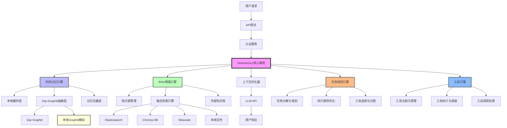
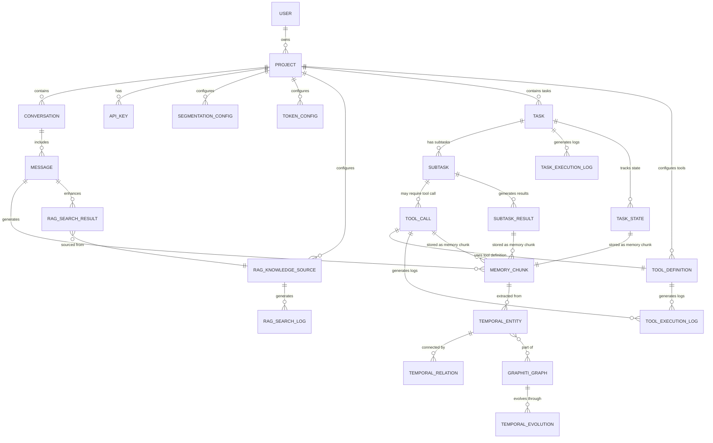
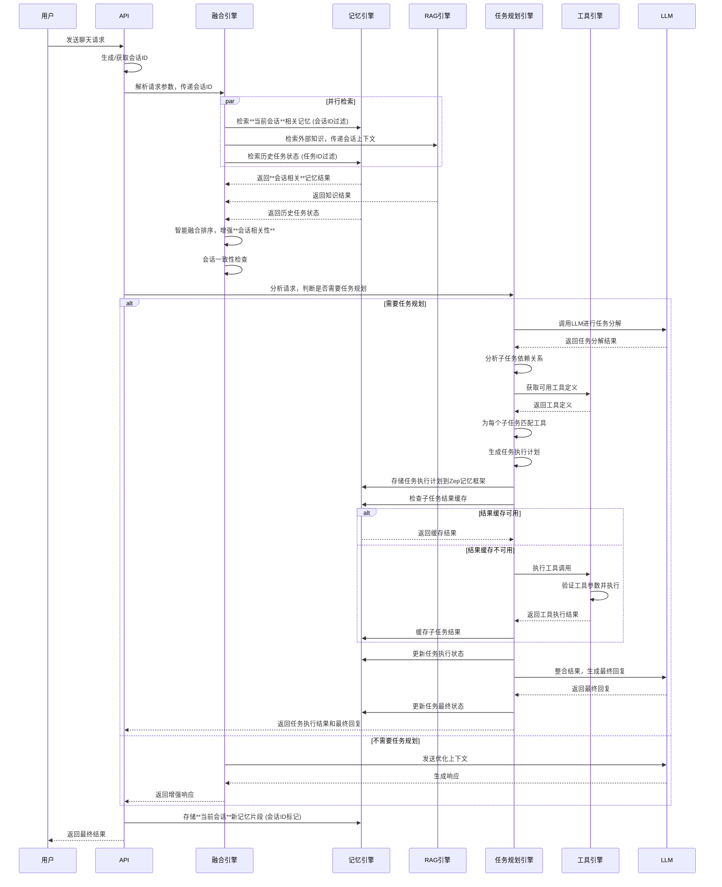
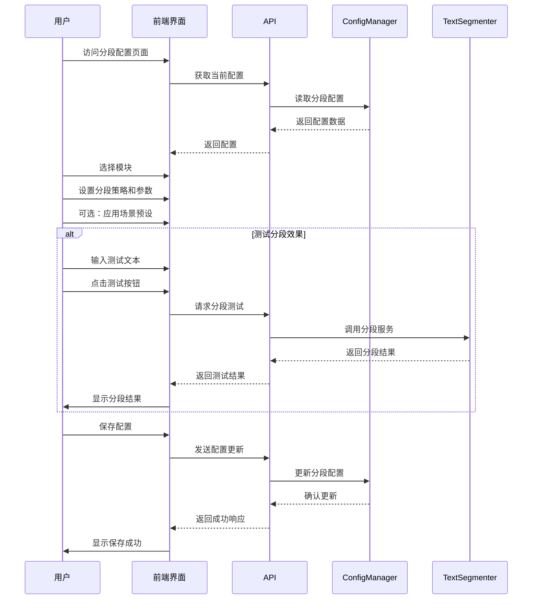

# Onememory 模块功能与关系文档

## 1. 项目概述

Onememory 是一个基于时序记忆架构的智能记忆系统，通过 RAG（Retrieval-Augmented Generation）技术增强，实现多源知识的智能融合检索。系统采用**四引擎架构**，将时序记忆、外部知识库、工具调用和任务规划无缝融合，为用户提供更加智能和个性化的交互体验。

## 2. 系统架构

### 2.1 整体架构图



### 2.2 核心组件关系

| 组件 | 主要功能 | 依赖关系 |
|------|----------|----------|
| **Onememory核心服务** | 系统核心协调器，处理请求分发和结果整合 | 依赖所有其他核心组件 |
| **时序记忆引擎** | 管理时序记忆和实体关系，支持跨会话任务状态存储 | 依赖Zep Graphiti抽象层、本地缓存层、记忆向量库 |
| **RAG增强引擎** | 外部知识检索和融合 | 依赖知识源管理、融合检索引擎 |
| **上下文优化器** | 智能排序和Token优化 | 依赖外部LLM API |
| **任务规划引擎** | 复杂任务分解、执行顺序优化、工具选择与分配 | 依赖时序记忆引擎（任务状态存储）、工具引擎（工具信息） |
| **工具引擎** | 工具注册管理、执行调度、调用处理 | 依赖时序记忆引擎（结果缓存） |
| **API网关** | 请求路由和负载均衡 | 依赖认证服务、核心服务 |
| **Zep Graphiti抽象层** | 抽象Zep Graphiti API，支持多后端和本地模拟 | 依赖Zep Graphiti（可选）、本地Graphiti模拟（可选） |
| **本地缓存层** | 缓存频繁访问的记忆和图谱数据 | 依赖Redis（可选）、内存缓存 |
| **分段配置模块** | 管理文本分段策略，支持多模块和场景特定配置 | 依赖TextSegmenter服务 |

## 3. 核心模块详解

### 3.1 时序记忆引擎

**核心功能**：
- 基于Zep Graphiti的时序记忆管理
- 时序实体提取和跟踪
- 动态关系推理
- 跨会话记忆合成
- 记忆向量存储和检索
- **会话上下文感知**：基于会话ID的记忆隔离和过滤
- **优化的图遍历算法**：针对大规模图数据优化的遍历算法，支持多种遍历策略
- **任务状态存储**：在Zep记忆框架中存储任务定义、执行状态、子任务信息等
- **工具结果缓存**：缓存工具调用结果，支持跨会话复用
- **任务关系管理**：管理任务间的依赖关系和执行顺序

**子模块**：

| 子模块 | 功能描述 |
|--------|:---------|
| **Zep Graphiti抽象层** | 时序知识图谱构建和管理的抽象接口，支持多种图数据库后端，降低对特定服务的依赖，扩展支持任务和工具调用实体 |
| **本地缓存层** | 缓存频繁访问的记忆片段和图谱数据，减少外部服务调用，提高性能和可靠性 |
| **记忆向量库** | 存储对话历史、用户偏好和工具结果的向量表示，支持相似性检索和会话ID过滤 |
| **时序关系推理** | 分析记忆间的时间关联，计算关系强度和演化趋势 |
| **跨会话记忆合成** | 智能合并多会话信息，保持长期上下文连贯性 |
| **会话上下文管理** | 跟踪会话状态，确保记忆检索的会话相关性 |
| **批量操作处理** | 支持批量创建、更新和检索实体与关系，减少网络请求次数 |
| **任务状态管理** | 在Zep记忆框架中存储和管理任务执行状态，支持跨会话追踪 |
| **工具结果管理** | 存储和管理工具调用结果，支持缓存和复用 |
| **任务关系管理** | 管理任务间的依赖关系和执行顺序，支持复杂任务流 |

### 3.2 RAG增强引擎

**核心功能**：
- 多源知识检索和融合
- 知识源管理和配置
- 智能融合算法
- 质量评估和过滤
- **会话上下文感知**：确保检索结果与当前会话高度相关

**子模块**：

| 子模块 | 功能描述 |
|--------|----------|
| **知识源管理** | 统一管理外部知识库连接，支持多种源类型 |
| **融合检索引擎** | 智能融合记忆与外部知识，基于权重和时效性，支持会话ID过滤 |
| **多源适配器** | 支持多种知识库类型，提供统一访问接口 |
| **质量评估** | 评估检索结果质量，过滤低相关性内容，增强会话相关性验证 |
| **会话上下文处理器** | 管理会话上下文，确保RAG检索考虑当前会话背景 |

**支持的知识源类型**：
- Elasticsearch：企业文档和日志
- Chroma DB：向量化的知识库
- Weaviate：语义知识图谱
- 本地文件：Markdown、PDF、TXT等
- API接口：第三方知识服务

### 3.3 上下文优化器

**核心功能**：
- 智能排序：基于相关性、时效性和**会话一致性**排序
- Token优化：动态调整上下文长度
- 质量评估：评估检索结果质量，增强**会话相关性**验证
- 上下文压缩：智能压缩长文本，减少Token使用
- **会话上下文优化**：保持会话主题一致性，增强上下文连贯性

### 3.4 任务规划引擎

**核心功能**：
- 复杂任务分解：将复杂用户请求分解为可执行的子任务序列
- 任务分解质量评估：评估任务分解的合理性、完整性和可行性
- 子任务依赖分析：分析子任务之间的依赖关系，确定执行顺序
- 智能工具选择与匹配：基于多维度评估的优化工具匹配算法，自动选择最合适的工具
- 执行顺序优化：优化子任务的执行顺序，提高整体执行效率
- 动态任务调整：根据执行过程中的情况，动态调整任务规划
- 增强的异常处理与恢复：完善的错误处理机制，支持细粒度重试、回滚和恢复策略
- 跨会话任务追踪：在Zep记忆框架中存储任务执行状态，支持跨会话恢复
- 任务结果整合：整合所有子任务的执行结果，生成最终回复

### 3.5 工具引擎

**核心功能**：
- 工具注册与管理：管理系统中可用的工具定义和实现
- 工具执行与调度：安全执行工具调用，支持并行执行
- 工具调用处理：处理LLM返回的工具调用请求
- 工具结果缓存：缓存工具调用结果，支持跨会话复用
- 工具权限管理：控制工具的访问权限
- 工具监控与日志：监控工具调用情况，记录详细日志

### 3.6 分段配置模块

**核心功能**：
- 管理文本分段策略，优化记忆片段的保存和检索效果
- 支持多模块特定配置，每个模块可以有独立的分段策略
- 提供场景预设，快速适应不同文本类型
- 实时测试分段效果，直观查看不同配置下的分割结果

**设计架构**：
- **分层配置**：基础配置 → 模块特定配置 → 场景默认配置
- **模块支持**：记忆模块、RAG模块、上下文模块、Token模块
- **场景预设**：长文档、短对话、代码片段

**主要功能**：
- **模块特定配置**：
  - 记忆模块：优化对话记忆的分段策略
  - RAG模块：优化外部知识的分段策略
  - 上下文模块：优化LLM上下文的分段策略
  - Token模块：优化Token使用的分段策略

- **场景预设配置**：
  - 长文档：适合处理长篇文章和文档
  - 短对话：适合处理聊天对话
  - 代码片段：适合处理代码内容

- **分段策略**：
  - 语义分段：基于语义相似性进行智能分段
  - 固定长度：按固定字符数进行分段
  - 自适应：根据内容复杂度调整分段大小
  - 混合策略：结合多种策略的优势

**配置参数**：
- 最大分段长度
- 最小分段长度
- 重叠长度
- 语义相似性阈值
- 结构保护选项
- 分割规则（句子/段落）
- 自定义分隔符

**工作流程**：
1. 用户选择要配置的模块
2. 设置分段策略和参数
3. 可选择应用场景预设
4. 测试分段效果
5. 保存配置

**与其他模块的关系**：
- 为MemoryManager提供记忆存储的分段配置
- 为RAGKnowledgeManager提供外部知识的分段配置
- 为上下文优化器提供上下文构建的分段配置
- 为Token管理模块提供Token使用的分段配置

## 4. 数据模型

### 4.1 核心实体关系



### 4.2 主要数据结构

**分段配置实体**：
```typescript
interface SegmentationConfig {
  id: string;
  projectId: string;
  base: {
    strategy: 'fixed' | 'semantic' | 'adaptive' | 'hybrid';
    chunkSize: number;
    overlap: number;
    separators: string[];
    minChunkSize: number;
    maxChunkSize: number;
    preserveStructure: boolean;
    splitOnSentences: boolean;
    splitOnParagraphs: boolean;
    customDelimiters: string[];
    semanticThreshold: number;
  };
  modules: {
    memory?: BaseSegmentationConfig;
    rag?: BaseSegmentationConfig;
    context?: BaseSegmentationConfig;
    token?: BaseSegmentationConfig;
  };
  scenarioDefaults: {
    longDocument?: BaseSegmentationConfig;
    shortConversation?: BaseSegmentationConfig;
    codeSnippets?: BaseSegmentationConfig;
  };
}
```

**记忆实体**：
```typescript
interface MemoryEntity {
  id: string;
  projectId: string;
  sessionId: string;
  content: string;
  embedding: number[];
  metadata: {
    timestamp: Date;
    importance: number;
    category: string;
    tags: string[];
    // 任务相关元数据
    taskId?: string;
    subtaskId?: string;
    toolCallId?: string;
  };
  relationships: Relationship[];
}
```

**知识片段**：
```typescript
interface KnowledgeChunk {
  id: string;
  sourceId: string;
  content: string;
  embedding: number[];
  metadata: {
    filePath?: string;
    section?: string;
    timestamp: Date;
    relevance: number;
  };
}
```

## 5. 核心功能流程

### 5.1 智能聊天流程（含任务规划和工具调用）



### 5.2 分段配置流程



## 6. 技术栈

| 类别 | 技术 | 用途 |
|------|------|------|
| **前端** | Vue + TypeScript + Tailwind CSS + Vite | 用户界面开发 |
| **后端** | Node.js + Express + TypeScript | API服务和业务逻辑 |
| **数据库** | PostgreSQL + Redis + 向量数据库 | 数据存储和缓存 |
| **嵌入服务** | OpenAI text-embedding-3-small | 生成文本向量表示 |
| **AI模型** | OpenAI GPT系列 | 生成响应和推理，任务规划 |
| **部署** | Docker + Docker Compose | 容器化部署 |
| **时序记忆** | Zep Graphiti + 抽象层 | 时序知识图谱管理，任务状态存储 |
| **缓存** | Redis + 内存缓存 | 本地缓存层，工具结果缓存 |
| **监控** | Prometheus + Grafana | 实时监控和告警，包括任务和工具调用 |
| **日志** | Winston + ELK Stack | 日志管理和分析，包括任务和工具调用日志 |
| **开发工具** | Jest + Supertest | 单元测试和集成测试 |
| **工具调用框架** | 自定义工具调用框架 | 工具注册、执行和管理 |
| **任务规划框架** | 自定义任务规划框架 | 复杂任务分解、执行顺序优化 |
| **分段引擎** | 自定义文本分段引擎 | 智能文本分段，支持多种策略 |

## 7. 部署架构

### 7.1 容器化部署

```yaml
version: '3.8'
services:
  onememory-api:
    image: onememory/api:latest
    ports:
      - "3000:3000"
    environment:
      - DATABASE_URL=postgresql://user:pass@db:5432/onememory
      - REDIS_URL=redis://redis:6379
      - OPENAI_API_KEY=${OPENAI_API_KEY}
    depends_on:
      - postgres
      - redis
      - qdrant
      - task-planning-service
      - tool-service
      
  memory-service:
    image: onememory/memory:latest
    environment:
      - GRAPH_DATABASE=neo4j://neo4j:7687
      - VECTOR_DATABASE=qdrant://qdrant:6333
      - ZEP_ABSTRACTION_LAYER_ENABLED=true
      - CACHE_ENABLED=true
      - CACHE_TTL=3600
      - TASK_STATE_STORAGE_ENABLED=true
    depends_on:
      - redis
      - qdrant
  
  task-planning-service:
    image: onememory/task-planning:latest
    environment:
      - OPENAI_API_KEY=${OPENAI_API_KEY}
      - MEMORY_SERVICE_URL=http://memory-service:3001
      - TOOL_SERVICE_URL=http://tool-service:3002
    depends_on:
      - memory-service
      - tool-service
  
  tool-service:
    image: onememory/tool:latest
    environment:
      - REDIS_URL=redis://redis:6379
      - MEMORY_SERVICE_URL=http://memory-service:3001
      - TOOL_CACHE_ENABLED=true
      - TOOL_CACHE_TTL=3600
    depends_on:
      - redis
      - memory-service
```

## 8. 监控与分析

### 8.1 性能指标

| 指标 | 目标值 | 描述 |
|------|--------|------|
| 检索延迟 | < 200ms | 平均检索时间 |
| 吞吐量 | 1000 QPS | 每秒处理请求数 |
| Top-5准确率 | > 90% | 检索结果准确率 |
| 融合结果相关性 | > 85% | 融合结果相关性评分 |
| **会话相关性** | > 90% | 检索结果与当前会话的相关性评分 |
| **跨会话记忆污染率** | < 5% | 不相关跨会话记忆的出现率 |
| 知识覆盖率 | > 95% | 知识源覆盖度 |
| 知识更新延迟 | < 1小时 | 知识源更新到可用的时间 |
| 任务规划成功率 | > 95% | 成功完成任务规划的请求数/总请求数 |
| 任务执行成功率 | > 90% | 成功完成执行的任务数/总任务数 |
| 工具调用成功率 | > 95% | 成功执行的工具调用数/总工具调用数 |

## 9. 未来规划

### 9.1 功能增强

- **多模态支持**：图像理解、音频处理、视频分析
- **智能推理**：知识图谱推理、因果分析
- **个性化优化**：基于用户反馈的自适应调整
- **团队协作**：多用户共享记忆和知识源
- **高级时序分析**：基于时间序列的预测和趋势分析
- **自动知识图谱构建**：从非结构化数据自动构建知识图谱
- **增强的记忆融合**：更智能的多源记忆融合算法

### 9.2 性能提升

- **GPU加速**：向量计算GPU加速
- **专用芯片**：考虑使用AI芯片
- **边缘计算**：支持边缘部署
- **算法优化**：采用最新检索算法，基于用户反馈优化

### 9.3 分段配置增强

- **自动优化**：基于使用数据自动调整分段策略
- **配置模板**：提供行业特定的配置模板
- **A/B测试**：支持不同分段策略的A/B测试
- **可视化配置**：提供更直观的配置界面
- **API支持**：提供完整的分段配置API

## 10. 总结

Onememory通过深度集成RAG技术、任务规划和工具调用功能，实现了时序记忆、外部知识、复杂任务处理和工具交互的智能融合。系统采用四引擎架构，在保证记忆连贯性的同时，通过外部知识库增强回答的准确性和全面性，并支持复杂任务的分解执行和外部工具调用。

**核心优势**：
- 时序感知的记忆管理，保持长期上下文连贯性
- 多源知识融合，提升回答的准确性和全面性
- **会话上下文感知**，确保检索结果与当前会话高度相关，避免"表面相关但实际不相关"的记忆污染
- 智能上下文优化，降低Token使用量和延迟
- 支持复杂任务的分解、规划和执行，提高系统处理复杂请求的能力
- 灵活的工具调用机制，扩展系统能力边界，支持与外部服务和工具交互
- 跨会话任务状态管理，支持任务的中断和恢复
- 可扩展的架构设计，支持多种知识源、工具和部署方式
- 完善的监控和分析，保证系统性能和质量
- 灵活的分段配置，适应不同模块和场景的需求

Onememory的设计理念是将记忆系统、知识增强、任务规划和工具调用深度融合，为用户提供更加智能、个性化、全面且实用的交互体验，适用于多种场景，包括智能助手、企业知识库、教育系统、自动化工作流和外部系统集成等。