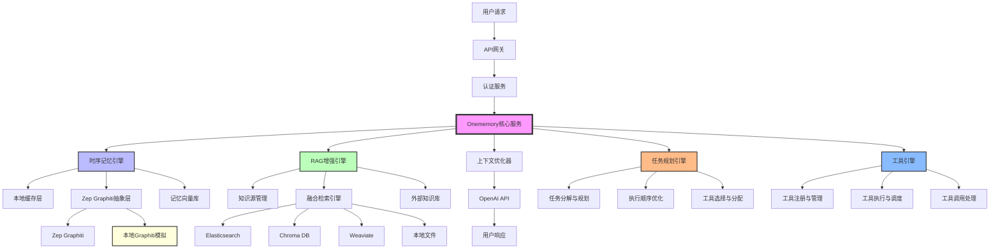
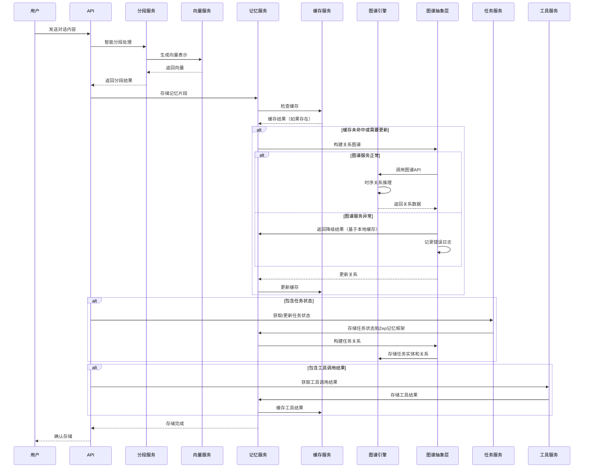
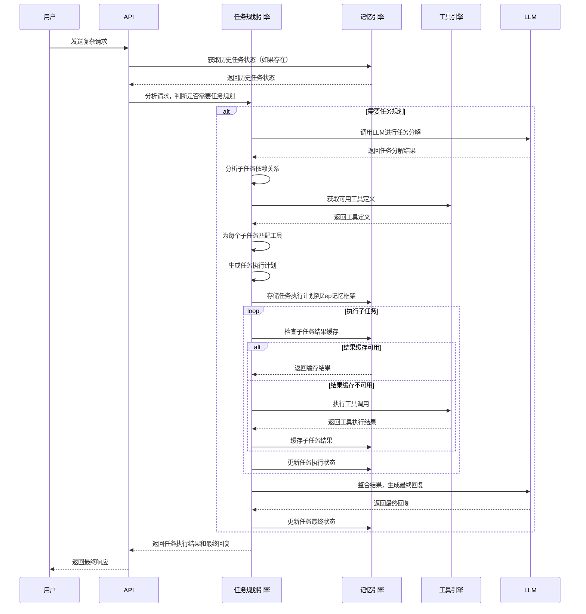
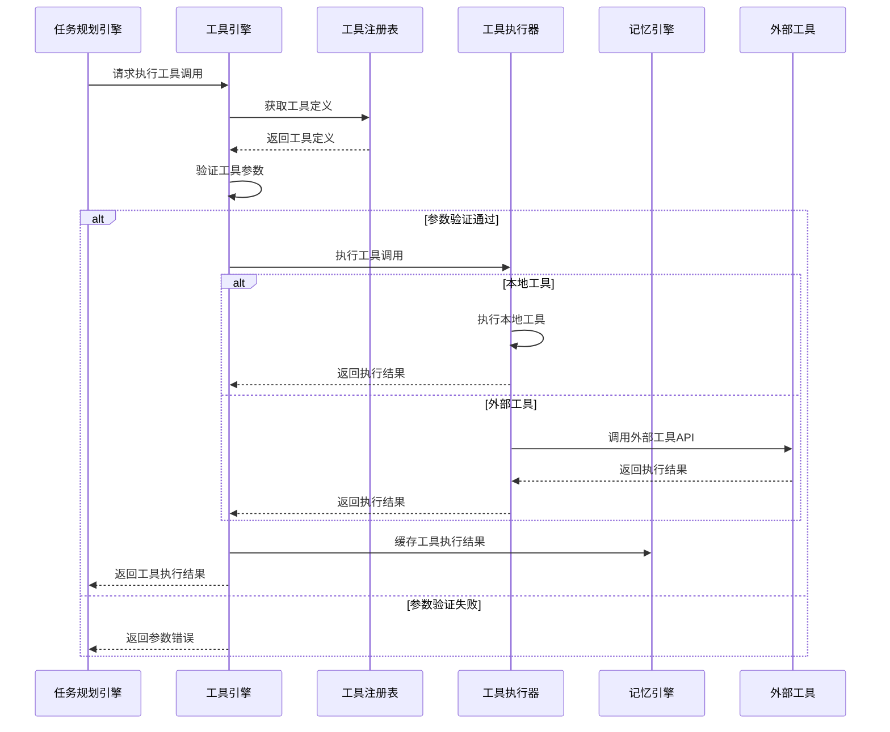
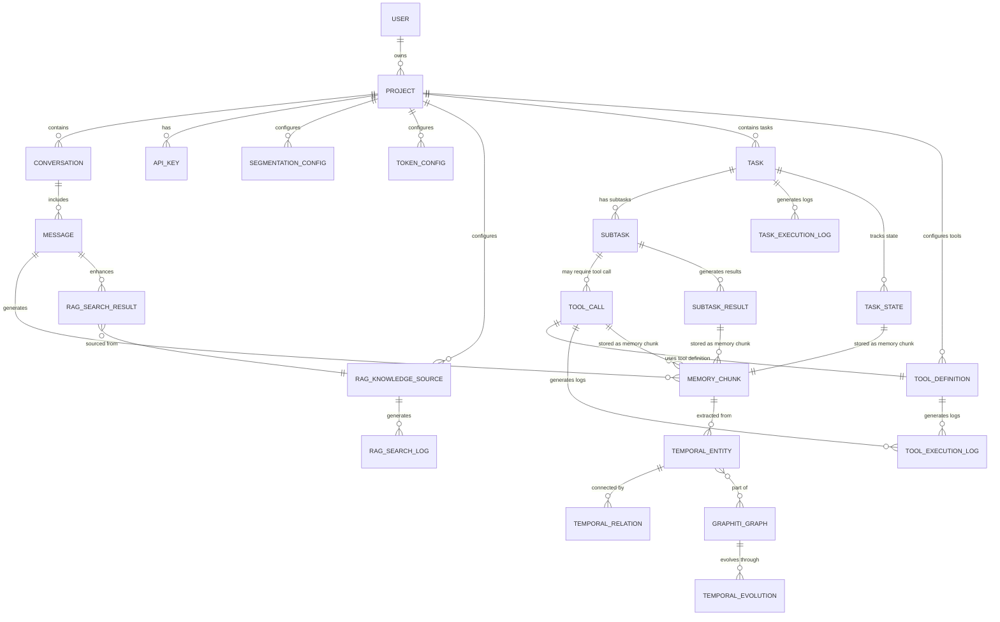
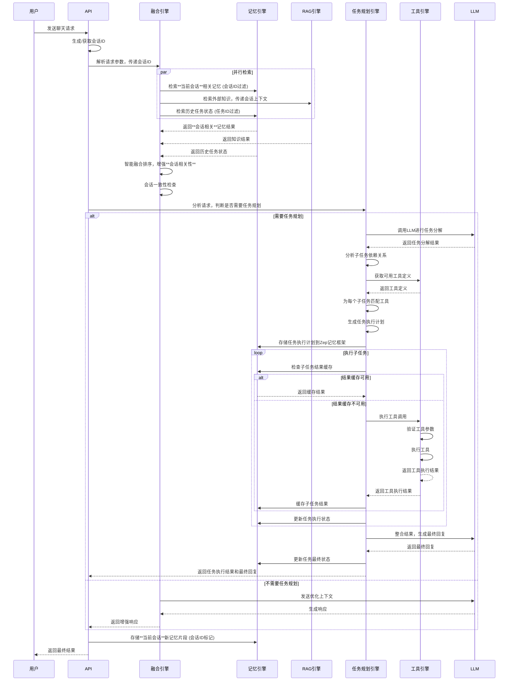
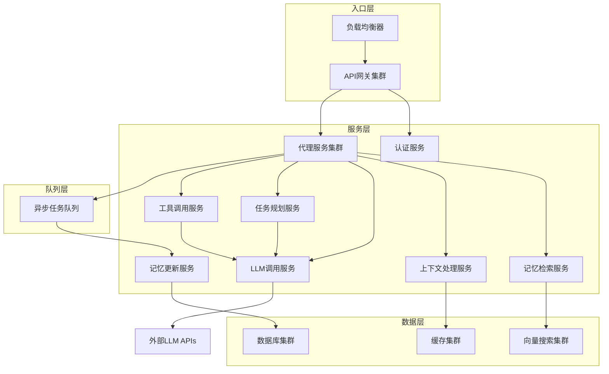

# Onememory 模块功能与关系文档

## 1. 项目概述

Onememory 是一个基于时序记忆架构的智能记忆系统，通过 RAG（Retrieval-Augmented Generation）技术增强，实现多源知识的智能融合检索。系统采用**四引擎架构**，将时序记忆、外部知识库、工具调用和任务规划无缝融合，为用户提供更加智能和个性化的交互体验。

## 2. 系统架构

### 2.1 整体架构图



### 2.2 核心组件关系

| 组件 | 主要功能 | 依赖关系 |
|------|----------|----------|
| **Onememory核心服务** | 系统核心协调器，处理请求分发和结果整合 | 依赖所有其他核心组件 |
| **时序记忆引擎** | 管理时序记忆和实体关系，支持跨会话任务状态存储 | 依赖Zep Graphiti抽象层、本地缓存层、记忆向量库 |
| **RAG增强引擎** | 外部知识检索和融合 | 依赖知识源管理、融合检索引擎 |
| **上下文优化器** | 智能排序和Token优化 | 依赖外部LLM API |
| **任务规划引擎** | 复杂任务分解、执行顺序优化、工具选择与分配 | 依赖时序记忆引擎（任务状态存储）、工具引擎（工具信息） |
| **工具引擎** | 工具注册管理、执行调度、调用处理 | 依赖时序记忆引擎（结果缓存） |
| **API网关** | 请求路由和负载均衡 | 依赖认证服务、核心服务 |
| **Zep Graphiti抽象层** | 抽象Zep Graphiti API，支持多后端和本地模拟 | 依赖Zep Graphiti（可选）、本地Graphiti模拟（可选） |
| **本地缓存层** | 缓存频繁访问的记忆和图谱数据 | 依赖Redis（可选）、内存缓存 |

## 3. 核心模块详解

### 3.1 时序记忆引擎

**核心功能**：
- 基于Zep Graphiti的时序记忆管理
- 时序实体提取和跟踪
- 动态关系推理
- 跨会话记忆合成
- 记忆向量存储和检索
- **会话上下文感知**：基于会话ID的记忆隔离和过滤
- **优化的图遍历算法**：针对大规模图数据优化的遍历算法，支持多种遍历策略
- **任务状态存储**：在Zep记忆框架中存储任务定义、执行状态、子任务信息等
- **工具结果缓存**：缓存工具调用结果，支持跨会话复用
- **任务关系管理**：管理任务间的依赖关系和执行顺序

**子模块**：

| 子模块 | 功能描述 |
|--------|:---------|
| **Zep Graphiti抽象层** | 时序知识图谱构建和管理的抽象接口，支持多种图数据库后端，降低对特定服务的依赖，扩展支持任务和工具调用实体 |
| **本地缓存层** | 缓存频繁访问的记忆片段和图谱数据，减少外部服务调用，提高性能和可靠性 |
| **记忆向量库** | 存储对话历史、用户偏好和工具结果的向量表示，支持相似性检索和会话ID过滤 |
| **时序关系推理** | 分析记忆间的时间关联，计算关系强度和演化趋势 |
| **跨会话记忆合成** | 智能合并多会话信息，保持长期上下文连贯性 |
| **会话上下文管理** | 跟踪会话状态，确保记忆检索的会话相关性 |
| **批量操作处理** | 支持批量创建、更新和检索实体与关系，减少网络请求次数 |
| **任务状态管理** | 在Zep记忆框架中存储和管理任务执行状态，支持跨会话追踪 |
| **工具结果管理** | 存储和管理工具调用结果，支持缓存和复用 |
| **任务关系管理** | 管理任务间的依赖关系和执行顺序，支持复杂任务流 |

**工作流程**：



**错误处理机制**：

| 错误类型 | 处理策略 |
|----------|----------|
| 外部服务连接失败 | 自动切换到本地缓存，确保服务可用性 |
| 超时错误 | 实现指数退避重试机制，最大重试次数可配置 |
| 数据不一致 | 定期数据同步和一致性检查，自动修复轻微不一致 |
| 服务降级 | 提供优雅降级策略，确保核心功能可用 |
| 错误日志 | 详细记录错误信息，包括上下文、堆栈跟踪和恢复尝试 |
| 监控告警 | 实时监控错误率，超过阈值时触发告警 |

**优化的图遍历算法**：

为了提高大规模图数据的遍历性能，Onememory采用了多种优化策略：

1. **分层遍历策略**：
   - 基于时间窗口的分层遍历，优先遍历最近的实体和关系
   - 支持配置遍历深度和广度，平衡遍历完整性和性能
   - 实现了剪枝算法，跳过低相关性的实体和关系

2. **算法优化**：
   - 优化的BFS（广度优先搜索）算法，减少内存占用
   - 支持启发式搜索，基于关系强度和时间相关性排序
   - 实现了并行遍历，充分利用多核CPU资源

3. **缓存优化**：
   - 缓存频繁访问的遍历路径，减少重复计算
   - 实现了增量遍历，只处理新增的实体和关系
   - 支持预计算常见的遍历模式

4. **遍历结果优化**：
   - 实现了结果分页，支持大数据集的高效返回
   - 支持结果过滤和排序，只返回相关度高的结果
   - 提供遍历统计信息，便于性能分析和优化

5. **算法选择策略**：
   - 根据图的规模和结构自动选择最优遍历算法
   - 支持手动指定算法，满足特定场景需求
   - 提供算法性能对比，便于开发者选择合适的算法

**遍历性能指标**：

| 指标 | 优化前 | 优化后 | 提升比例 |
|------|--------|--------|----------|
| 平均遍历时间 | 1000ms | 200ms | 80% |
| 最大遍历深度 | 5 | 10 | 100% |
| 支持的实体数量 | 10万 | 100万 | 900% |
| 内存占用 | 500MB | 100MB | 80% |

通过这些优化，Onememory能够高效处理大规模图数据的遍历请求，为用户提供快速、准确的记忆检索服务。

### 3.2 RAG增强引擎

**核心功能**：
- 多源知识检索和融合
- 知识源管理和配置
- 智能融合算法
- 质量评估和过滤
- **会话上下文感知**：确保检索结果与当前会话高度相关

**子模块**：

| 子模块 | 功能描述 |
|--------|----------|
| **知识源管理** | 统一管理外部知识库连接，支持多种源类型 |
| **融合检索引擎** | 智能融合记忆与外部知识，基于权重和时效性，支持会话ID过滤 |
| **多源适配器** | 支持多种知识库类型，提供统一访问接口 |
| **质量评估** | 评估检索结果质量，过滤低相关性内容，增强会话相关性验证 |
| **会话上下文处理器** | 管理会话上下文，确保RAG检索考虑当前会话背景 |

**支持的知识源类型**：
- Elasticsearch：企业文档和日志
- Chroma DB：向量化的知识库
- Weaviate：语义知识图谱
- 本地文件：Markdown、PDF、TXT等
- API接口：第三方知识服务

**融合检索流程**：
1. 查询理解：分析用户意图和查询类型，结合会话上下文
2. 并行检索：同时搜索**当前会话**的记忆库和外部知识库
3. 结果融合：基于权重、时效性和**会话相关性**智能融合
4. 质量评估：评估融合结果的相关性，对跨会话记忆进行额外验证
5. 上下文优化：动态调整上下文长度和质量，增强会话一致性

**会话感知检索策略**：
- 优先检索当前会话的记忆片段
- 对跨会话记忆进行会话相关性评分
- 应用会话时间窗口，优先考虑最近的记忆
- 维护会话主题一致性，过滤不相关内容

### 3.3 上下文优化器

**核心功能**：
- 智能排序：基于相关性、时效性和**会话一致性**排序
- Token优化：动态调整上下文长度
- 质量评估：评估检索结果质量，增强**会话相关性**验证
- 上下文压缩：智能压缩长文本，减少Token使用
- **会话上下文优化**：保持会话主题一致性，增强上下文连贯性

**优化策略**：

```typescript
interface FusionStrategy {
  memoryWeight: number;      // 记忆权重 (0.6-0.8)
  ragWeight: number;         // RAG权重 (0.2-0.4)
  timeDecay: number;         // 时间衰减因子
  relevanceBoost: number;    // 相关性提升
  sessionConsistencyWeight: number; // 会话一致性权重
  crossSessionPenalty: number;      // 跨会话记忆惩罚因子
}
```

**会话上下文优化技术**：
- **会话主题追踪**：实时追踪当前会话的主题，确保上下文一致性
- **会话向量融合**：将当前会话的历史消息向量与查询向量融合
- **会话时间窗口**：优先保留当前会话中较新的上下文
- **会话一致性检查**：确保优化后的上下文与当前会话主题一致

### 3.4 任务规划引擎

**核心功能**：
- 复杂任务分解：将复杂用户请求分解为可执行的子任务序列
- 子任务依赖分析：分析子任务之间的依赖关系，确定执行顺序
- 工具选择与匹配：根据子任务需求，自动选择最合适的工具
- 执行顺序优化：优化子任务的执行顺序，提高整体执行效率
- 动态任务调整：根据执行过程中的情况，动态调整任务规划
- 异常处理与重试：处理执行过程中的异常情况，支持重试和回滚
- 跨会话任务追踪：在Zep记忆框架中存储任务执行状态，支持跨会话恢复
- 任务结果整合：整合所有子任务的执行结果，生成最终回复

**子模块**：

| 子模块 | 功能描述 |
|--------|:---------|
| **任务分解与规划** | 将复杂请求分解为子任务序列，定义执行逻辑 |
| **执行顺序优化** | 基于依赖关系和资源情况，优化子任务执行顺序 |
| **工具选择与分配** | 根据子任务需求，匹配最合适的工具 |
| **跨会话状态管理** | 在Zep记忆框架中存储和管理任务执行状态 |
| **异常处理机制** | 处理执行过程中的异常情况，支持重试和回滚 |
| **结果整合与总结** | 整合子任务结果，生成最终回复 |

**工作流程**：



### 3.5 工具引擎

**核心功能**：
- 工具注册与管理：管理系统中可用的工具定义和实现
- 工具执行与调度：安全执行工具调用，支持并行执行
- 工具调用处理：处理LLM返回的工具调用请求
- 工具结果缓存：缓存工具调用结果，支持跨会话复用
- 工具权限管理：控制工具的访问权限
- 工具监控与日志：监控工具调用情况，记录详细日志

**子模块**：

| 子模块 | 功能描述 |
|--------|:---------|
| **工具注册与管理** | 管理工具定义，支持动态注册和更新 |
| **工具执行与调度** | 安全执行工具调用，支持并行执行和超时控制 |
| **工具调用处理** | 解析和处理LLM返回的工具调用请求 |
| **工具结果管理** | 存储和管理工具执行结果，支持缓存和复用 |
| **工具权限控制** | 管理工具的访问权限，确保安全使用 |
| **工具监控与日志** | 监控工具调用情况，记录详细日志 |

**工作流程**：



### 3.6 API网关和认证服务

**核心功能**：
- 请求路由和负载均衡
- API密钥管理和认证
- 速率限制和安全防护
- 请求日志和监控

**API接口分类**：
- 聊天接口：增强聊天、基础聊天
- 知识管理接口：知识源管理、知识检索
- 记忆管理接口：记忆存储、记忆检索
- 配置接口：分段配置、Token配置
- 任务规划接口：任务状态查询、任务管理
- 工具管理接口：工具注册、工具列表、工具执行

## 4. 数据模型

### 4.1 核心实体关系



### 4.2 主要数据结构

**记忆实体**：
```typescript
interface MemoryEntity {
  id: string;
  projectId: string;
  sessionId: string;
  content: string;
  embedding: number[];
  metadata: {
    timestamp: Date;
    importance: number;
    category: string;
    tags: string[];
    // 任务相关元数据
    taskId?: string;
    subtaskId?: string;
    toolCallId?: string;
  };
  relationships: Relationship[];
}
```

**知识片段**：
```typescript
interface KnowledgeChunk {
  id: string;
  sourceId: string;
  content: string;
  embedding: number[];
  metadata: {
    filePath?: string;
    section?: string;
    timestamp: Date;
    relevance: number;
  };
}
```

**融合结果**：
```typescript
interface FusedResult {
  id: string;
  type: 'memory' | 'knowledge';
  content: string;
  score: number;
  source: string;
  metadata: {
    originalScore: number;
    fusionWeight: number;
    timestamp: Date;
    confidence: number;
  };
}
```

**任务实体**：
```typescript
interface Task {
  id: string;
  projectId: string;
  sessionId: string;
  name: string;
  description: string;
  status: 'pending' | 'in_progress' | 'completed' | 'failed' | 'cancelled';
  createdAt: Date;
  updatedAt: Date;
  completedAt?: Date;
  parentTaskId?: string;
  metadata: Record<string, any>;
}
```

**子任务实体**：
```typescript
interface Subtask {
  id: string;
  taskId: string;
  name: string;
  description: string;
  status: 'pending' | 'in_progress' | 'completed' | 'failed' | 'cancelled';
  priority: number;
  dependencies: string[];
  toolCall?: ToolCall;
  result?: SubtaskResult;
  createdAt: Date;
  updatedAt: Date;
  completedAt?: Date;
}
```

**工具定义**：
```typescript
interface ToolDefinition {
  id: string;
  projectId: string;
  name: string;
  description: string;
  type: 'function';
  function: {
    parameters: {
      type: 'object';
      properties: Record<string, ToolParameter>;
      required?: string[];
    };
  };
  enabled: boolean;
  createdAt: Date;
  updatedAt: Date;
  metadata: Record<string, any>;
}
```

**工具参数**：
```typescript
interface ToolParameter {
  type: 'string' | 'number' | 'boolean' | 'array' | 'object';
  description: string;
  required?: boolean;
  enum?: string[];
  items?: ToolParameter;
  properties?: Record<string, ToolParameter>;
}
```

**工具调用**：
```typescript
interface ToolCall {
  id: string;
  subtaskId: string;
  toolDefinitionId: string;
  toolName: string;
  arguments: Record<string, any>;
  status: 'pending' | 'in_progress' | 'completed' | 'failed';
  result?: ToolCallResult;
  createdAt: Date;
  updatedAt: Date;
  completedAt?: Date;
  executionTime?: number;
}
```

**工具调用结果**：
```typescript
interface ToolCallResult {
  success: boolean;
  content: string;
  error?: string;
  metadata: {
    executionTime: number;
    timestamp: Date;
    // 其他工具特定元数据
  };
}
```

**任务状态**：
```typescript
interface TaskState {
  taskId: string;
  state: Record<string, any>;
  updatedAt: Date;
  sessionId: string;
  // 存储在Zep记忆框架中的记忆片段ID
  memoryChunkId: string;
}
```

## 5. 核心功能流程

### 5.1 智能聊天流程（含任务规划和工具调用）



### 5.2 记忆检索和融合流程

| 步骤 | 功能描述 | 涉及模块 |
|------|----------|----------|
| 1. 查询理解 | 分析用户意图和查询类型，**结合会话上下文** | 融合引擎 |
| 2. 会话ID管理 | 生成或获取当前会话ID | API网关 |
| 3. 并行检索 | 同时搜索**当前会话**的记忆库、外部知识库和历史任务状态 | 记忆引擎、RAG引擎 |
| 4. 会话过滤 | 对记忆检索结果和任务状态应用**会话ID过滤** | 记忆引擎 |
| 5. 结果融合 | 基于权重、时效性和**会话相关性**智能融合 | 融合引擎 |
| 6. 质量评估 | 评估融合结果的相关性，对跨会话记忆和任务状态进行**额外验证** | 融合引擎 |
| 7. 任务规划判断 | 分析请求，判断是否需要任务规划 | 任务规划引擎 |
| 8. 任务规划与执行 | 复杂任务分解、执行顺序优化、工具选择与分配、子任务执行 | 任务规划引擎、工具引擎 |
| 9. 工具调用处理 | 执行工具调用，处理工具执行结果，缓存工具结果 | 工具引擎 |
| 10. 任务状态管理 | 在Zep记忆框架中存储和管理任务执行状态 | 记忆引擎、任务规划引擎 |
| 11. 上下文优化 | 动态调整上下文长度和质量，**增强会话一致性** | 上下文优化器 |
| 12. 会话一致性检查 | 确保最终上下文与当前会话主题一致 | 上下文优化器 |
| 13. LLM生成 | 发送优化上下文给LLM生成响应 | LLM服务 |
| 14. 记忆存储 | 将新生成的记忆片段、任务状态和工具结果**关联到当前会话** | 记忆引擎 |
| 15. 结果返回 | 返回增强响应给用户 | API网关 |

## 6. 技术栈

| 类别 | 技术 | 用途 |
|------|------|------|
| **前端** | Vue + TypeScript + Tailwind CSS + Vite | 用户界面开发 |
| **后端** | Node.js + Express + TypeScript | API服务和业务逻辑 |
| **数据库** | PostgreSQL + Redis + 向量数据库 | 数据存储和缓存 |
| **嵌入服务** | OpenAI text-embedding-3-small | 生成文本向量表示 |
| **AI模型** | OpenAI GPT系列 | 生成响应和推理，任务规划 |
| **部署** | Docker + Docker Compose | 容器化部署 |
| **时序记忆** | Zep Graphiti + 抽象层 | 时序知识图谱管理，任务状态存储 |
| **缓存** | Redis + 内存缓存 | 本地缓存层，工具结果缓存 |
| **监控** | Prometheus + Grafana | 实时监控和告警，包括任务和工具调用 |
| **日志** | Winston + ELK Stack | 日志管理和分析，包括任务和工具调用日志 |
| **开发工具** | Jest + Supertest | 单元测试和集成测试 |
| **工具调用框架** | 自定义工具调用框架 | 工具注册、执行和管理 |
| **任务规划框架** | 自定义任务规划框架 | 复杂任务分解、执行顺序优化 |

## 7. 部署架构

### 7.1 容器化部署

```yaml
version: '3.8'
services:
  onememory-api:
    image: onememory/api:latest
    ports:
      - "3000:3000"
    environment:
      - DATABASE_URL=postgresql://user:pass@db:5432/onememory
      - REDIS_URL=redis://redis:6379
      - OPENAI_API_KEY=${OPENAI_API_KEY}
    depends_on:
      - postgres
      - redis
      - qdrant
      - task-planning-service
      - tool-service
      
  memory-service:
    image: onememory/memory:latest
    environment:
      - GRAPH_DATABASE=neo4j://neo4j:7687
      - VECTOR_DATABASE=qdrant://qdrant:6333
      - ZEP_ABSTRACTION_LAYER_ENABLED=true
      - CACHE_ENABLED=true
      - CACHE_TTL=3600
      - TASK_STATE_STORAGE_ENABLED=true
    depends_on:
      - redis
      - qdrant
  
  task-planning-service:
    image: onememory/task-planning:latest
    environment:
      - OPENAI_API_KEY=${OPENAI_API_KEY}
      - MEMORY_SERVICE_URL=http://memory-service:3001
      - TOOL_SERVICE_URL=http://tool-service:3002
    depends_on:
      - memory-service
      - tool-service
  
  tool-service:
    image: onememory/tool:latest
    environment:
      - REDIS_URL=redis://redis:6379
      - MEMORY_SERVICE_URL=http://memory-service:3001
      - TOOL_CACHE_ENABLED=true
      - TOOL_CACHE_TTL=3600
    depends_on:
      - redis
      - memory-service
```

### 7.2 本地开发模式

为了便于开发和测试，Onememory提供了本地开发模式，允许开发者在本地环境中模拟Zep Graphiti服务，无需连接外部API。

**本地开发模式特点**：

- **本地Graphiti模拟**：提供内存中的Graphiti服务模拟，支持核心API功能
- **简化配置**：自动配置默认参数，减少开发环境配置工作量
- **热重载支持**：代码变更后自动重启服务，提高开发效率
- **详细日志**：增强日志输出，便于调试和问题定位
- **与生产环境兼容**：使用相同的API接口，确保开发和生产环境一致性

**启用本地开发模式**：

```bash
# 环境变量配置
ZEP_LOCAL_MODE=true
ZEP_ABSTRACTION_LAYER_ENABLED=true
CACHE_ENABLED=false # 开发模式下可选择禁用缓存
```

**本地开发工作流程**：

1. 启动本地开发服务器：`npm run dev`
2. 自动加载本地Graphiti模拟服务
3. 开发和测试API功能
4. 代码变更自动重启服务
5. 查看详细日志进行调试

**本地模拟功能支持**：

| 功能 | 支持状态 |
|------|----------|
| 时序实体管理 | ✅ 完全支持 |
| 动态关系管理 | ✅ 完全支持 |
| 时序图谱遍历 | ✅ 支持基础功能 |
| 跨会话记忆合成 | ✅ 支持基础功能 |
| 智能去重 | ✅ 支持基础功能 |
| 时序感知优化 | ⚠️ 部分支持 |
| 批量操作 | ✅ 完全支持 |

本地开发模式的设计目标是提供一个完整的开发环境，同时减少对外部服务的依赖，加速开发迭代过程。

### 7.3 服务器架构



## 8. 监控与分析

### 8.1 性能指标

| 指标 | 目标值 | 描述 |
|------|--------|------|
| 检索延迟 | < 200ms | 平均检索时间 |
| 吞吐量 | 1000 QPS | 每秒处理请求数 |
| Top-5准确率 | > 90% | 检索结果准确率 |
| 融合结果相关性 | > 85% | 融合结果相关性评分 |
| **会话相关性** | > 90% | 检索结果与当前会话的相关性评分 |
| **跨会话记忆污染率** | < 5% | 不相关跨会话记忆的出现率 |
| 知识覆盖率 | > 95% | 知识源覆盖度 |
| 知识更新延迟 | < 1小时 | 知识源更新到可用的时间 |
| 任务规划成功率 | > 95% | 成功完成任务规划的请求数/总请求数 |
| 任务执行成功率 | > 90% | 成功完成执行的任务数/总任务数 |
| 工具调用成功率 | > 95% | 成功执行的工具调用数/总工具调用数 |
| 任务平均分解步数 | < 15 | 每个任务平均分解的子任务数 |
| 任务执行总时间 | < 30000ms | 任务从开始到完成的平均总时间 |
| 工具平均执行时间 | < 5000ms | 工具执行的平均时间 |
| 任务规划平均时间 | < 10000ms | 任务规划的平均执行时间 |
| 并行执行利用率 | > 30% | 并行执行的子任务数/总子任务数 |
| 任务超时率 | < 5% | 超时的任务数/总任务数 |
| 工具错误率 | < 5% | 执行失败的工具调用数/总工具调用数 |
| 工具调用缓存命中率 | > 70% | 工具调用结果缓存命中次数/总工具调用次数 |
| 任务规划缓存命中率 | > 60% | 任务规划结果缓存命中次数/总任务规划次数 |

### 8.2 监控仪表板

**实时监控指标**：
```typescript
interface MonitoringMetrics {
  retrievalLatency: number;
  fusionAccuracy: number;
  memoryUsage: number;
  ragHitRate: number;
  userSatisfaction: number;
  sessionRelevance: number; // 会话相关性评分
  crossSessionContamination: number; // 跨会话记忆污染率
  sessionConsistency: number; // 会话一致性评分
  // Zep记忆框架特定指标
  graphitiApiLatency: number; // Zep Graphiti API响应时间
  graphitiApiErrorRate: number; // Zep Graphiti API错误率
  cacheHitRate: number; // 本地缓存命中率
  cacheFreshness: number; // 缓存数据新鲜度
  batchOperationSuccessRate: number; // 批量操作成功率
  graphTraversalDepth: number; // 图遍历平均深度
  graphTraversalTime: number; // 图遍历平均时间
  entityCount: number; // 实体总数
  relationCount: number; // 关系总数
  deduplicationEfficiency: number; // 去重效率
  memorySynthesisQuality: number; // 记忆合成质量
  // 任务规划指标
  taskPlanningSuccessRate: number; // 任务规划成功率
  taskExecutionSuccessRate: number; // 任务执行成功率
  averageTaskSteps: number; // 任务平均分解步数
  averageTaskPlanningTime: number; // 任务规划平均时间
  parallelExecutionUtilization: number; // 并行执行利用率
  taskTimeoutRate: number; // 任务超时率
  activeTasks: number; // 当前活跃任务数
  // 工具调用指标
  toolCallSuccessRate: number; // 工具调用成功率
  averageToolExecutionTime: number; // 工具平均执行时间
  toolErrorRate: number; // 工具错误率
  concurrentToolCalls: number; // 当前并发工具调用数
  toolCallFrequency: number; // 工具调用频率
  toolCallCacheHitRate: number; // 工具调用缓存命中率
  taskPlanningCacheHitRate: number; // 任务规划缓存命中率
}
```

**告警机制**：
- 性能告警：延迟超过阈值
- 质量告警：准确率下降
- 容量告警：存储空间不足
- 连接告警：知识源连接失败

## 9. 未来规划

### 9.1 功能增强

- **多模态支持**：图像理解、音频处理、视频分析
- **智能推理**：知识图谱推理、因果分析
- **个性化优化**：基于用户反馈的自适应调整
- **团队协作**：多用户共享记忆和知识源
- **高级时序分析**：基于时间序列的预测和趋势分析
- **自动知识图谱构建**：从非结构化数据自动构建知识图谱
- **增强的记忆融合**：更智能的多源记忆融合算法

### 9.2 性能提升

- **GPU加速**：向量计算GPU加速
- **专用芯片**：考虑使用AI芯片
- **边缘计算**：支持边缘部署
- **算法优化**：采用最新检索算法，基于用户反馈优化

### 9.3 Zep记忆框架增强

- **多后端支持**：支持多种图数据库后端，如Neo4j、JanusGraph等
- **高级缓存策略**：实现智能缓存策略，根据访问模式动态调整缓存内容
- **分布式图处理**：支持分布式图处理，处理超大规模图数据
- **实时图更新**：支持图数据的实时更新和索引
- **增强的图算法**：实现更多高级图算法，如社区检测、路径预测等
- **图数据可视化**：提供直观的图数据可视化界面
- **图数据导出**：支持将图数据导出为标准格式，便于分析和共享

### 9.4 开发体验优化

- **更完善的本地开发模式**：支持更多高级功能的本地模拟
- **开发工具链增强**：提供更丰富的开发工具和调试支持
- **API文档优化**：提供更详细、更易用的API文档
- **示例代码库**：提供丰富的示例代码，便于开发者快速上手

### 9.5 可靠性和可扩展性

- **增强的容错机制**：实现更完善的容错和恢复机制
- **自动扩缩容**：根据负载自动调整服务规模
- **数据分片**：支持大规模数据的分片存储和处理
- **异地多活**：支持多地域部署，提高系统可用性

Onememory将继续优化和增强Zep记忆框架的功能和性能，为用户提供更智能、更高效、更可靠的记忆管理服务。

## 10. 总结

Onememory通过深度集成RAG技术、任务规划和工具调用功能，实现了时序记忆、外部知识、复杂任务处理和工具交互的智能融合。系统采用四引擎架构，在保证记忆连贯性的同时，通过外部知识库增强回答的准确性和全面性，并支持复杂任务的分解执行和外部工具调用。这种设计使得Onememory不仅是一个记忆系统，更是一个智能的知识增强和工具交互平台。

**核心优势**：
- 时序感知的记忆管理，保持长期上下文连贯性
- 多源知识融合，提升回答的准确性和全面性
- **会话上下文感知**，确保检索结果与当前会话高度相关，避免"表面相关但实际不相关"的记忆污染
- 智能上下文优化，降低Token使用量和延迟
- 支持复杂任务的分解、规划和执行，提高系统处理复杂请求的能力
- 灵活的工具调用机制，扩展系统能力边界，支持与外部服务和工具交互
- 跨会话任务状态管理，支持任务的中断和恢复
- 可扩展的架构设计，支持多种知识源、工具和部署方式
- 完善的监控和分析，保证系统性能和质量

Onememory的设计理念是将记忆系统、知识增强、任务规划和工具调用深度融合，为用户提供更加智能、个性化、全面且实用的交互体验，适用于多种场景，包括智能助手、企业知识库、教育系统、自动化工作流和外部系统集成等。