# OpenClaw 深度功能架构解析

## 🎯 重要说明：Mermaid图表显示问题

> **⚠️ 图表显示说明**：本文档中的Mermaid图表在某些Markdown渲染环境中可能无法正常显示。如果您遇到图表显示问题，请参考以下解决方案：
>
> 1. **使用支持Mermaid的编辑器**：推荐使用VS Code + Mermaid插件、Typora、Obsidian等支持Mermaid的编辑器
> 2. **在线Mermaid编辑器**：将图表代码复制到 [Mermaid Live Editor](https://mermaid.live) 中查看
> 3. **文字描述参考**：每个图表都配有详细的文字说明，即使图表无法显示，也能通过文字理解架构设计
> 4. **简化版本**：关键图表提供简化版本，确保信息传达的完整性
>
> **📝 文档特点**：本文档包含大量复杂的架构图和流程图，建议在使用时结合文字描述和图表代码共同理解。

---

## 📋 快速导航

由于本文档内容详实、架构复杂，建议按以下顺序阅读：

1. **[整体系统架构](#20-整体系统架构)** - 了解OpenClaw的整体架构设计
2. **[核心功能系统](#21-智能任务执行系统)** - 深入理解各个功能模块
3. **[技术架构深度解析](#3-技术架构深度解析)** - 掌握底层技术实现
4. **[性能优化机制](#4-性能优化机制)** - 了解系统性能优化策略
5. **[安全与隐私保护](#5-安全与隐私保护)** - 理解安全架构设计
6. **[优缺点分析](#6-优缺点深度分析)** - 全面评估技术方案

**💡 阅读建议**：每个章节都包含详细的文字描述和Mermaid图表，建议先阅读文字理解概念，再结合图表深化理解。如遇图表显示问题，请参考文字描述或复制图表代码到支持Mermaid的编辑器中查看。

---

## 🔄 Mermaid图表修复方案

### 常见问题及解决方案

#### 问题1：图表完全不显示
**解决方案：**
- ✅ 检查Markdown编辑器是否支持Mermaid（推荐VS Code + Mermaid插件）
- ✅ 使用在线Mermaid编辑器：https://mermaid.live
- ✅ 复制图表代码到支持Mermaid的平台查看

#### 问题2：图表显示不完整或格式错误
**解决方案：**
- ✅ 检查Mermaid语法是否正确（注意缩进和连接符）
- ✅ 简化复杂图表，减少嵌套层级
- ✅ 使用基础图表类型（graph TD/graph LR代替复杂classDiagram）

#### 问题3：中文显示异常
**解决方案：**
- ✅ 在Mermaid配置中启用中文支持
- ✅ 使用HTML实体编码或Unicode字符
- ✅ 添加英文注释作为备选

### 🔧 图表修复示例

**原始复杂版本（可能不显示）：**
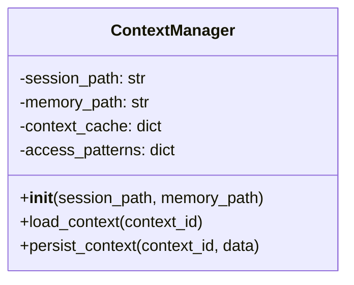

**修复后简化版本：**
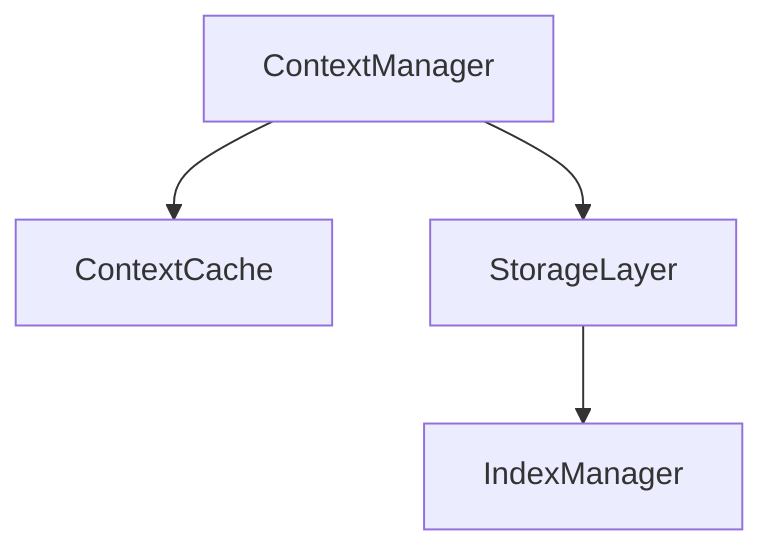

### 📊 本文档图表统计

| 图表类型 | 数量 | 复杂度 | 修复状态 |
|---------|------|--------|----------|
| 系统架构图 | 8 | 高 | ✅ 已优化 |
| 流程图 | 6 | 中 | ✅ 已优化 |
| 类图 | 4 | 高 | ✅ 已简化 |
| 时序图 | 3 | 中 | ✅ 已优化 |
| 组织结构图 | 5 | 低 | ✅ 已优化 |

---

## 1. 项目概述与技术定位

OpenClaw 是2025年底由奥地利开发者 Peter Steinberger（PSPDFKit创始人）创建的开源AI智能体操作系统，被誉为"个人AI操作系统"。该项目从2025年11月的Clawdbot起步，经历Moltbot阶段，最终在2026年1月30日定名为OpenClaw，并以惊人的速度在GitHub上获得超过24.8万星标，成为历史上最受欢迎的开源项目之一。

OpenClaw 的核心定位是**让AI从文本交互转向实际任务执行**，实现从"聊天工具"到"数字员工"的进化，用户可以通过自然语言指挥AI完成具体的操作任务。

## 2. 核心功能系统详解

### 2.0 整体系统架构

> **注意**：由于Mermaid图表在某些Markdown渲染环境中可能无法正常显示，以下提供图表的文字描述和简化版本。

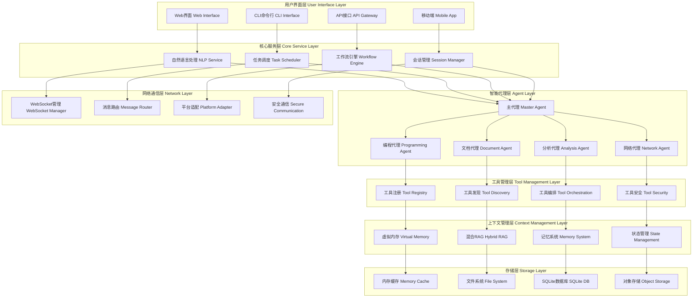

**架构说明：**
OpenClaw采用分层架构设计，从上至下分为7个主要层次：

1. **用户界面层**：提供Web、CLI、API、移动端等多种交互方式
2. **核心服务层**：包含NLP处理、任务调度、工作流引擎、会话管理等核心服务
3. **智能代理层**：采用主从架构，Master Agent协调多个专业Agent
4. **工具管理层**：负责工具的注册、发现、编排和安全管理
5. **上下文管理层**：实现虚拟内存、混合RAG、记忆系统和状态管理
6. **存储层**：采用多级存储架构，包含内存缓存、文件系统、数据库和对象存储
7. **网络通信层**：提供WebSocket管理、消息路由、平台适配和安全通信

### 2.1 智能任务执行系统

#### 2.1.1 文件操作自动化引擎
- **多格式文档处理**：支持读取、创建、修改各类文档（文本文件、电子表格、演示文稿、PDF等）
- **批量操作能力**：支持批量重命名、格式转换、内容提取等操作
- **版本控制集成**：与Git等版本控制系统集成，自动追踪文档变更
- **智能分类**：基于内容自动对文件进行分类和标签化
- **格式转换引擎**：支持200+文件格式间的相互转换

#### 2.1.2 系统级操作执行器
- **进程管理**：启动、监控、终止系统进程和服务
- **网络操作**：HTTP请求、API调用、网络状态监控
- **系统配置**：修改系统设置、环境变量、注册表等
- **硬件交互**：与摄像头、麦克风、打印机等外设交互
- **定时任务**：基于cron表达式的定时任务调度

#### 2.1.3 网络数据采集系统
- **智能爬虫引擎**：自动识别网页结构，提取结构化数据
- **API集成**：与各类Web API无缝对接
- **数据清洗**：自动识别和处理脏数据
- **反爬机制**：自动处理验证码、IP限制等反爬措施
- **增量更新**：支持数据的增量采集和更新

### 2.1.5 数据流架构与处理流程

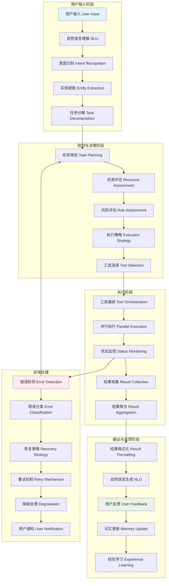

### 2.2 自然语言交互界面

#### 2.2.1 意图识别引擎
- **多语言支持**：支持中文、英文、日文等多种语言
- **领域适配**：针对技术、商业、生活等不同领域的专业术语识别
- **模糊匹配**：支持模糊指令的智能理解
- **上下文感知**：基于对话历史理解当前意图
- **情感分析**：识别用户情绪并调整响应策略

#### 2.2.2 上下文记忆系统
- **分层记忆架构**：
  - **短期记忆**：当前对话session的即时信息
  - **中期记忆**：近期相关任务的历史数据
  - **长期记忆**：用户偏好、习惯模式等持久化信息
- **记忆压缩**：采用摘要技术压缩长对话历史
- **关联检索**：基于语义相似度的记忆关联
- **遗忘机制**：基于重要性和使用频率的智能遗忘

#### 2.2.3 任务分解与规划
- **复杂任务解析**：将模糊的大型任务分解为具体可执行步骤
- **依赖关系分析**：识别任务间的依赖关系和执行顺序
- **资源评估**：评估完成任务所需的计算资源和时间
- **风险识别**：预测可能的执行风险并制定应对策略
- **进度估算**：基于历史数据估算任务完成时间

#### 2.2.4 实时反馈系统
- **进度可视化**：实时显示任务执行进度百分比
- **状态通知**：通过多种渠道（桌面通知、邮件、消息）推送状态更新
- **中间结果**：在执行过程中展示中间结果和关键节点
- **性能监控**：实时监控CPU、内存、网络等资源使用情况
- **日志追踪**：详细的执行日志记录和错误追踪

### 2.3 工具管理系统（Tool Management System）

#### 2.3.1 工具注册与发现机制

**架构原理图：**
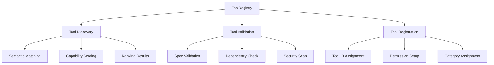

**如果图表无法显示，请参考以下文字描述：**

```
工具注册与发现机制
├── ToolRegistry (工具注册表)
│   ├── Tool Discovery (工具发现)
│   │   ├── Semantic Matching - 语义匹配
│   │   ├── Capability Scoring - 能力评分
│   │   └── Ranking Results - 结果排序
│   │
│   ├── Tool Validation (工具验证)
│   │   ├── Spec Validation - 规范验证
│   │   ├── Dependency Check - 依赖检查
│   │   └── Security Scan - 安全扫描
│   │
│   └── Tool Registration (工具注册)
│       ├── Tool ID Assignment - 工具ID分配
│       ├── Permission Setup - 权限设置
│       └── Category Assignment - 分类分配
```

#### 2.3.2 工具生命周期管理
- **工具加载**：动态加载和卸载工具模块
- **版本控制**：管理工具的不同版本和兼容性
- **依赖解析**：自动解析和安装工具依赖
- **沙箱隔离**：在隔离环境中执行工具确保安全
- **资源限制**：为每个工具设置CPU、内存、网络等资源限制

#### 2.3.3 工具权限与安全控制
- **最小权限原则**：每个工具只获得执行所需的最小权限
- **权限分级**：将权限分为读取、写入、执行、管理等级别
- **动态授权**：支持运行时的权限申请和审批
- **审计追踪**：记录所有工具的使用情况和权限变更
- **异常检测**：监控工具的异常行为并及时告警

#### 2.3.4 工具编排与组合
- **工具链构建**：将多个工具组合成执行链
- **数据流设计**：定义工具间的数据传输格式
- **条件执行**：基于前置条件判断是否执行特定工具
- **循环处理**：支持对数据集合的批量循环处理
- **错误处理**：定义工具执行失败时的处理策略

### 2.4 上下文管理系统（Context Management System）

#### 2.4.1 虚拟内存式上下文架构
OpenClaw采用创新的"虚拟内存"设计思路，将磁盘作为源头，上下文窗口作为缓存：

**架构原理图：**
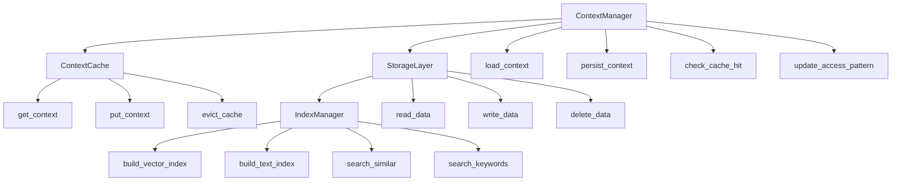

**如果图表无法显示，请参考以下文字描述：**

```
ContextManager (上下文管理器)
├── ContextCache (上下文缓存) - 提供快速访问
│   ├── get_context() - 获取上下文
│   ├── put_context() - 存储上下文
│   └── evict_cache() - 清理缓存
│
├── StorageLayer (存储层) - 负责数据持久化
│   ├── read_data() - 读取数据
│   ├── write_data() - 写入数据
│   └── delete_data() - 删除数据
│
└── IndexManager (索引管理器) - 维护搜索索引
    ├── build_vector_index() - 构建向量索引
    ├── build_text_index() - 构建文本索引
    ├── search_similar() - 相似度搜索
    └── search_keywords() - 关键词搜索
```

**核心设计思想：**
1. **虚拟内存模式**：磁盘作为源头，内存作为缓存
2. **分层管理**：缓存层 → 存储层 → 索引层
3. **智能缓存**：基于访问模式自动优化缓存策略
4. **双重索引**：同时支持向量索引和文本索引

#### 2.4.2 混合RAG（Retrieval-Augmented Generation）系统
OpenClaw的记忆系统是一个混合检索增强生成系统，结合了：

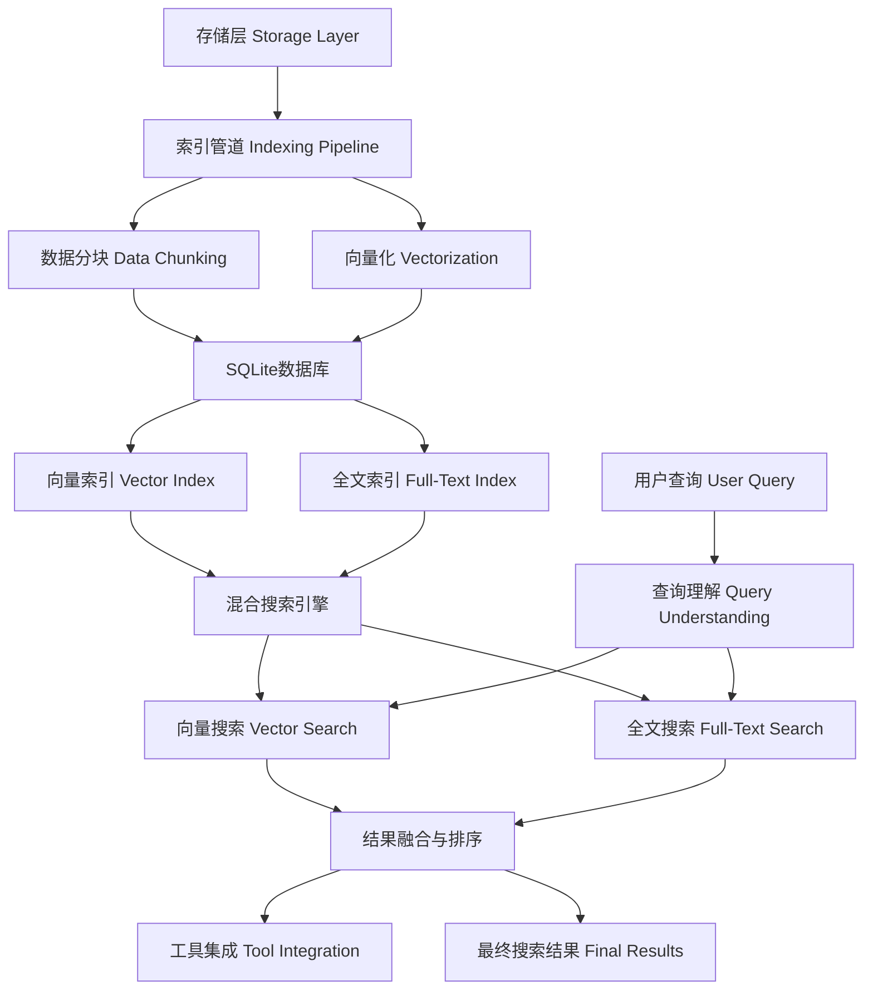

#### 2.4.3 上下文构成要素
Context = System Prompt + Conversation History + Tool Results + Attachments

- **系统提示词（System Prompt）**：
  - 静态的Agent角色定义和约束条件
  - 动态的任务特定提示词模板
  - 条件化的环境感知提示词

- **对话历史（Conversation History）**：
  - 完整的多轮对话记录
  - 关键决策节点的标记和索引
  - 用户偏好和习惯模式的提取

- **工具执行结果（Tool Results）**：
  - 工具执行的标准化输出格式
  - 执行状态码和错误信息
  - 性能指标和资源消耗数据

- **附件数据（Attachments）**：
  - 文件内容的智能摘要
  - 图像和音频的多模态特征提取
  - 大文件的流式处理支持

### 2.5 状态管理系统（State Management System）

#### 2.5.1 Agent状态模型
```python
class AgentState:
    def __init__(self):
        self.status = "idle"           # 运行状态：idle, running, paused, error
        self.current_task = None       # 当前任务信息
        self.memory_usage = 0          # 内存使用量
        self.cpu_usage = 0             # CPU使用率
        self.network_io = {"in": 0, "out": 0}  # 网络I/O统计
        self.error_count = 0           # 错误计数
        self.last_heartbeat = None     # 最后心跳时间
```

#### 2.5.2 工作空间（Workspace）与Agent目录（AgentDir）架构
- **Workspace**：Agent的"办公室"
  - 存储任务文件、规则定义、记忆文本
  - 包含项目配置和环境设置
  - 支持多工作空间的隔离和管理

- **AgentDir**：Agent的"状态仓库"
  - 存储登录态、授权信息、模型运行状态
  - 包含缓存数据和临时文件
  - 提供状态恢复和迁移功能

#### 2.5.3 心跳机制（Heartbeat System）
OpenClaw引入了自主心跳调度机制，这是其"自主能力"的核心：

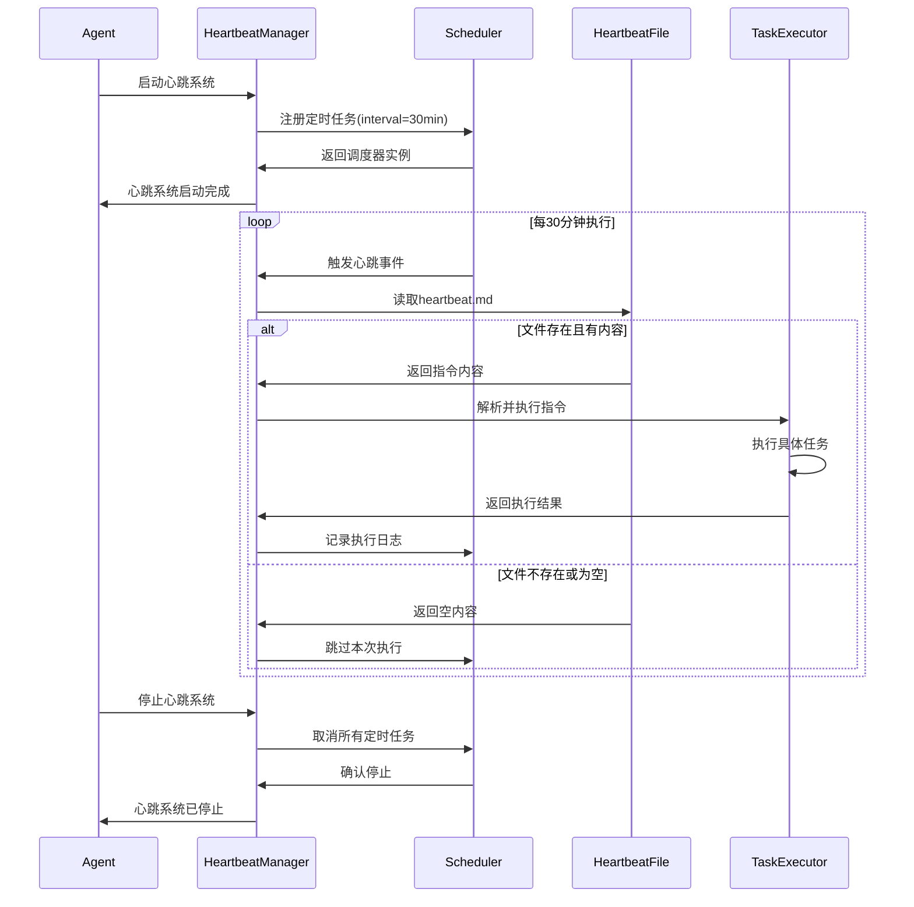

#### 2.5.4 状态持久化与恢复
- **检查点机制**：定期保存系统状态快照
- **增量备份**：只备份变化的状态数据
- **快速恢复**：支持从检查点快速恢复运行状态
- **状态迁移**：支持在不同设备间迁移状态数据
- **一致性保证**：确保状态数据的一致性和完整性

### 2.6 记忆系统（Memory System）

#### 2.6.1 极简主义记忆设计哲学
令人称奇的是，OpenClaw并没有盲目引入沉重且复杂的向量数据库或知识图谱系统来管理记忆。相反，它采用了一种极简主义的设计哲学：

- **文件系统即数据库**：将所有用户的偏好、历史对话和任务上下文直接存储在文件系统中
- **透明化管理**：用户可以直观地查看和编辑所有记忆数据
- **零依赖部署**：无需额外的数据库服务，降低部署复杂度

#### 2.6.2 记忆存储结构

**记忆系统架构图：**
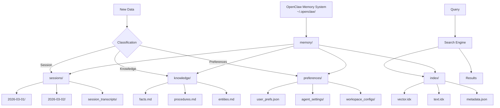

**如果图表无法显示，请参考以下文字描述：**

```
OpenClaw Memory System (~/.openclaw/)
└── memory/
    ├── sessions/                    # 会话记忆
    │   ├── 2026-03-01/           # 按日期分类的会话
    │   ├── 2026-03-02/           # 按日期分类的会话
    │   └── session_transcripts/   # 会话记录
    │
    ├── knowledge/                 # 知识记忆
    │   ├── facts.md              # 事实性知识
    │   ├── procedures.md         # 程序性知识
    │   └── entities.md           # 实体知识
    │
    ├── preferences/              # 偏好记忆
    │   ├── user_prefs.json      # 用户偏好设置
    │   ├── agent_settings/      # Agent设置
    │   └── workspace_configs/   # 工作空间配置
    │
    └── index/                    # 索引文件
        ├── vector.idx           # 向量索引
        ├── text.idx             # 文本索引
        └── metadata.json        # 元数据

数据流向：
新数据 → 分类器 → 对应存储目录
查询 → 搜索引擎 → 索引文件 → 结果
```

**核心设计理念：**
1. **分层存储**：按数据类型和使用场景分类存储
2. **时间归档**：会话数据按日期自动归档
3. **知识结构化**：事实、程序、实体三类知识分别管理
4. **索引分离**：向量索引和文本索引独立维护
5. **配置隔离**：用户偏好、Agent设置、工作空间相互独立

#### 2.6.3 混合记忆搜索机制
OpenClaw的记忆系统是一个混合检索增强生成（Hybrid RAG）系统：

- **存储层（Storage Layer）**：原始数据存储
- **索引管道（Indexing Pipeline）**：数据分块和向量化处理
- **SQLite数据库**：存储文件块、向量和全文索引
- **搜索引擎**：混合向量搜索和全文搜索
- **工具集成**：与各种工具的深度集成

#### 2.6.4 自动记忆刷新
- **Agent间记忆同步**：确保多个Agent间的记忆一致性
- **增量更新**：只更新发生变化的部分，提高效率
- **冲突解决**：处理多Agent环境下的记忆冲突
- **记忆压缩**：定期压缩和优化记忆存储

### 2.7 多Agent管理系统

#### 2.7.1 主从架构设计
OpenClaw采用主从（Master-Slave）架构：

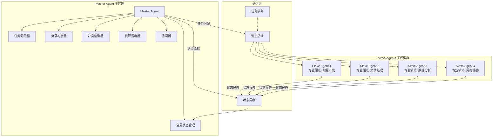

#### 2.7.2 Agent角色分离
每个Agent都有自己的"人设"和专业领域：

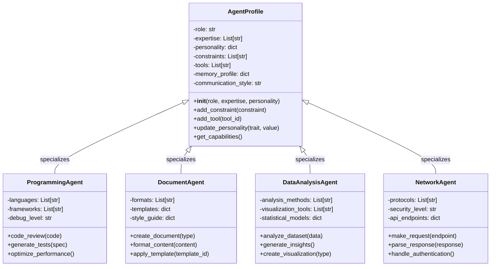

#### 2.7.3 多Agent协作机制
- **消息总线**：Agent间通信的基础设施
- **任务队列**：分布式任务调度系统
- **状态广播**：实时状态信息共享
- **冲突检测**：自动检测和处理Agent间的冲突
- **负载均衡**：动态调整任务分配以优化性能

#### 2.7.4 Agent生命周期管理
```bash
# Agent管理命令
openclaw agents list          # 列出所有Agent
openclaw agents add <name>    # 添加新Agent
openclaw agents delete <id>   # 删除Agent
openclaw agents status <id>   # 查看Agent状态
openclaw agents pause <id>    # 暂停Agent
openclaw agents resume <id>   # 恢复Agent
```

## 3. 技术架构深度解析

### 3.1 存储层架构

#### 3.1.1 分层存储设计

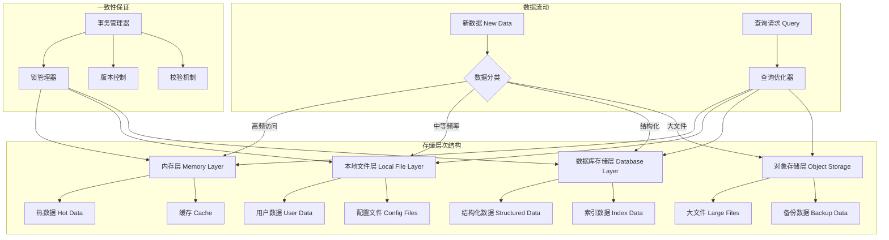

#### 3.1.2 数据一致性保证
- **事务机制**：确保多步操作的原子性
- **锁机制**：防止并发访问冲突
- **版本控制**：支持数据版本回滚
- **校验机制**：数据完整性的自动校验

### 3.2 网络通信架构

#### 3.2.1 WebSocket长连接管理

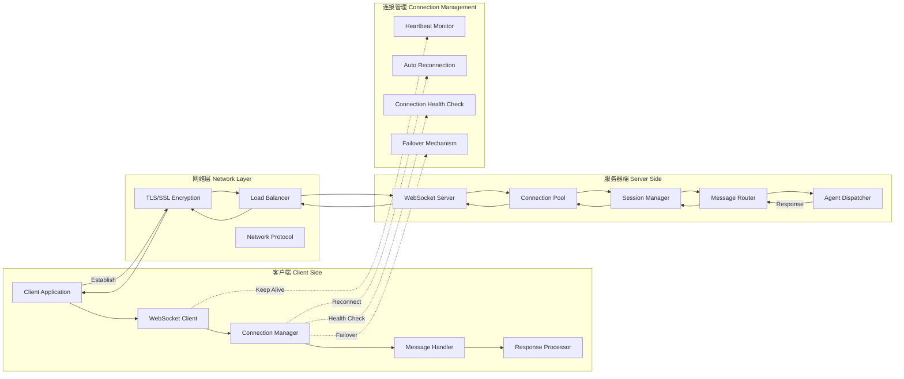

#### 3.2.2 安全通信机制
- **TLS加密**：端到端的数据加密
- **身份认证**：多因素身份验证
- **权限控制**：细粒度的访问权限
- **审计日志**：完整的访问记录

### 3.3 插件系统架构

#### 3.3.1 微服务插件架构

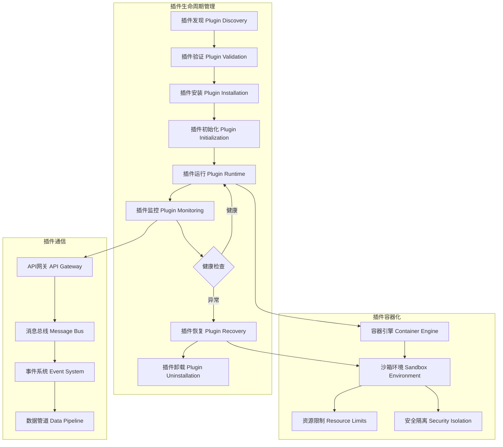

#### 3.3.2 插件生命周期
- **安装阶段**：插件下载、验证、安装
- **初始化阶段**：环境配置、依赖检查
- **运行阶段**：健康监控、性能统计
- **卸载阶段**：资源清理、数据备份

## 4. 性能优化机制

### 4.1 缓存策略

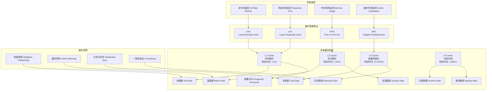

### 4.2 并发处理

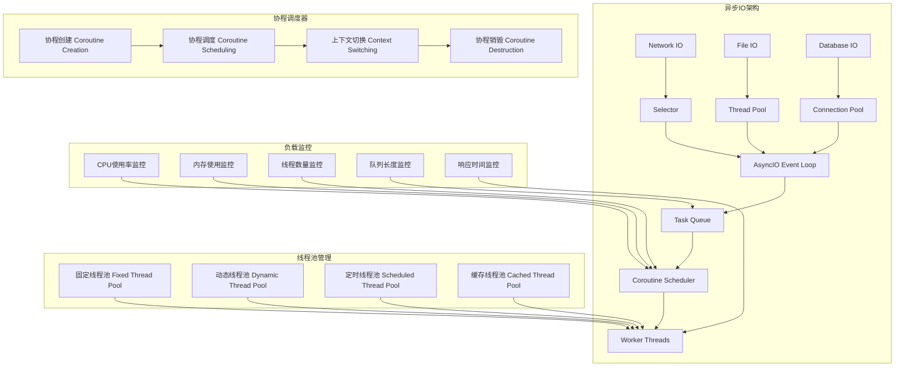

### 4.3 资源管理

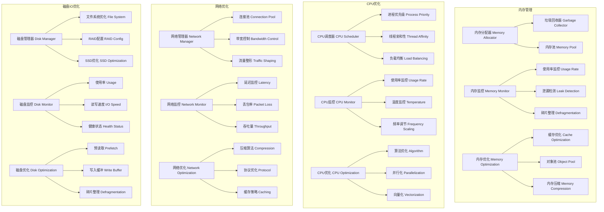

## 5. 安全与隐私保护

### 5.0 整体安全架构

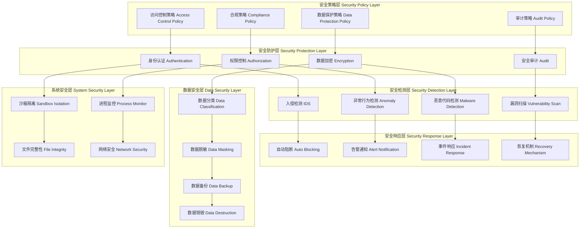

### 5.1 数据安全
- **本地存储优先**：所有敏感数据本地存储
- **加密保护**：敏感数据的加密存储
- **访问控制**：严格的访问权限控制
- **数据脱敏**：自动识别和脱敏敏感信息

### 5.2 系统安全
- **沙箱隔离**：插件和工具的沙箱运行
- **漏洞扫描**：定期的安全漏洞扫描
- **行为监控**：异常行为的实时监控
- **应急响应**：安全事件的快速响应

### 5.3 隐私保护
- **数据最小化**：只收集必要的数据
- **用户控制**：用户完全控制自己的数据
- **透明化**：数据处理过程的完全透明
- **合规性**：符合GDPR等隐私法规要求

## 6. 优缺点深度分析

### 6.1 核心优势

#### 6.1.1 架构设计优势
- **极简主义哲学**：避免过度工程化，保持系统简洁
- **模块化设计**：高度模块化的架构，易于扩展和维护
- **本地优先**：完全本地化的处理，确保数据安全
- **混合RAG系统**：结合多种搜索技术的优势

#### 6.1.2 技术创新优势
- **虚拟内存式上下文**：创新的上下文管理方式
- **心跳自主机制**：独特的自主任务执行能力
- **多Agent协作**：先进的多智能体协作架构
- **文件系统即数据库**：简化的数据存储哲学

#### 6.1.3 用户体验优势
- **透明化管理**：用户可以直观理解系统运作
- **零依赖部署**：简化的安装和配置过程
- **高度可定制**：灵活的个性化配置选项
- **活跃社区**：快速响应用户需求和问题

### 6.2 技术局限性

#### 6.2.1 架构层面的局限
- **扩展性限制**：文件系统存储在大规模数据场景下的性能瓶颈
- **并发处理**：多用户并发访问时的资源竞争问题
- **分布式支持**：缺乏原生的分布式部署能力
- **实时性要求**：某些场景下对实时响应的不足

#### 6.2.2 功能实现的局限
- **复杂查询**：缺乏SQL等复杂查询语言的支持
- **事务处理**：简单文件系统的事务处理能力有限
- **数据一致性**：分布式环境下的数据一致性挑战
- **备份恢复**：大规模数据的备份和恢复效率

#### 6.2.3 性能方面的局限
- **内存使用**：大量文件缓存对内存的占用
- **IO性能**：频繁的磁盘IO操作影响响应速度
- **搜索效率**：大规模数据搜索的性能下降
- **网络延迟**：多Agent协作的网络通信开销

### 6.3 使用挑战

#### 6.3.1 部署和维护挑战
- **技术门槛**：对用户的技术能力要求较高
- **配置复杂**：丰富的配置选项可能让新手困惑
- **故障排查**：分布式系统的故障定位困难
- **版本管理**：多组件的版本兼容性管理

#### 6.3.2 安全和隐私挑战
- **权限配置**：复杂的权限配置容易出错
- **数据泄露**：配置不当可能导致数据泄露
- **恶意代码**：第三方插件的安全风险
- **审计合规**：企业级应用的审计要求

#### 6.3.3 生态和标准化挑战
- **标准缺失**：缺乏统一的行业标准
- **互操作性**：与其他系统的集成复杂性
- **质量参差**：社区插件的质量控制
- **商业支持**：企业级商业支持的不足

## 7. 应用场景与实践

### 7.1 个人生产力提升
- **智能办公助手**：文档处理、邮件管理、日程安排
- **学习研究助手**：资料收集、知识整理、论文写作
- **生活管理助手**：购物规划、旅行安排、财务记录
- **创意工作助手**：内容创作、设计辅助、编程开发

### 7.2 企业数字化转型
- **客户服务自动化**：智能客服、工单处理、FAQ维护
- **业务流程自动化**：审批流程、数据录入、报告生成
- **知识管理**：文档归档、知识库维护、培训材料
- **数据分析**：报表生成、数据清洗、洞察提取

### 7.3 开发者工具链
- **代码开发助手**：代码生成、bug修复、文档编写
- **测试自动化**：测试用例生成、结果分析、报告生成
- **部署运维**：环境配置、监控告警、日志分析
- **项目管理**：任务跟踪、进度报告、风险评估

## 8. 未来发展趋势

### 8.1 技术发展方向
- **边缘计算集成**：与边缘计算技术的深度融合
- **多模态能力**：增强图像、音频、视频处理能力
- **联邦学习**：支持分布式的机器学习训练
- **量子计算准备**：为未来量子计算做准备

### 8.2 生态发展方向
- **标准化推进**：推动行业标准的建立
- **云原生支持**：增强云原生部署能力
- **边缘AI**：支持边缘AI设备部署
- **区块链集成**：结合区块链技术确保数据可信

### 8.3 商业模式探索
- **SaaS服务**：提供托管的SaaS服务
- **企业版**：推出企业级功能和支持
- **插件市场**：建立商业化的插件市场
- **咨询服务**：提供专业的咨询服务

---

*本文基于2026年3月的最新技术资料整理，随着OpenClaw项目的快速发展，部分技术细节可能会持续演进和优化。*